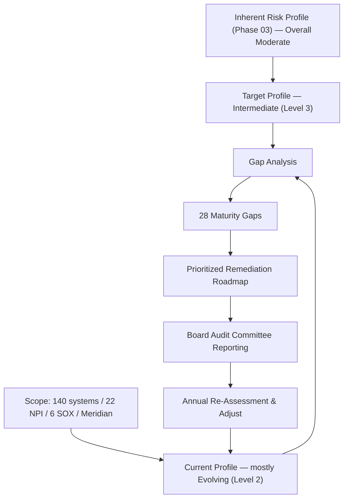

# 05.01 — Assessment Approach & Scope

| Field | Value |
|---|---|
| Document ID | CCB-CSF-APPR-2026-501 |
| Version | 1.0 |
| Date | 2026-06-15 |
| Classification | Confidential — Nonpublic Information (NPI) // Illustrative Portfolio Sample |
| Owner | Rachel Alvarez, Chief Information Security Officer (CISO/ISO) |
| Author | Advisory Team (Financial-Services GRC) |
| Status | Approved |

## Purpose

This document establishes the **methodology, maturity scale, and scope** for Cornerstone Community Bank's FFIEC Cybersecurity Assessment, conducted for 2026 using the **NIST Cybersecurity Framework (CSF) 2.0** as its assessment spine. It defines how the Bank builds a **current profile** and a **target profile**, how the resulting gaps are counted and prioritized, and the cadence by which the assessment is refreshed and reported to the Board Audit Committee.

The FFIEC Cybersecurity Assessment Tool (CAT) was **officially sunset on August 31, 2025**. Cornerstone has adopted NIST CSF 2.0 as the successor spine while preserving the CAT's two-part logic — an **inherent-risk determination** paired with a **maturity assessment** — so that continuity with prior examinations is maintained. This document is the entry point for Phase 05; the detailed transition rationale is in 05.02, the inherent-risk recap in 05.03, and the per-function assessments in 05.04 through 05.09.

## Why NIST CSF 2.0

NIST CSF 2.0 is the examiner-appropriate successor to the CAT for a community bank of Cornerstone's size and complexity. The rationale:

| Driver | Explanation |
|---|---|
| CAT sunset | FFIEC retired the CAT on 2025-08-31 and pointed institutions to standards-based frameworks (NIST CSF, CRI Profile, CIS Controls). |
| Regulatory alignment | CSF 2.0 maps cleanly to the FFIEC IT Examination Handbook booklets and to GLBA §501(b) safeguards obligations. |
| New Govern function | CSF 2.0 adds a dedicated **Govern** function, directly supporting FFIEC's emphasis on board oversight and risk governance. |
| Profile mechanics | Current-vs-target profiles express risk-based prioritization the way examiners expect, replacing the CAT's declarative-statement approach. |
| Crosswalk continuity | NIST publishes CAT-to-CSF and 800-53 crosswalks, preserving traceability to prior CAT results and to Phase 04 controls. |

## The Maturity Scale (Definitive)

Cornerstone assesses each CSF 2.0 Category on a **five-level maturity scale**. This scale is used **consistently across all Phase 05 documents**. It is a superset of the four NIST Implementation Tiers, extended to a five-point scale so that "Evolving" (the Bank's typical current state) and "Intermediate" (its target) can be expressed distinctly.

| Level | Name | Definition | Approx. CSF Tier |
|---|---|---|---|
| 1 | Baseline | Ad hoc or reactive; practices undocumented or inconsistent. | Tier 1 — Partial |
| 2 | Evolving | Documented and largely practiced, but not consistently measured or governed. | Tier 2 — Risk-Informed |
| 3 | Intermediate | Formalized, resourced, measured, and repeatable across the enterprise. | Tier 3 — Repeatable |
| 4 | Advanced | Metrics-driven and integrated with enterprise risk; continuous refinement. | Tier 3–4 |
| 5 | Innovative | Adaptive; predictive analytics and automation drive continuous improvement. | Tier 4 — Adaptive |

**Baseline posture (2026):** most Categories sit at **Level 2 — Evolving**, with several detection/response Categories at **Level 1–2**. **Target profile:** **Level 3 — Intermediate** for all Categories, commensurate with the Bank's overall **Moderate** inherent risk. Reaching Level 3 enterprise-wide is the objective that generates the **28 maturity gaps** tracked in this phase.

## Scope

The assessment is **enterprise-wide** and covers the people, processes, and technology that protect NPI and financially significant systems.

| Scope Dimension | In Scope | Notes |
|---|---|---|
| Systems (total) | 140 | Full enterprise inventory (Phase 02). |
| NPI-bearing systems | 22 | GLBA §501(b) safeguards focus. |
| SOX ITGC systems | 6 | Financially significant; ICFR overlap (Phase 06). |
| Core / digital banking | Meridian Core Services, LLC | Outsourced; SOC 1 Type II & SOC 2 Type II reliance. |
| Facilities | HQ (Riverton, OH) + 18 branches | Physical & environmental safeguards. |
| Workforce | ~240 employees | Awareness, training, roles & responsibilities. |
| Third parties | 85 (12 critical/high) | Supply-chain risk assessed under GV.SC (Phase 07). |

Because core and digital banking are outsourced to **Meridian**, the assessment explicitly treats the **Meridian dependency** as a first-class scope element: Meridian-operated controls are assessed through SOC report reliance, complementary user-entity controls (CUECs), and enhanced third-party oversight. This dependency is a recurring theme in the Govern (supply chain), Protect, and Detect/Respond functions.

## How the Profiles Are Built

The **current profile** is evidence-based. Each of the 22 CSF 2.0 Categories is scored by triangulating three inputs: (1) Phase 04 control documentation and operating evidence, (2) independent testing results (pen test, internal audit — Phase 08), and (3) interviews with control owners. The **target profile** is set by mapping inherent-risk drivers (05.03) to a required maturity level — higher inherent risk demands higher target maturity. Where current < target, a **gap** is recorded, sized (Minor / Moderate / Significant), assigned an owner, and tracked to closure.

| Profile Element | Source of Truth | Owner |
|---|---|---|
| Current maturity score | Phase 04 controls + Phase 08 testing + interviews | Marcus Doyle (IT Security Manager) |
| Target maturity score | Inherent-risk mapping (05.03) + board risk appetite | Rachel Alvarez (CISO) |
| Gap sizing & priority | Delta × inherent-risk weight | CISO + CRO |
| Remediation actions | Roadmap entries with milestones | Control owners |
| Evidence & sign-off | Assessment workpapers | Internal Audit review |

## CSF 2.0 Structure at a Glance

The assessment covers the full NIST CSF 2.0 taxonomy: **6 Functions, 22 Categories, and 106 Subcategories**. The distribution below shows where the Bank's assessment effort concentrates and previews the gap weighting (Detect/Respond/Recover carry disproportionate gaps relative to their size).

| Function | Categories | Subcategories | Phase 05 Doc | Gaps |
|---|---|---|---|---|
| Govern (GV) | 6 | 31 | 05.04 | 5 |
| Identify (ID) | 3 | 21 | 05.05 | 5 |
| Protect (PR) | 5 | 22 | 05.06 | 3 |
| Detect (DE) | 2 | 11 | 05.07 | 6 |
| Respond (RS) | 4 | 13 | 05.08 | 5 |
| Recover (RC) | 2 | 8 | 05.09 | 4 |
| **Total** | **22** | **106** | — | **28** |

## Roles in the Assessment (RACI)

The assessment is a cross-functional exercise. The RACI below fixes accountability so examiners can trace who scored, who validated, and who approved.

| Activity | Responsible | Accountable | Consulted | Informed |
|---|---|---|---|---|
| Score current profile | IT Security Manager | CISO | Control owners | CRO |
| Set target profile | CISO | CISO | CRO | Audit Committee |
| Validate risk alignment | CRO | CRO | CISO | CIO |
| Independent review | Internal Audit | Dir. Internal Audit | CISO | Audit Committee |
| Approve &amp; report | CISO | Audit Committee Chair | CRO, CIO | Board |

## Cadence and Governance

The full CSF 2.0 assessment is refreshed **annually**, with a **semi-annual gap-closure review** to the Audit Committee and **event-driven re-scoring** when a material change occurs (new system, significant incident, examiner finding, or major Meridian change). The CISO owns the assessment; the CRO validates target-tier alignment with risk appetite; Internal Audit independently reviews the workpapers; and the Board Audit Committee receives the results as part of the annual GLBA §501(b) reporting cycle.

## Cross-References

- **05.02** — CAT-to-CSF 2.0 transition rationale and crosswalk.
- **05.03** — Inherent Risk Profile recap and target-maturity alignment.
- **05.04–05.09** — Per-function current-vs-target assessments and gaps.
- **Phase 02** — Asset inventory (140 systems / 22 NPI / 6 SOX) defining scope.
- **Phase 03** — Risk assessment and FFIEC inherent risk profile (overall Moderate).
- **Phase 04** — Control design providing current-profile evidence.
- **Phase 08** — Independent testing feeding current-profile scoring.

---
[⬅ Previous](05.00-README.md) · [🏠 Phase README](05.00-README.md) · [Next ➡](05.02-cat-to-nist-csf-transition.md)
