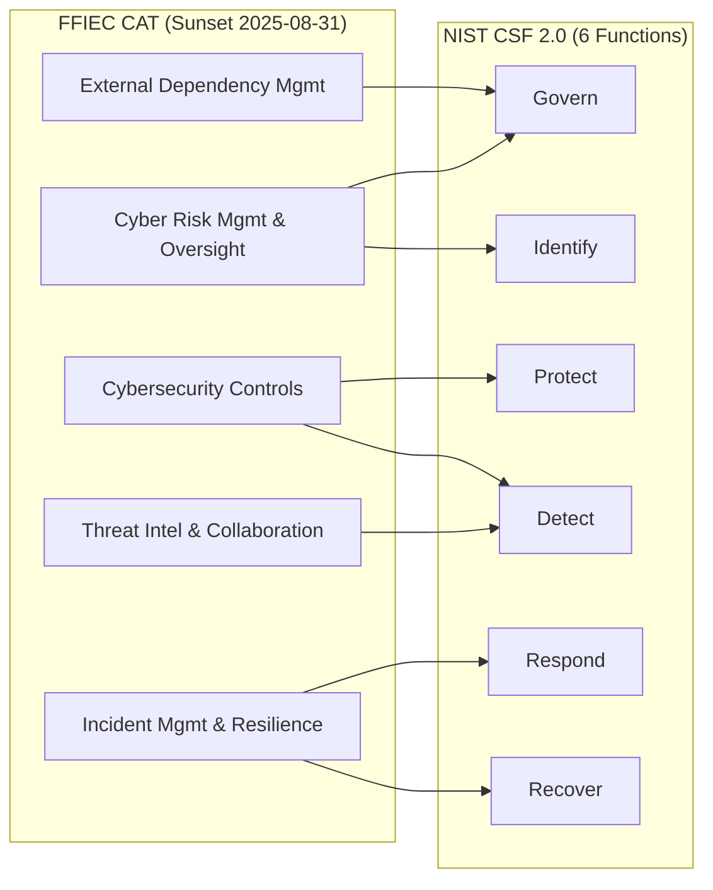

# 05.02 — CAT → NIST CSF 2.0 Transition

| Field | Value |
|---|---|
| Document ID | CCB-CSF-TRAN-2026-502 |
| Version | 1.0 |
| Date | 2026-06-15 |
| Classification | Confidential — Nonpublic Information (NPI) // Illustrative Portfolio Sample |
| Owner | Rachel Alvarez, Chief Information Security Officer (CISO/ISO) |
| Author | Advisory Team (Financial-Services GRC) |
| Status | Approved |

## Purpose

This document explains **why and how** Cornerstone Community Bank transitioned its FFIEC Cybersecurity Assessment from the retired **FFIEC Cybersecurity Assessment Tool (CAT)** to the **NIST Cybersecurity Framework (CSF) 2.0**. It records the CAT sunset, provides a **domain-to-function crosswalk** preserving continuity with prior CAT results, references the **CRI Profile** as an alternative crosswalk, and documents why CSF 2.0 is examiner-appropriate for a ~$1.2B community bank.

## The CAT Sunset

The FFIEC issued the CAT in 2015 to help institutions assess **inherent risk** and **cybersecurity maturity**. On **August 31, 2025**, the FFIEC **officially sunset the CAT** and announced it would no longer maintain or update the tool. The FFIEC directed institutions to standards-based resources — notably the **NIST CSF**, the **CRI Profile** (Cyber Risk Institute Financial Services Profile), and the **CIS Critical Security Controls** — for ongoing cybersecurity self-assessment.

| Item | Detail |
|---|---|
| Tool retired | FFIEC Cybersecurity Assessment Tool (CAT) |
| Sunset date | 2025-08-31 |
| Reason | Superseded by maintained, standards-based frameworks |
| FFIEC-referenced successors | NIST CSF, CRI Profile, CIS Controls |
| Cornerstone's choice | NIST CSF 2.0 (primary), CRI Profile (secondary crosswalk) |

Cornerstone's transition **preserves the CAT's analytical value**: the CAT paired an **Inherent Risk Profile** with **five maturity domains**. The Bank retains both halves — the inherent-risk determination lives on in 05.03, and the maturity assessment is now expressed through CSF 2.0's six Functions and 22 Categories.

## Mapping the CAT's 5 Domains to CSF 2.0's 6 Functions

The CAT organized maturity into **five domains**. NIST CSF 2.0 organizes cybersecurity outcomes into **six Functions** (Govern, Identify, Protect, Detect, Respond, Recover). The crosswalk below preserves traceability so prior CAT maturity conclusions carry forward.

| CAT Domain | Primary CSF 2.0 Function(s) | Rationale |
|---|---|---|
| 1. Cyber Risk Management &amp; Oversight | **Govern**; Identify | Governance, strategy, policy, board oversight, workforce. |
| 2. Threat Intelligence &amp; Collaboration | **Detect**; Identify (Risk Assessment) | Threat feeds, monitoring, information sharing. |
| 3. Cybersecurity Controls | **Protect**; Detect | Preventive, detective &amp; corrective safeguards. |
| 4. External Dependency Management | **Govern** (Supply Chain); Identify | Third-party &amp; connection management (Meridian). |
| 5. Cyber Incident Management &amp; Resilience | **Respond**; **Recover** | Incident response, resilience, recovery. |

## Structural Comparison

The two frameworks share a risk-based philosophy but differ in mechanics. Understanding the differences prevents mis-reading prior CAT results against the new profile.

| Attribute | FFIEC CAT | NIST CSF 2.0 |
|---|---|---|
| Status | Sunset 2025-08-31 | Actively maintained by NIST |
| Structure | 5 domains, declarative statements | 6 Functions, 22 Categories, 106 Subcategories |
| Maturity model | 5 maturity levels (Baseline→Innovative) | 4 Implementation Tiers + Profiles |
| Risk pairing | Inherent Risk Profile (5 categories) | Organizational context + Risk Assessment |
| Governance emphasis | Within "Oversight" domain | Dedicated **Govern** Function |
| Cornerstone scale used | — | 5-level Baseline→Innovative (see 05.01) |

Because Cornerstone's five-level maturity scale (05.01) deliberately mirrors the CAT's Baseline→Innovative naming, **historical CAT maturity ratings map one-to-one** onto the current CSF assessment scale, easing examiner comparison year-over-year.

## The CRI Profile as an Alternative Crosswalk

The **CRI Profile** (Cyber Risk Institute Financial Services Profile) is a financial-sector overlay that consolidates CSF, FFIEC Handbook, and other regulatory expectations into a single questionnaire. Cornerstone references the CRI Profile as a **secondary crosswalk** to demonstrate that its CSF 2.0-based assessment also satisfies sector-specific regulatory expectations. The Bank does not maintain a separate CRI questionnaire; instead it retains the **CSF-to-CRI mapping** so an examiner requesting CRI-formatted evidence can be served from the same workpapers.

| Framework | Role at Cornerstone | Maintained By |
|---|---|---|
| NIST CSF 2.0 | Primary assessment spine | NIST |
| CRI Profile | Secondary financial-sector crosswalk | Cyber Risk Institute |
| CIS Controls v8 | Technical control mapping | CIS |
| FFIEC IT Handbook | Regulatory expectation baseline | FFIEC |

## Transition Timeline and Continuity

The migration was sequenced so that no assessment period lapsed between the CAT sunset and the first CSF 2.0 cycle, preserving an unbroken maturity record for examiners.

| Date | Milestone |
|---|---|
| Pre-2025 | Assessments conducted on the FFIEC CAT (inherent risk + 5 maturity domains). |
| 2025-08-31 | FFIEC officially sunsets the CAT. |
| 2026-01 | Advisory engagement kickoff; CSF 2.0 selected as successor spine. |
| 2026-03 | Inherent risk re-confirmed (Phase 03) → overall Moderate. |
| 2026-06 | First full CSF 2.0 current-vs-target assessment (this phase). |
| Annual | Recurring CSF 2.0 re-assessment with CRI crosswalk retained. |

## Subcategory Continuity

CSF 2.0's 106 Subcategories provide finer granularity than the CAT's declarative statements. The crosswalk is maintained at the Subcategory level so a prior CAT statement can be traced to one or more CSF Subcategories, and vice versa.

| Function | Subcategories | Predominant CAT Domain Source |
|---|---|---|
| Govern | 31 | Domains 1 &amp; 4 (Oversight, External Dependency) |
| Identify | 21 | Domains 1 &amp; 2 (Risk Mgmt, Threat Intel) |
| Protect | 22 | Domain 3 (Cybersecurity Controls) |
| Detect | 11 | Domains 2 &amp; 3 (Threat Intel, Controls) |
| Respond | 13 | Domain 5 (Incident Mgmt &amp; Resilience) |
| Recover | 8 | Domain 5 (Incident Mgmt &amp; Resilience) |

## Why CSF 2.0 Is Examiner-Appropriate

For an FFIEC IT examination, CSF 2.0 is defensible and expected: it is government-maintained, maps directly to the IT Examination Handbook and GLBA §501(b), introduces the **Govern** Function that mirrors examiner emphasis on board oversight, and expresses results as risk-based **profiles** rather than a static checklist. Combined with the retained inherent-risk determination and the CRI crosswalk, the approach gives examiners continuity with prior CAT results and confidence that the Bank's self-assessment is standards-based and current.

## Cross-References

- **05.01** — Assessment approach, maturity scale, and scope.
- **05.03** — Inherent Risk Profile recap (the retained CAT "inherent risk" half).
- **05.04–05.09** — Per-function assessments built on this crosswalk.
- **Phase 04** — Controls mapped to CSF 2.0 (Cybersecurity Controls domain).
- **Phase 07** — External Dependency Management → Govern Supply Chain (Meridian).

---
[⬅ Previous](05.01-assessment-approach-and-scope.md) · [🏠 Phase README](05.00-README.md) · [Next ➡](05.03-inherent-risk-profile-recap.md)
