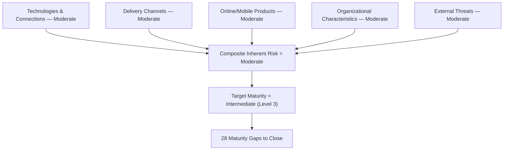

# 05.03 — Inherent Risk Profile Recap

| Field | Value |
|---|---|
| Document ID | CCB-CSF-IRP-2026-503 |
| Version | 1.0 |
| Date | 2026-06-15 |
| Classification | Confidential — Nonpublic Information (NPI) // Illustrative Portfolio Sample |
| Owner | Rachel Alvarez, Chief Information Security Officer (CISO/ISO) |
| Author | Advisory Team (Financial-Services GRC) |
| Status | Approved |

## Purpose

This document recaps the **FFIEC-style Inherent Risk Profile** developed in Phase 03 (see 03.05) and **aligns it to the target maturity profile** used throughout Phase 05. It is the bridge between "how much inherent cyber risk does Cornerstone carry?" and "how mature must our cybersecurity practices therefore be?" The governing principle, preserved from the CAT and standard FFIEC practice, is that **higher inherent risk demands higher target maturity**.

## Inherent Risk Recap — Overall Moderate

Inherent risk is the risk present **before** considering the strength of controls. Following the CAT's five-category structure, Phase 03 rated Cornerstone's inherent risk across the categories below. The composite determination is **overall Moderate** — consistent with a ~$1.2B community bank that outsources its core, offers digital banking to ~62,000 users, but has a limited product set and geographic footprint (18 branches, Ohio).

| Inherent-Risk Category | Rating | Key Drivers |
|---|---|---|
| Technologies &amp; Connection Types | Moderate | 140 systems; outsourced core (Meridian); VPN/remote access; limited internet-facing footprint. |
| Delivery Channels | Moderate | Online + mobile banking (~62,000 users); ATM/branch; no proprietary high-risk channels. |
| Online / Mobile Products &amp; Services | Moderate | Retail + small-business digital banking, bill pay, external transfers; no crypto/merchant-acquiring. |
| Organizational Characteristics | Moderate | ~240 employees; public holding company (CCBK); M&amp;A none pending; moderate change velocity. |
| External Threats | Moderate | Community-bank threat profile: phishing, ATO, ransomware, third-party compromise. |
| **Composite Inherent Risk** | **Moderate** | Balanced across all five categories; no category rated High or Least. |

This composite anchors the entire Phase 05 target profile. It also ties directly to the Phase 03 risk register outcome — **42 risks (8 High, 18 Moderate, 16 Low)** — which supplies the specific scenarios the maturity target must be strong enough to withstand.

## Aligning Inherent Risk to Target Maturity

The FFIEC maturity model expects a **defensible relationship** between inherent risk and maturity: an institution should not sit at Baseline maturity while carrying Significant inherent risk. Cornerstone applies the mapping below. With **Moderate** composite inherent risk, the **enterprise target is Intermediate (Level 3)** maturity across all CSF 2.0 Categories.

| Composite Inherent Risk | Minimum Defensible Target Maturity | Cornerstone Position |
|---|---|---|
| Least | Baseline (Level 1) | — |
| Minimal | Evolving (Level 2) | — |
| **Moderate** | **Intermediate (Level 3)** | **Cornerstone (target)** |
| Significant | Advanced (Level 4) | — |
| Most | Innovative (Level 5) | — |

Because most Categories currently sit at **Evolving (Level 2)** while the target is **Intermediate (Level 3)**, the assessment produces a **one-level lift** across the majority of the framework — the origin of the **28 maturity gaps**. Detection and response Categories, which sit closer to **Baseline (Level 1–2)**, require the largest lift and therefore carry the heaviest share of the gaps.

## Category-Level Risk-to-Maturity Alignment

Not every CSF Function faces identical inherent-risk pressure. The table below shows how inherent-risk drivers weight the target and where the current profile is furthest behind — informing gap prioritization in the function documents.

| CSF 2.0 Function | Dominant Inherent-Risk Driver | Current (typical) | Target | Relative Gap Pressure |
|---|---|---|---|---|
| Govern | Organizational characteristics; public-company oversight | Evolving | Intermediate | Moderate |
| Identify | Technologies &amp; connections (140 systems) | Evolving | Intermediate | Moderate |
| Protect | Delivery channels; online/mobile products | Evolving–Intermediate | Intermediate | Low (strongest) |
| Detect | External threats; digital channels | Baseline–Evolving | Intermediate | High |
| Respond | External threats; incident velocity | Baseline–Evolving | Intermediate | High |
| Recover | Delivery-channel availability; Meridian dependency | Baseline–Evolving | Intermediate | High |

The pattern is deliberate and evidence-based: Cornerstone's **Protect** function is strongest because Phase 04 delivered mature preventive controls (MFA, encryption, patch/vulnerability management, hardening). **Detect, Respond, and Recover** lag because monitoring, incident response, and resilience programs are less formalized — precisely the areas the 28-gap roadmap concentrates on.

## Linkage to the Risk Register

The Moderate inherent-risk determination is not abstract — it is populated by the **42 risks** in the Phase 03 register. The **8 High risks** exert the most upward pressure on target maturity and map to the functions carrying the largest gap loads.

| Register Band | Count | Primary CSF Functions Stressed | Effect on Target |
|---|---|---|---|
| High | 8 | Detect, Respond, Protect | Drives Intermediate floor; concentrates gaps in DE/RS. |
| Moderate | 18 | Identify, Govern, Protect | Confirms enterprise-wide Intermediate target. |
| Low | 16 | Recover, Identify | Supports maintenance rather than lift. |
| **Total** | **42** | — | **Composite → Intermediate target** |

## Residual-Risk Perspective

Target maturity is set to reduce **residual** risk to within appetite. With Protect already near target and the 28-gap roadmap closing Detect/Respond/Recover, the Bank's projected residual posture is **Low-to-Moderate, well-managed** — consistent with the Satisfactory (URSIT composite "2") examination trajectory and the ICFR-effective SOX outcome expected in Phases 08–09.

## How This Recap Is Used

Each per-function document (05.04–05.09) opens from this alignment: it inherits the **Intermediate** target, states the current maturity per Category, and records the gap where current < target. The CRO validates that the target remains commensurate with the Moderate inherent-risk determination, and re-validates whenever inherent risk changes (new products, acquisitions, threat shifts, or a material change to the Meridian relationship).

## Cross-References

- **03.05** — FFIEC Inherent Risk Profile (source of the Moderate determination).
- **03.07** — Risk register (42 risks: 8 High / 18 Moderate / 16 Low).
- **05.01** — Maturity scale definition and profile mechanics.
- **05.02** — CAT-to-CSF transition preserving the inherent-risk half.
- **05.04–05.09** — Function assessments inheriting the Intermediate target.

---
[⬅ Previous](05.02-cat-to-nist-csf-transition.md) · [🏠 Phase README](05.00-README.md) · [Next ➡](05.04-nist-csf-govern-function.md)
