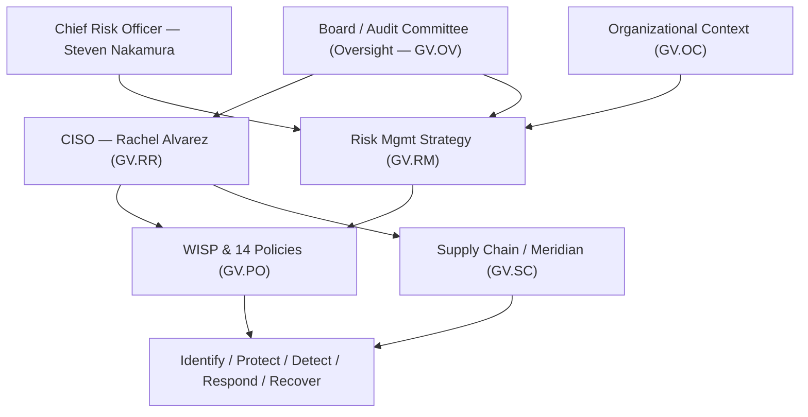

# 05.04 — NIST CSF 2.0 Govern (GV) Function

| Field | Value |
|---|---|
| Document ID | CCB-CSF-GOVERN-2026-504 |
| Version | 1.0 |
| Date | 2026-06-15 |
| Classification | Confidential — Nonpublic Information (NPI) // Illustrative Portfolio Sample |
| Owner | Rachel Alvarez, Chief Information Security Officer (CISO/ISO) |
| Author | Advisory Team (Financial-Services GRC) |
| Status | Approved |

## Purpose

This document assesses the **Govern (GV)** function of NIST CSF 2.0 for Cornerstone Community Bank — the newest and most examiner-relevant of the six Functions. Govern establishes how cybersecurity risk is **understood, prioritized, and overseen** across the enterprise. The assessment scores each of the **six Govern Categories** against the five-level maturity scale (05.01), sets the **Intermediate (Level 3)** target from the Moderate inherent-risk determination (05.03), and records the resulting gaps. Govern contributes **5** of the program's **28** maturity gaps.

## The Six Govern Categories

| Category ID | Category | Focus |
|---|---|---|
| GV.OC | Organizational Context | Mission, stakeholders, legal/regulatory requirements, dependencies. |
| GV.RM | Risk Management Strategy | Risk appetite, tolerance, and strategy for cyber risk decisions. |
| GV.RR | Roles, Responsibilities &amp; Authorities | Accountability, resourcing, and the CISO mandate. |
| GV.PO | Policy | The WISP and 14 core policies; policy lifecycle. |
| GV.OV | Oversight | Board/Audit Committee monitoring of strategy and performance. |
| GV.SC | Cybersecurity Supply Chain Risk Management | Third-party / Meridian dependency governance. |

## Current vs Target Maturity

Govern is anchored by strong foundational governance (board-approved WISP, designated CISO, public-company oversight discipline) but is held back by **inconsistent measurement, an emerging risk-appetite statement, and a supply-chain program still being formalized**.

| Category | Current | Target | Delta | Assessment Basis |
|---|---|---|---|---|
| GV.OC — Organizational Context | Intermediate | Intermediate | 0 | Regulatory scope, NPI, and dependencies well-documented (Phase 01–02). |
| GV.RM — Risk Management Strategy | Evolving | Intermediate | 1 | Risk appetite defined (03.08) but not yet fully quantified or cascaded. |
| GV.RR — Roles &amp; Responsibilities | Intermediate | Intermediate | 0 | CISO mandate, CRO, board committee roles are clear and resourced. |
| GV.PO — Policy | Intermediate | Intermediate | 0 | WISP + 14 board-approved policies with review cadence (Phase 04). |
| GV.OV — Oversight | Evolving | Intermediate | 1 | Board reporting exists; cyber KRIs/metrics not yet standardized. |
| GV.SC — Supply Chain Risk Mgmt | Evolving | Intermediate | 1 | 85 vendors inventoried; enhanced-oversight program maturing (Phase 07). |

## Gap Detail — Govern (5 Gaps)

The Govern gaps concentrate on **measurement and cascade**: the governance structure exists, but its outputs (risk appetite, KRIs, supply-chain assurance) are not yet consistently quantified and repeated.

| Gap ID | Category | Gap Description | Size | Target Action | Owner |
|---|---|---|---|---|---|
| GV-G1 | GV.RM | Risk-appetite statement not fully quantified or cascaded to system owners. | Moderate | Publish quantified cyber risk-appetite &amp; tolerance thresholds; cascade to 22 NPI systems. | CRO |
| GV-G2 | GV.OV | Board cyber reporting lacks a standardized KRI/metrics dashboard. | Moderate | Build recurring cyber KRI pack for Audit Committee (quarterly). | CISO |
| GV-G3 | GV.SC | Supply-chain tiering not consistently tied to CSF outcomes for all 85 vendors. | Moderate | Extend CSF-aligned due-diligence to all 12 critical vendors; risk-tier remainder. | CISO |
| GV-G4 | GV.SC | Meridian complementary user-entity controls (CUECs) not formally tracked to owners. | Significant | Map SOC 1/SOC 2 CUECs to Cornerstone control owners with attestation. | Marcus Doyle |
| GV-G5 | GV.RM | Risk decisions (accept/transfer) not consistently logged against appetite. | Minor | Stand up risk-decision log integrated with the risk register. | CRO |

## Meridian Supply-Chain Governance (GV.SC)

Because core and digital banking are outsourced to **Meridian Core Services, LLC**, GV.SC is the Govern Category with the greatest examiner interest. Cornerstone relies on Meridian's **SOC 1 Type II** and **SOC 2 Type II** reports, but the assessment found that **CUEC ownership** and **CSF-aligned tiering** are not yet fully formalized (gaps GV-G3, GV-G4). Closing these lifts GV.SC to Intermediate and strengthens the Bank's position under the 2023 Interagency Guidance on Third-Party Relationships (detailed in Phase 07).

## Subcategory Highlights

Govern spans **31 of the 106 Subcategories** — the largest share of any Function, reflecting the weight CSF 2.0 places on governance. Selected Subcategory-level observations:

| Subcategory (illustrative) | Observation | Status |
|---|---|---|
| GV.OC-03 (legal/regulatory requirements) | GLBA, FFIEC, SOX, FDICIA scope documented (Phase 01). | At target |
| GV.RM-02 (risk appetite established) | Appetite defined but not fully quantified. | Gap GV-G1 |
| GV.RR-02 (roles &amp; authorities) | CISO mandate and CRO independence clear. | At target |
| GV.OV-01 (strategy reviewed) | Board review occurs; KRI dashboard absent. | Gap GV-G2 |
| GV.SC-07 (supplier risk assessed) | Meridian CUECs not fully tracked. | Gap GV-G4 |

## Remediation Sequencing

Govern gaps are sequenced to establish measurable governance early, since Govern outputs (appetite, KRIs, supply-chain tiering) drive prioritization in every other Function.

| Priority | Gap | Target Window | Dependency |
|---|---|---|---|
| 1 | GV-G4 (Meridian CUECs) | Near-term | Phase 07 vendor program |
| 2 | GV-G1 (quantified appetite) | Near-term | CRO risk model |
| 3 | GV-G2 (board KRI pack) | Mid-term | Detect metrics (05.07) |
| 4 | GV-G3 (CSF-aligned tiering) | Mid-term | Phase 07 |
| 5 | GV-G5 (risk-decision log) | Mid-term | Risk register |

## Roll-Up

| Metric | Value |
|---|---|
| Categories assessed | 6 |
| Categories at target (Intermediate) | 3 (GV.OC, GV.RR, GV.PO) |
| Categories below target | 3 (GV.RM, GV.OV, GV.SC) |
| Govern maturity gaps | 5 (of 28 program-wide) |
| Largest single gap | GV-G4 (Meridian CUEC ownership) — Significant |

Govern's foundation is sound; the work is to make governance **measurable and repeatable**. All five gaps are Minor-to-Significant (no critical gaps), consistent with the Bank's Moderate inherent risk and Satisfactory examination trajectory.

## Cross-References

- **05.01 / 05.03** — Maturity scale and inherent-risk-to-target alignment.
- **03.08** — Risk appetite and treatment (feeds GV.RM).
- **04.01 / 04.02** — WISP and policy framework (GV.PO).
- **04.03** — Administrative safeguards, roles & responsibilities (GV.RR).
- **Phase 07** — Third-party/vendor risk and Meridian oversight (GV.SC).
- **Phase 09** — Board reporting cadence (GV.OV).

---
[⬅ Previous](05.03-inherent-risk-profile-recap.md) · [🏠 Phase README](05.00-README.md) · [Next ➡](05.05-nist-csf-identify-function.md)
