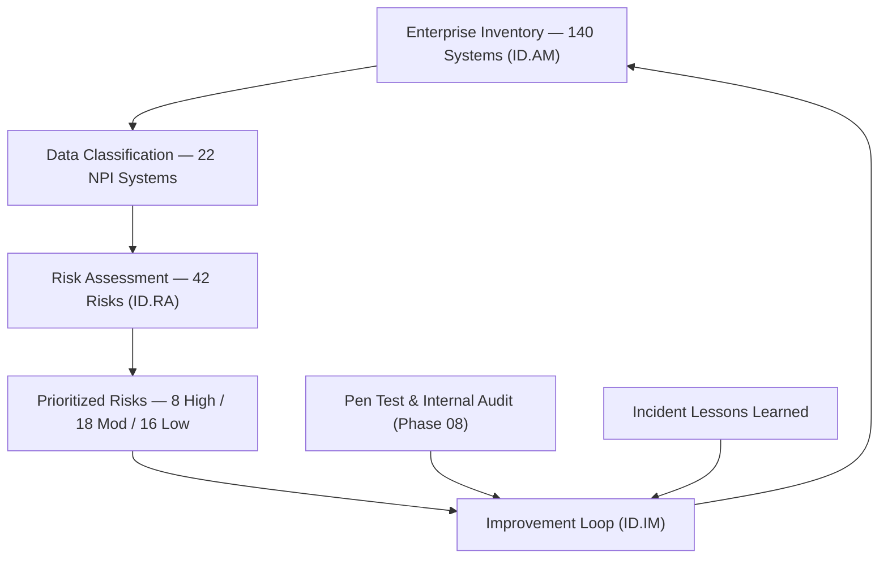

# 05.05 — NIST CSF 2.0 Identify (ID) Function

| Field | Value |
|---|---|
| Document ID | CCB-CSF-IDENTIFY-2026-505 |
| Version | 1.0 |
| Date | 2026-06-15 |
| Classification | Confidential — Nonpublic Information (NPI) // Illustrative Portfolio Sample |
| Owner | Marcus Doyle, IT Security Manager |
| Author | Advisory Team (Financial-Services GRC) |
| Status | Approved |

## Purpose

This document assesses the **Identify (ID)** function of NIST CSF 2.0 for Cornerstone Community Bank. Identify establishes the organizational understanding needed to manage cybersecurity risk to systems, people, assets, data, and capabilities. It scores the **three Identify Categories** against the five-level maturity scale (05.01), applies the **Intermediate (Level 3)** target from the Moderate inherent-risk determination (05.03), and records the resulting gaps. Identify contributes **5** of the program's **28** maturity gaps.

## The Three Identify Categories

| Category ID | Category | Focus |
|---|---|---|
| ID.AM | Asset Management | Inventory of hardware, software, data, and service dependencies. |
| ID.RA | Risk Assessment | Identifying, analyzing, and prioritizing cybersecurity risk. |
| ID.IM | Improvement | Learning from assessments, tests, and incidents to improve. |

Note: NIST CSF 2.0 relocated the former "Governance" and "Business Environment" content into the **Govern** function (05.04), leaving Identify focused on asset management, risk assessment, and continuous improvement.

## Current vs Target Maturity

Identify benefits from a strong Phase 02 asset inventory and a rigorous Phase 03 risk assessment, but is held back by **manual inventory maintenance, incomplete data-flow mapping, and an improvement loop that is not yet systematic**.

| Category | Current | Target | Delta | Assessment Basis |
|---|---|---|---|---|
| ID.AM — Asset Management | Evolving | Intermediate | 1 | 140-system inventory exists (Phase 02) but maintained semi-manually; data-flow maps partial. |
| ID.RA — Risk Assessment | Intermediate | Intermediate | 0 | Formal 800-30-based methodology; 42 risks rated (Phase 03); annual cadence. |
| ID.IM — Improvement | Evolving | Intermediate | 1 | Lessons-learned captured ad hoc; no closed-loop improvement register. |

## Gap Detail — Identify (5 Gaps)

Identify's gaps cluster in **asset management fidelity** and **closed-loop improvement** — the risk-assessment engine itself is already at target.

| Gap ID | Category | Gap Description | Size | Target Action | Owner |
|---|---|---|---|---|---|
| ID-G1 | ID.AM | Asset inventory maintained semi-manually; drift between inventory and reality. | Moderate | Automate discovery/reconciliation feeding the CMDB monthly. | Marcus Doyle |
| ID-G2 | ID.AM | Data-flow maps for NPI across the 22 systems are incomplete. | Moderate | Complete NPI data-flow diagrams incl. Meridian interfaces. | Marcus Doyle |
| ID-G3 | ID.AM | Software/end-of-life tracking not consistently linked to patch program. | Minor | Add EOL/EOS flags to inventory; feed vulnerability mgmt (04.09). | IT Operations |
| ID-G4 | ID.IM | No formal, tracked improvement register spanning tests, audits, incidents. | Moderate | Stand up a CSF improvement register with owners &amp; due dates. | CISO |
| ID-G5 | ID.IM | Post-incident/post-test lessons not systematically fed back into risk assessment. | Minor | Formalize lessons-learned → risk-register update workflow. | CRO |

## Asset Management and the Meridian Dependency (ID.AM)

Asset management must account for **service dependencies**, not just owned hardware and software. Cornerstone's most significant dependency is **Meridian Core Services**, which operates the core and digital-banking platforms. Gap ID-G2 specifically requires the NPI data-flow maps to trace data crossing the Meridian boundary, so that downstream Protect and Detect controls (and Meridian's CUECs) can be validated against actual flows.

| Asset Class | Inventory Status | Target State |
|---|---|---|
| Hardware / endpoints | Tracked; semi-manual | Automated discovery + reconciliation |
| Software / applications | Tracked; EOL flags partial | EOL/EOS lifecycle tracking |
| Data / NPI stores | 22 systems identified; flows partial | Complete NPI data-flow maps |
| Service dependencies | Meridian + key vendors listed | CSF-aligned dependency register |

## Subcategory Highlights

Identify covers **21 of the 106 Subcategories**. Selected observations:

| Subcategory (illustrative) | Observation | Status |
|---|---|---|
| ID.AM-01 (hardware inventoried) | Tracked but semi-manual; drift risk. | Gap ID-G1 |
| ID.AM-07 (data flows mapped) | NPI flows across 22 systems incomplete. | Gap ID-G2 |
| ID.RA-01 (vulnerabilities identified) | Monthly scanning + pen test (Phase 08). | At target |
| ID.RA-05 (risks prioritized) | 42 risks rated 8/18/16 (Phase 03). | At target |
| ID.IM-01 (improvements identified) | Lessons captured ad hoc; no register. | Gap ID-G4 |

## Remediation Sequencing

Identify gaps are sequenced so that accurate asset visibility (a Detect prerequisite) lands before the improvement loop is formalized.

| Priority | Gap | Target Window | Dependency |
|---|---|---|---|
| 1 | ID-G1 (automated inventory) | Near-term | CMDB tooling |
| 2 | ID-G2 (NPI data-flow maps) | Near-term | Meridian interface docs |
| 3 | ID-G4 (improvement register) | Mid-term | Phase 08 outputs |
| 4 | ID-G3 (EOL tracking) | Mid-term | Patch program (04.09) |
| 5 | ID-G5 (lessons → risk loop) | Mid-term | Risk register |

## Roll-Up

| Metric | Value |
|---|---|
| Categories assessed | 3 |
| Categories at target (Intermediate) | 1 (ID.RA) |
| Categories below target | 2 (ID.AM, ID.IM) |
| Identify maturity gaps | 5 (of 28 program-wide) |
| Largest single gaps | ID-G1, ID-G2, ID-G4 — Moderate |

Identify's risk-assessment core is mature; the improvement is to make **asset visibility automated** and the **improvement loop systematic**, so that Detect and Respond controls are aimed at an accurate, current picture of the environment.

## Cross-References

- **Phase 02** — Asset inventory and data classification (ID.AM source).
- **03.01 / 03.07** — Risk methodology and register (ID.RA).
- **04.09** — Vulnerability &amp; patch management (consumes EOL data, ID-G3).
- **05.03** — Inherent-risk-to-target alignment.
- **05.07** — Detect function (depends on accurate asset visibility).
- **Phase 08** — Independent testing feeding the improvement loop (ID.IM).

---
[⬅ Previous](05.04-nist-csf-govern-function.md) · [🏠 Phase README](05.00-README.md) · [Next ➡](05.06-nist-csf-protect-function.md)
