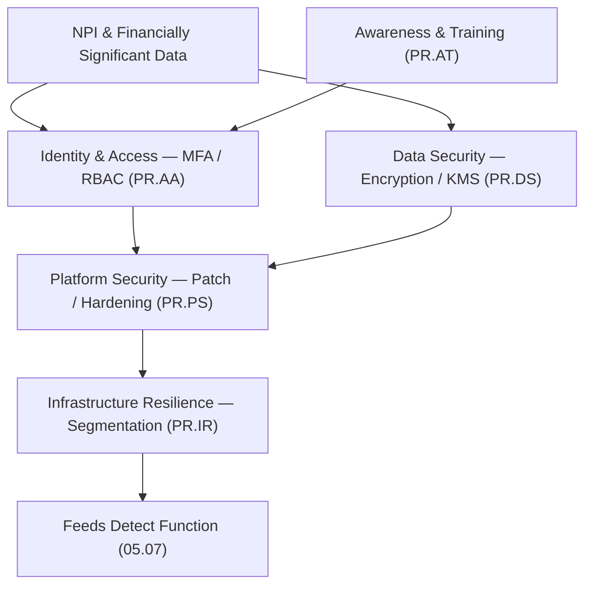

# 05.06 — NIST CSF 2.0 Protect (PR) Function

| Field | Value |
|---|---|
| Document ID | CCB-CSF-PROTECT-2026-506 |
| Version | 1.0 |
| Date | 2026-06-15 |
| Classification | Confidential — Nonpublic Information (NPI) // Illustrative Portfolio Sample |
| Owner | Marcus Doyle, IT Security Manager |
| Author | Advisory Team (Financial-Services GRC) |
| Status | Approved |

## Purpose

This document assesses the **Protect (PR)** function of NIST CSF 2.0 for Cornerstone Community Bank. Protect covers the safeguards that limit or contain the impact of cybersecurity events. It is the Bank's **strongest function** because Phase 04 delivered a mature set of preventive controls — **MFA, encryption, patch/vulnerability management, hardening, and awareness training**. The assessment scores the **five Protect Categories** against the five-level maturity scale (05.01), applies the **Intermediate (Level 3)** target, and records the **fewest gaps of any function** — Protect contributes just **3** of the program's **28** maturity gaps.

## The Five Protect Categories

| Category ID | Category | Focus | Primary Phase 04 Controls |
|---|---|---|---|
| PR.AA | Identity Management, Authentication &amp; Access Control | Identity lifecycle, MFA, least privilege. | 04.06, 04.07 |
| PR.AT | Awareness &amp; Training | Security awareness, phishing simulation, role-based training. | 04.12 |
| PR.DS | Data Security | Encryption at rest/in transit, key management, media sanitization. | 04.08 |
| PR.PS | Platform Security | Secure configuration, hardening, patch/vulnerability management. | 04.09, 04.11 |
| PR.IR | Technology Infrastructure Resilience | Network segmentation, protective resilience of infrastructure. | 04.04, 04.11 |

## Current vs Target Maturity

Protect is at or near target across the board. Two Categories (PR.AA, PR.DS) already reach **Intermediate**; the remainder sit at the top of **Evolving** with narrow, well-understood gaps.

| Category | Current | Target | Delta | Assessment Basis |
|---|---|---|---|---|
| PR.AA — Identity &amp; Access | Intermediate | Intermediate | 0 | Enterprise MFA, RBAC, joiner/mover/leaver process (04.06–04.07). |
| PR.AT — Awareness &amp; Training | Intermediate | Intermediate | 0 | Annual + role-based training; monthly phishing simulations (04.12). |
| PR.DS — Data Security | Intermediate | Intermediate | 0 | AES-256 at rest, TLS 1.2+ in transit, KMS, NIST 800-88 sanitization (04.08). |
| PR.PS — Platform Security | Evolving | Intermediate | 1 | Patch SLAs &amp; hardening baselines exist; server-patch timeliness inconsistent (04.09, 04.11). |
| PR.IR — Infrastructure Resilience | Evolving | Intermediate | 1 | Segmentation in place; micro-segmentation &amp; resilience testing maturing (04.04). |

## Gap Detail — Protect (3 Gaps)

Protect's few gaps are refinements, not foundational weaknesses: tightening patch timeliness for servers, advancing segmentation, and extending privileged-access controls.

| Gap ID | Category | Gap Description | Size | Target Action | Owner |
|---|---|---|---|---|---|
| PR-G1 | PR.PS | Server-side patch timeliness inconsistent vs the defined SLA for high/critical CVEs. | Moderate | Enforce automated patch orchestration; measure SLA adherence monthly (04.09). | IT Operations |
| PR-G2 | PR.IR | Network segmentation coarse; NPI segments not micro-segmented from general LAN. | Moderate | Advance to micro-segmentation around the 22 NPI systems; test isolation. | Marcus Doyle |
| PR-G3 | PR.AA | Privileged access lacks full just-in-time (JIT) elevation and session recording. | Minor | Implement PAM with JIT elevation and privileged session monitoring. | Marcus Doyle |

## Why Protect Is the Strongest Function

Protect leads the maturity profile because the Phase 04 program invested heavily in preventive safeguards mapped directly to the 8 High risks. The controls below are already operating at Intermediate maturity and were corroborated by Phase 08 independent testing (pen test findings remediated; internal audit Satisfactory).

| Control Domain | Maturity Evidence | CSF Category |
|---|---|---|
| Multi-factor authentication | Enforced for remote, admin, and digital-banking access | PR.AA |
| Encryption | AES-256 at rest; TLS 1.2+ in transit; centralized key management | PR.DS |
| Vulnerability &amp; patch mgmt | Defined SLAs; monthly scanning; Redwood pen-test validation | PR.PS |
| Secure configuration | CIS-aligned hardening baselines; drift monitoring | PR.PS |
| Awareness &amp; training | Annual + role-based; monthly phishing simulations | PR.AT |
| Media sanitization | NIST SP 800-88 procedures | PR.DS |

## Subcategory Highlights

Protect covers **22 of the 106 Subcategories**, and the Bank meets the majority at Intermediate. Selected observations:

| Subcategory (illustrative) | Observation | Status |
|---|---|---|
| PR.AA-03 (authentication) | Enterprise MFA enforced (04.07). | At target |
| PR.DS-01 (data at rest) | AES-256 encryption; centralized KMS (04.08). | At target |
| PR.PS-02 (patch management) | Server patch timeliness inconsistent. | Gap PR-G1 |
| PR.IR-01 (network protection) | Segmentation coarse; not micro-segmented. | Gap PR-G2 |
| PR.AA-05 (privileged access) | No full JIT elevation / session recording. | Gap PR-G3 |

## Remediation Sequencing

Protect gaps are incremental hardening and are sequenced after the higher-pressure Detect work, since Protect is already near target.

| Priority | Gap | Target Window | Dependency |
|---|---|---|---|
| 1 | PR-G1 (patch orchestration) | Near-term | ID-G3 (EOL data) |
| 2 | PR-G2 (micro-segmentation) | Mid-term | ID-G2 (data flows) |
| 3 | PR-G3 (PAM / JIT) | Mid-term | PAM tooling |

## Roll-Up

| Metric | Value |
|---|---|
| Categories assessed | 5 |
| Categories at target (Intermediate) | 3 (PR.AA, PR.AT, PR.DS) |
| Categories below target | 2 (PR.PS, PR.IR) |
| Protect maturity gaps | 3 (of 28 program-wide) — fewest of any function |
| Largest single gaps | PR-G1, PR-G2 — Moderate |

Protect's strength is deliberate: the Bank's preventive posture is mature, and the residual work is incremental hardening (patch orchestration, micro-segmentation, PAM). The maturity emphasis for the remaining roadmap shifts decisively toward **Detect, Respond, and Recover**.

## Cross-References

- **04.06 / 04.07** — Access control, IAM, authentication &amp; MFA (PR.AA).
- **04.08** — Encryption and key management (PR.DS).
- **04.09 / 04.11** — Vulnerability/patch management and hardening (PR.PS).
- **04.12** — Security awareness and training (PR.AT).
- **05.03** — Inherent-risk-to-target alignment.
- **05.07** — Detect function (consumes Protect telemetry).
- **Phase 08** — Independent testing validating Protect controls.

---
[⬅ Previous](05.05-nist-csf-identify-function.md) · [🏠 Phase README](05.00-README.md) · [Next ➡](05.07-nist-csf-detect-function.md)
