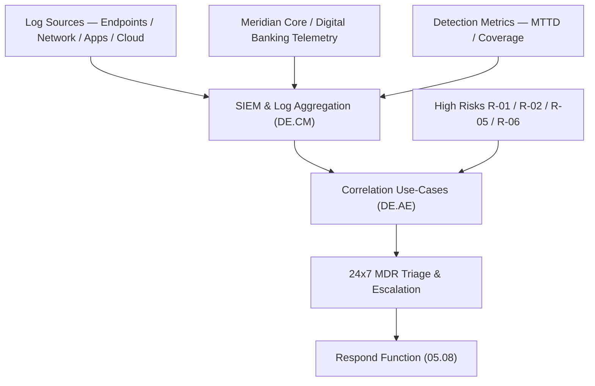

# 05.07 — NIST CSF 2.0 Detect (DE) Function

| Field | Value |
|---|---|
| Document ID | CCB-CSF-DETECT-2026-507 |
| Version | 1.0 |
| Date | 2026-06-15 |
| Classification | Confidential — Nonpublic Information (NPI) // Illustrative Portfolio Sample |
| Owner | Marcus Doyle, IT Security Manager |
| Author | Advisory Team (Financial-Services GRC) |
| Status | Approved |

## Purpose

This document assesses the **Detect (DE)** function of NIST CSF 2.0 for Cornerstone Community Bank. Detect covers the timely discovery and analysis of adverse cybersecurity events. Together with Respond and Recover, it is one of the **areas needing the most maturity work** — the Bank's monitoring is functional but not yet consistent, correlated, and measured across all 22 NPI systems. The assessment scores the **two Detect Categories** against the five-level maturity scale (05.01), applies the **Intermediate (Level 3)** target, and records the **largest single-function gap count** — Detect contributes **6** of the program's **28** maturity gaps.

## The Two Detect Categories

| Category ID | Category | Focus |
|---|---|---|
| DE.CM | Continuous Monitoring | Monitoring assets, network, personnel activity, and external service providers to find anomalies. |
| DE.AE | Adverse Event Analysis | Analyzing anomalies and indicators to characterize events and support response. |

## Current vs Target Maturity

Both Detect Categories sit **below target**. A SIEM and 24x7 managed detection exist (04.10), but log coverage is incomplete, correlation use-cases are limited, and detection performance is not yet measured against defined objectives.

| Category | Current | Target | Delta | Assessment Basis |
|---|---|---|---|---|
| DE.CM — Continuous Monitoring | Evolving | Intermediate | 1 | SIEM + MDR in place; log coverage < 100% of NPI systems; Meridian telemetry limited. |
| DE.AE — Adverse Event Analysis | Baseline | Intermediate | 2 | Alert triage functional but few correlated use-cases; no formal detection-engineering process. |

## Gap Detail — Detect (6 Gaps)

Detect carries the heaviest gap load. The gaps span **coverage** (getting all NPI systems and Meridian telemetry into the SIEM), **analytics** (building correlated, risk-aligned use-cases), and **measurement** (proving detection works).

| Gap ID | Category | Gap Description | Size | Target Action | Owner |
|---|---|---|---|---|---|
| DE-G1 | DE.CM | Log coverage below 100% of the 22 NPI-bearing systems. | Significant | Onboard all NPI systems to the SIEM; enforce logging baselines (04.11). | Marcus Doyle |
| DE-G2 | DE.CM | Meridian core/digital-banking telemetry not integrated into monitoring. | Significant | Establish Meridian log/alert feed per SOC CUECs; monitor digital-banking events. | Marcus Doyle |
| DE-G3 | DE.AE | Correlation use-cases limited; not mapped to the 8 High risks. | Moderate | Build detection use-cases for ATO, ransomware, DLP, and privilege abuse. | IT Security |
| DE-G4 | DE.AE | No formal detection-engineering / use-case lifecycle process. | Moderate | Adopt detection-engineering workflow with tuning &amp; peer review. | Marcus Doyle |
| DE-G5 | DE.CM | Detection performance not measured (no MTTD / coverage KPIs). | Moderate | Define &amp; report MTTD, coverage %, and alert-quality metrics monthly. | CISO |
| DE-G6 | DE.AE | Threat intelligence not systematically fed into detection content. | Minor | Integrate FS-ISAC/threat feeds into SIEM enrichment &amp; use-case tuning. | IT Security |

## Continuous Monitoring Coverage (DE.CM)

The central Detect deficiency is **coverage**. Effective continuous monitoring requires that every NPI-bearing system — and the outsourced Meridian platform — emit security-relevant logs into the SIEM. Today, coverage is partial, which limits the value of downstream analytics and response.

| Monitoring Domain | Current State | Target State |
|---|---|---|
| Endpoint / server logs | Majority onboarded | 100% of NPI + SOX systems |
| Network / perimeter | Monitored | Full east-west visibility |
| Digital-banking (Meridian) | Limited | Integrated event feed per CUECs |
| Identity / authentication | MFA + auth logs onboarded | ATO / impossible-travel analytics |
| Cloud / SaaS | Partial | Full API-based log ingestion |

## Adverse Event Analysis (DE.AE)

Analytical maturity lags coverage. Alerts are triaged by a 24x7 MDR capability (04.10), but the Bank has **few correlated, risk-aligned use-cases** and **no formal detection-engineering lifecycle** to build, tune, and retire them. Closing DE-G3 through DE-G6 moves DE.AE from Baseline to Intermediate by aligning detection content to the 8 High risks, adding a tuning process, integrating threat intelligence, and measuring detection performance.

## Subcategory Highlights

Detect covers **11 of the 106 Subcategories**, and the Bank currently meets few at Intermediate. Selected observations:

| Subcategory (illustrative) | Observation | Status |
|---|---|---|
| DE.CM-01 (network monitoring) | SIEM present; coverage < 100% of NPI. | Gap DE-G1 |
| DE.CM-06 (external providers) | Meridian telemetry not integrated. | Gap DE-G2 |
| DE.CM-09 (computing hardware/software) | Endpoint logs mostly onboarded. | Partial |
| DE.AE-02 (analyze events) | Few correlated, risk-aligned use-cases. | Gap DE-G3 |
| DE.AE-07 (threat intel integrated) | Feeds not systematically applied. | Gap DE-G6 |

## Remediation Sequencing

Detect is first in the enterprise roadmap because it delivers the largest posture improvement and unblocks Respond/Recover.

| Priority | Gap | Target Window | Dependency |
|---|---|---|---|
| 1 | DE-G1 (NPI log coverage) | Immediate | ID-G1 asset visibility |
| 2 | DE-G2 (Meridian telemetry) | Immediate | GV-G4 CUEC mapping |
| 3 | DE-G3 (risk-aligned use-cases) | Near-term | High-risk scenarios (03.07) |
| 4 | DE-G5 (detection metrics) | Near-term | Feeds GV-G2 board KRIs |
| 5 | DE-G4 (detection engineering) | Mid-term | Use-case backlog |
| 6 | DE-G6 (threat-intel integration) | Mid-term | FS-ISAC feed |

## Roll-Up

| Metric | Value |
|---|---|
| Categories assessed | 2 |
| Categories at target (Intermediate) | 0 |
| Categories below target | 2 (DE.CM, DE.AE) |
| Detect maturity gaps | 6 (of 28 program-wide) — most of any function |
| Largest single gaps | DE-G1, DE-G2 — Significant |

Detect is the pivot point of the maturity roadmap. It consumes the mature Protect telemetry (05.06) and feeds the Respond and Recover functions (05.08–05.09). Raising Detect to Intermediate — chiefly by closing coverage gaps and building risk-aligned analytics — delivers the largest single improvement to the Bank's overall cybersecurity posture.

## Cross-References

- **04.10** — Logging, monitoring, and detection controls (SIEM/MDR).
- **04.11** — Secure configuration/hardening (logging baselines feeding DE.CM).
- **05.06** — Protect function (telemetry source for detection).
- **05.08** — Respond function (consumes Detect output).
- **03.07** — High risks (R-01, R-02, R-05, R-06) driving detection use-cases.
- **Phase 07** — Meridian oversight and 36-hour incident-notification workflow.

---
[⬅ Previous](05.06-nist-csf-protect-function.md) · [🏠 Phase README](05.00-README.md) · [Next ➡](05.08-nist-csf-respond-function.md)
