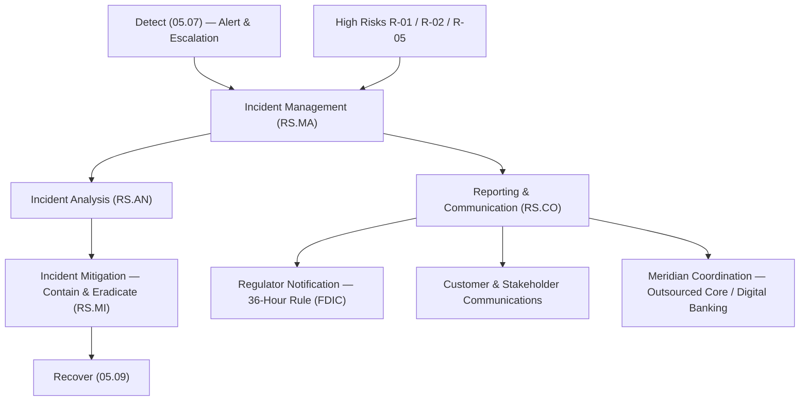

# 05.08 — NIST CSF 2.0 Respond (RS) Function

| Field | Value |
|---|---|
| Document ID | CCB-CSF-RESPOND-2026-508 |
| Version | 1.0 |
| Date | 2026-06-15 |
| Classification | Confidential — Nonpublic Information (NPI) // Illustrative Portfolio Sample |
| Owner | Marcus Doyle, IT Security Manager |
| Author | Advisory Team (Financial-Services GRC) |
| Status | Approved |

## Purpose

This document assesses the **Respond (RS)** function of NIST CSF 2.0 for Cornerstone Community Bank. Respond covers the actions taken once a cybersecurity incident is detected: managing the incident, analyzing it, reporting and communicating, and mitigating its effects. Along with Detect (05.07) and Recover (05.09), Respond is one of the **three weakest functions** in the current profile. The Bank has an incident-response capability and a 24x7 managed-detection escalation path (04.10), but its incident-response plan is **not yet formalized, exercised, or fully aligned** to the regulatory **36-hour Computer-Security Incident Notification Rule** and to the outsourced **Meridian Core Services** boundary.

This assessment scores the **four Respond Categories** against the **five-level maturity scale** — **Baseline → Evolving → Intermediate → Advanced → Innovative** — applies the **Intermediate (Level 3)** target profile, and records **5** of the program's **28** maturity gaps.

## Scope and Method

Respond is assessed as one of the **6 Functions** of NIST CSF 2.0 (which comprises 22 Categories and 106 Subcategories in total). The Respond function contributes **4 of the 22 Categories**. Scoring reflects the Bank's **Moderate** overall inherent risk, the outsourcing of core and digital banking to Meridian, and the population of **22 NPI-bearing systems** and **6 SOX-significant systems** that any incident could touch.

## The Four Respond Categories

| Category ID | Category | Focus |
|---|---|---|
| RS.MA | Incident Management | Executing and managing the incident-response process once an incident is declared. |
| RS.AN | Incident Analysis | Analysis to ensure effective response and to support forensics and recovery. |
| RS.CO | Incident Response Reporting &amp; Communication | Coordinating response activities with internal and external stakeholders, including regulators. |
| RS.MI | Incident Mitigation | Containing and eradicating incidents to limit impact. |

## Current vs Target Maturity

All four Respond Categories sit **below the Intermediate target**. The building blocks exist — an escalation path, a security team, and MDR support — but the plan is informal, playbooks are thin, and the regulatory-notification and communications runbooks are not documented or tested.

| Category | Current | Target | Delta | Assessment Basis |
|---|---|---|---|---|
| RS.MA — Incident Management | Evolving | Intermediate | 1 | IR capability exists; plan not board-approved, roles informal, no annual tabletop. |
| RS.AN — Incident Analysis | Evolving | Intermediate | 1 | MDR performs triage; forensic readiness &amp; evidence-handling procedures immature. |
| RS.CO — Incident Reporting &amp; Communication | Baseline | Intermediate | 2 | No documented 36-hour notification runbook; customer/stakeholder comms plan incomplete. |
| RS.MI — Incident Mitigation | Evolving | Intermediate | 1 | Ad hoc containment; playbooks for ransomware/ATO/DLP not standardized. |

## Gap Detail — Respond (5 Gaps)

Respond carries **5 maturity gaps**. They cluster around **formalization** (a board-approved, tested plan), **playbooks** (repeatable containment for the most likely scenarios), and **communication** (the 36-hour regulatory notification and stakeholder messaging).

| Gap ID | Category | Gap Description | Size | Target Action | Owner |
|---|---|---|---|---|---|
| RS-G1 | RS.MA | Incident-response plan not formalized, board-approved, or exercised via annual tabletop. | Significant | Finalize IR plan; assign roles/RACI; run annual tabletop and after-action reviews. | Marcus Doyle |
| RS-G2 | RS.MI | Scenario playbooks (ransomware, account takeover, data loss/DLP) not standardized. | Significant | Build and test containment/eradication playbooks for top scenarios. | IT Security |
| RS-G3 | RS.CO | No documented 36-hour regulatory notification runbook for "notification incidents." | Significant | Author 36-hour FDIC notification runbook with decision tree, owners, and timers. | Rachel Alvarez |
| RS-G4 | RS.CO | Incident communications plan (internal, customer, media, regulator) incomplete. | Moderate | Develop tiered comms plan with pre-approved templates and legal/Compliance review. | Angela Foster |
| RS-G5 | RS.AN | Coordination with Meridian for outsourced incidents not formalized; forensic readiness immature. | Moderate | Establish Meridian incident-coordination protocol per SOC CUECs; define evidence handling. | Marcus Doyle |

## Incident Management &amp; Mitigation (RS.MA / RS.MI)

The core of Respond is a **repeatable, exercised process**. Cornerstone can currently mobilize a response, but the process depends on individual knowledge rather than a documented, rehearsed plan. Closing **RS-G1** (formalize and test the plan) and **RS-G2** (standardize scenario playbooks) moves these Categories to Intermediate and directly reduces the impact of the Bank's highest-rated risks — ransomware, account takeover, and data exfiltration.

| Response Capability | Current State | Target State |
|---|---|---|
| IR plan | Informal / draft | Board-approved, versioned, owner-assigned |
| Roles &amp; RACI | Implicit | Documented incident-commander model |
| Tabletop exercises | None in last cycle | Annual, with after-action tracking |
| Scenario playbooks | Ad hoc | Standardized for ransomware / ATO / DLP |
| Containment tooling | Manual isolation | Semi-automated host/identity isolation |

## Reporting &amp; Communication (RS.CO)

RS.CO is the **weakest Respond Category (Baseline)** and the one of greatest examiner interest, because it carries the **36-hour Computer-Security Incident Notification Rule** obligation to notify the FDIC of a qualifying "notification incident." The Bank must be able to recognize a notification incident, start the clock, and communicate consistently across internal, customer, regulator, and media audiences — including where the incident originates at **Meridian**.

| Communication Channel | Trigger | Owner | Current Gap |
|---|---|---|---|
| FDIC 36-hour notification | Qualifying notification incident | CISO (Rachel Alvarez) | No runbook / timer (RS-G3) |
| Customer notification | NPI compromise (state law + Reg P) | Privacy Officer (Karen Ellis) | Templates incomplete (RS-G4) |
| Internal / executive brief | Any Sev-1/Sev-2 incident | IT Security Manager | Informal (RS-G4) |
| Meridian coordination | Incident at outsourced platform | Marcus Doyle | Not formalized (RS-G5) |

## Subcategory Highlights

Respond's Subcategories draw from the CSF 2.0 catalog of 106 Subcategories. Selected observations against the Intermediate target:

| Subcategory (illustrative) | Observation | Status |
|---|---|---|
| RS.MA-01 (IR process executed) | Capability exists; plan informal. | Gap RS-G1 |
| RS.MA-02 (incidents triaged &amp; validated) | MDR triages; criteria not documented. | Partial |
| RS.AN-03 (forensics performed) | Forensic readiness immature. | Gap RS-G5 |
| RS.CO-02 (incidents reported) | No 36-hour runbook. | Gap RS-G3 |
| RS.CO-03 (information shared) | Comms templates incomplete. | Gap RS-G4 |
| RS.MI-01 / RS.MI-02 (contain / eradicate) | Ad hoc; playbooks not standardized. | Gap RS-G2 |

## Remediation Sequencing

Respond is prioritized immediately after Detect because a validated response capability is what converts detection into contained impact and satisfies the 36-hour obligation.

| Priority | Gap | Target Window | Dependency |
|---|---|---|---|
| 1 | RS-G3 (36-hour notification runbook) | Immediate | Detect coverage (05.07); Legal/Compliance |
| 2 | RS-G1 (formalize &amp; test IR plan) | Near-term | Board/Audit Committee approval |
| 3 | RS-G2 (scenario playbooks) | Near-term | High-risk scenarios (03.07) |
| 4 | RS-G4 (communications plan) | Near-term | Privacy Officer / Compliance |
| 5 | RS-G5 (Meridian coordination) | Mid-term | GV-G4 CUEC mapping; Phase 07 |

## Roll-Up

| Metric | Value |
|---|---|
| Categories assessed | 4 (RS.MA, RS.AN, RS.CO, RS.MI) |
| Categories at target (Intermediate) | 0 |
| Categories below target | 4 |
| Respond maturity gaps | 5 (of 28 program-wide) |
| Largest single gaps | RS-G1, RS-G2, RS-G3 — Significant |

Respond consumes the output of Detect (05.07) and hands off to Recover (05.09). Raising Respond to Intermediate — chiefly by formalizing and testing the IR plan, standardizing playbooks, and documenting the 36-hour notification and communications runbooks — is one of the highest-value moves in the remediation roadmap (05.12) and a focus area for the FFIEC IT examination.

## Cross-References

- **04.10** — Logging, monitoring, and detection controls (MDR escalation feeding Respond).
- **05.07** — Detect function (produces the alerts Respond acts on).
- **05.09** — Recover function (receives contained incidents for restoration).
- **05.11** — Consolidated maturity gap register (RS-G1…RS-G5 mapped to G-IDs).
- **03.07** — High risks (R-01, R-02, R-05) driving response playbooks.
- **Phase 07** — Meridian oversight, BCP/DR, and the 36-hour incident-notification workflow.

---
[⬅ Previous](05.07-nist-csf-detect-function.md) · [🏠 Phase README](05.00-README.md) · [Next ➡](05.09-nist-csf-recover-function.md)
