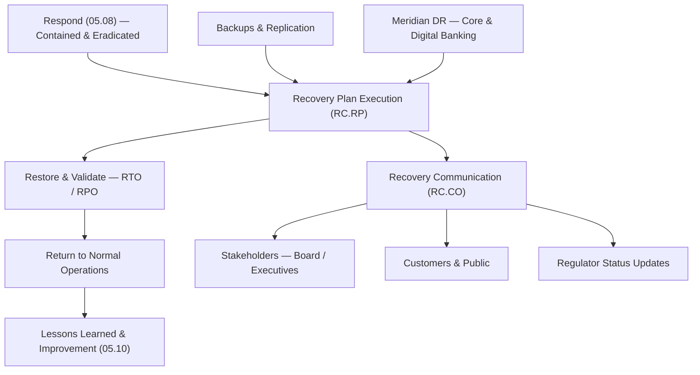

# 05.09 — NIST CSF 2.0 Recover (RC) Function

| Field | Value |
|---|---|
| Document ID | CCB-CSF-RECOVER-2026-509 |
| Version | 1.0 |
| Date | 2026-06-15 |
| Classification | Confidential — Nonpublic Information (NPI) // Illustrative Portfolio Sample |
| Owner | Marcus Doyle, IT Security Manager |
| Author | Advisory Team (Financial-Services GRC) |
| Status | Approved |

## Purpose

This document assesses the **Recover (RC)** function of NIST CSF 2.0 for Cornerstone Community Bank. Recover covers the restoration of assets and operations affected by a cybersecurity incident, and the communication that accompanies recovery. Together with Detect (05.07) and Respond (05.08), Recover is one of the **three weakest functions** in the current profile. Cornerstone maintains backups and a business-continuity/disaster-recovery (BCP/DR) capability anchored on the outsourced **Meridian Core Services** platform, but restoration is **not tested at a defined cadence**, recovery playbooks are thin, and **RTO/RPO objectives are defined but not validated** through exercises.

This assessment scores the **two Recover Categories** against the **five-level maturity scale** — **Baseline → Evolving → Intermediate → Advanced → Innovative** — applies the **Intermediate (Level 3)** target profile, and records **4** of the program's **28** maturity gaps.

## Scope and Method

Recover is one of the **6 Functions** of NIST CSF 2.0 (22 Categories and 106 Subcategories in total) and contributes **2 of the 22 Categories**. Recovery scope spans the **22 NPI-bearing systems** and the **6 SOX-significant systems**, with the material dependency being **Meridian**, which hosts core banking and digital banking. Because the core is outsourced, much of the Bank's recovery posture depends on Meridian's DR program and the Bank's ability to validate it — reinforcing the need for tested procedures rather than reliance alone.

## The Two Recover Categories

| Category ID | Category | Focus |
|---|---|---|
| RC.RP | Incident Recovery Plan Execution | Restoring systems and data and returning to normal operations. |
| RC.CO | Incident Recovery Communication | Coordinating recovery status with internal and external stakeholders. |

## Current vs Target Maturity

Both Recover Categories sit **below the Intermediate target**. Backups and a DR arrangement exist, but the capability is unproven because restoration and failover are not regularly exercised and objectives are not validated.

| Category | Current | Target | Delta | Assessment Basis |
|---|---|---|---|---|
| RC.RP — Incident Recovery Plan Execution | Evolving | Intermediate | 1 | Backups &amp; DR exist; restoration not tested at cadence; RTO/RPO unvalidated. |
| RC.CO — Incident Recovery Communication | Baseline | Intermediate | 2 | Recovery status comms to stakeholders/customers/regulators not planned or templated. |

## Gap Detail — Recover (4 Gaps)

Recover carries **4 maturity gaps**, concentrated in **proving** the recovery capability: testing restoration, documenting recovery playbooks, validating RTO/RPO, and planning recovery communications.

| Gap ID | Category | Gap Description | Size | Target Action | Owner |
|---|---|---|---|---|---|
| RC-G1 | RC.RP | Backup restoration and DR failover not tested at a defined cadence. | Significant | Establish scheduled restore/failover tests (incl. Meridian) with documented results. | Marcus Doyle |
| RC-G2 | RC.RP | Recovery playbooks not documented for priority systems and NPI data. | Moderate | Author per-system recovery runbooks with sequencing and dependencies. | IT Operations |
| RC-G3 | RC.RP | RTO/RPO objectives defined but not validated against actual recovery performance. | Moderate | Measure recovery time/point against objectives during tests; close variances. | Marcus Doyle |
| RC-G4 | RC.CO | Recovery communications (stakeholders, customers, regulators) not planned/templated. | Minor | Build recovery-status comms plan with cadence, owners, and pre-approved templates. | Angela Foster |

## Recovery Plan Execution (RC.RP)

The central Recover deficiency is **untested restoration**. Backups and a DR arrangement provide the raw capability, but without regular, documented restore and failover tests, the Bank cannot demonstrate it will meet its recovery objectives during a real incident. Closing **RC-G1**, **RC-G2**, and **RC-G3** proves the capability end to end and lifts RC.RP to Intermediate.

| Recovery Element | Current State | Target State |
|---|---|---|
| Backups | Performed &amp; monitored | Immutable / air-gapped copies for critical data |
| Restore testing | Ad hoc | Scheduled restore tests with sign-off |
| DR failover | Arrangement in place (Meridian) | Exercised annually, results documented |
| Recovery playbooks | Thin / informal | Per-system runbooks with sequencing |
| RTO / RPO | Defined | Validated against test results |

## RTO / RPO Validation (RC-G3)

Recovery objectives exist on paper but are **unvalidated**. The remediation establishes measurement against objectives during each test so that gaps between target and actual performance are visible and closed. Illustrative objectives for priority systems:

| System Tier | Illustrative RTO | Illustrative RPO | Validation Status |
|---|---|---|---|
| Core banking (Meridian) | ≤ 4 hours | ≤ 15 minutes | To be validated with Meridian (RC-G1/RC-G3) |
| Digital banking (Meridian) | ≤ 4 hours | ≤ 15 minutes | To be validated (RC-G3) |
| Internal NPI systems | ≤ 24 hours | ≤ 4 hours | Restore test pending (RC-G1) |
| Reporting / SOX systems | ≤ 24 hours | ≤ 24 hours | Restore test pending (RC-G1) |

## Recovery Communication (RC.CO)

RC.CO is the **weaker Recover Category (Baseline)**. During recovery, stakeholders — the Board, executives, customers, and regulators — need timely, consistent status updates. Today there is no planned cadence or template set. Gap **RC-G4** builds a recovery-communications plan that dovetails with the Respond communications work (RS-G4, 05.08) so that response messaging transitions cleanly into recovery messaging.

## Subcategory Highlights

Recover's Subcategories draw from the CSF 2.0 catalog of 106 Subcategories. Selected observations against the Intermediate target:

| Subcategory (illustrative) | Observation | Status |
|---|---|---|
| RC.RP-01 (recovery plan executed) | Plan exists; not exercised. | Gap RC-G1 |
| RC.RP-02 (recovery actions selected/scoped) | Playbooks thin. | Gap RC-G2 |
| RC.RP-04 (integrity of restored assets verified) | Verification not standardized. | Partial |
| RC.RP-05 (normal operations restored) | RTO/RPO unvalidated. | Gap RC-G3 |
| RC.CO-03 / RC.CO-04 (recovery communicated) | No planned status comms. | Gap RC-G4 |

## Remediation Sequencing

Recover follows Detect and Respond in the roadmap because a proven recovery capability is what limits the duration and cost of an incident once it has been contained.

| Priority | Gap | Target Window | Dependency |
|---|---|---|---|
| 1 | RC-G1 (restore / failover testing) | Near-term | Meridian coordination (RS-G5, Phase 07) |
| 2 | RC-G3 (RTO/RPO validation) | Near-term | RC-G1 test results |
| 3 | RC-G2 (recovery playbooks) | Mid-term | Asset/data-flow maps (ID-G2) |
| 4 | RC-G4 (recovery comms plan) | Mid-term | Response comms plan (RS-G4) |

## Roll-Up

| Metric | Value |
|---|---|
| Categories assessed | 2 (RC.RP, RC.CO) |
| Categories at target (Intermediate) | 0 |
| Categories below target | 2 |
| Recover maturity gaps | 4 (of 28 program-wide) |
| Largest single gap | RC-G1 (untested restoration / DR) — Significant |

Recover closes the incident lifecycle that begins at Detect (05.07) and passes through Respond (05.08). Raising Recover to Intermediate — chiefly by testing restoration and DR failover, documenting recovery playbooks, validating RTO/RPO, and planning recovery communications — completes the six-function assessment and feeds the overall scorecard (05.10) and remediation roadmap (05.12).

## Cross-References

- **05.07** — Detect function (start of the incident lifecycle).
- **05.08** — Respond function (containment feeding recovery; comms alignment RS-G4/RC-G4).
- **05.10** — Maturity scoring and target profile (Recover roll-up into the scorecard).
- **05.11** — Consolidated maturity gap register (RC-G1…RC-G4 mapped to G-IDs).
- **ID-G2** — NPI data-flow maps (input to per-system recovery playbooks).
- **Phase 07** — BCP/DR program, Meridian DR reliance, RTO/RPO, and tabletop exercises.

---
[⬅ Previous](05.08-nist-csf-respond-function.md) · [🏠 Phase README](05.00-README.md) · [Next ➡](05.10-maturity-scoring-and-target-profile.md)
