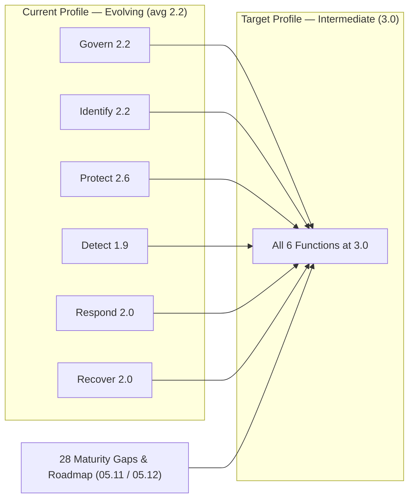
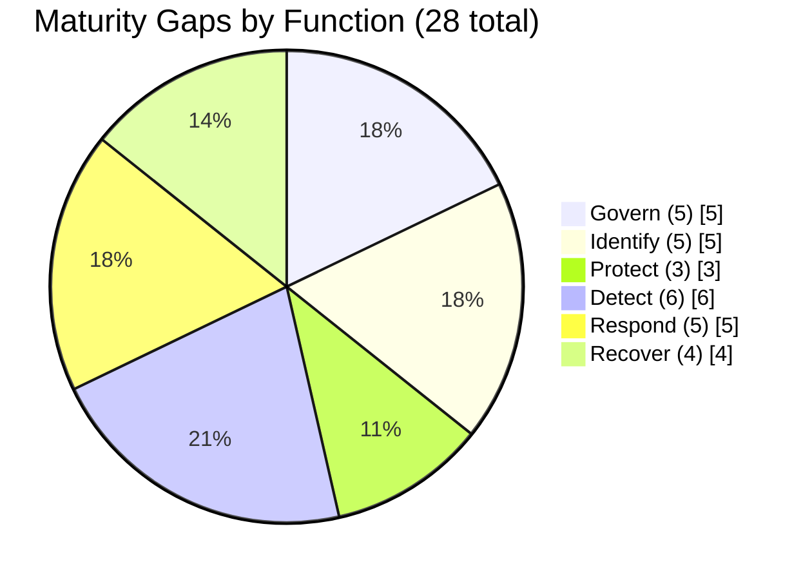

# 05.10 — Maturity Scoring &amp; Target Profile

| Field | Value |
|---|---|
| Document ID | CCB-CSF-SCORING-2026-510 |
| Version | 1.0 |
| Date | 2026-06-15 |
| Classification | Confidential — Nonpublic Information (NPI) // Illustrative Portfolio Sample |
| Owner | Rachel Alvarez, CISO |
| Author | Advisory Team (Financial-Services GRC) |
| Status | Approved |

## Purpose

This document consolidates the function-level assessments (05.04–05.09) into a single **maturity scorecard** for Cornerstone Community Bank and states the **target profile**. It establishes the Bank's **current profile** across all **6 NIST CSF 2.0 Functions**, the **Intermediate target**, and the **28 maturity gaps** that separate them. The scorecard is the anchor for the gap analysis (05.11) and remediation roadmap (05.12), and it is the artifact the FFIEC IT examination will reference for cybersecurity maturity.

## The Maturity Scale

Cornerstone scores maturity on a **five-level scale**, applied consistently across every Function, Category, and Subcategory:

| Level | Tier | Meaning |
|---|---|---|
| 1 | **Baseline** | Ad hoc / informal; controls exist but are inconsistent and undocumented. |
| 2 | **Evolving** | Repeatable and documented in parts; not yet consistent or measured. |
| 3 | **Intermediate** | Defined, consistently applied, and measured across scope. **← Target** |
| 4 | **Advanced** | Managed with metrics-driven improvement and automation. |
| 5 | **Innovative** | Optimizing / adaptive; leading practice, continuously improving. |

The **current profile is mostly "Evolving" (Level 2)**, with weaker Detect/Respond/Recover Categories dipping toward Baseline. The **target profile is "Intermediate" (Level 3)** across all six Functions — a deliberate, risk-based target appropriate to the Bank's **Moderate** overall inherent risk, its **~$1.2B** asset size, and its reliance on the outsourced **Meridian** core.

## Framework Coverage

The scorecard spans the full CSF 2.0 spine: **6 Functions, 22 Categories, 106 Subcategories.**

| Function | Categories | Role in Program |
|---|---|---|
| Govern (GV) | 6 | Oversight, risk management, third-party governance |
| Identify (ID) | 3 | Asset, data-flow, and improvement management |
| Protect (PR) | 5 | Safeguards over NPI and SOX systems |
| Detect (DE) | 2 | Monitoring and adverse-event analysis |
| Respond (RS) | 4 | Incident management, analysis, comms, mitigation |
| Recover (RC) | 2 | Recovery execution and communication |
| **Total** | **22** | — |

## Overall Maturity Scorecard

Each Function is scored at a modal current tier, assigned the Intermediate target, and carries its share of the 28 gaps. Protect is the **strongest** Function (fewest, lightest gaps); Detect, Respond, and Recover are the **weakest** and drive the roadmap sequencing.

| Function | Current Tier | Target Tier | Current Score (1–5) | Target Score | Gap Count | Notes |
|---|---|---|---|---|---|---|
| Govern (GV) | Evolving | Intermediate | 2.2 | 3.0 | 5 | Meridian CUEC ownership + board KRIs |
| Identify (ID) | Evolving | Intermediate | 2.2 | 3.0 | 5 | Asset drift + NPI data-flow maps |
| Protect (PR) | Evolving (approaching Intermediate) | Intermediate | 2.6 | 3.0 | 3 | **Strongest**; patch/segmentation/PAM |
| Detect (DE) | Evolving (weak) | Intermediate | 1.9 | 3.0 | 6 | **Weakest**; coverage + analytics |
| Respond (RS) | Evolving (weak) | Intermediate | 2.0 | 3.0 | 5 | IR plan/playbooks/36-hour runbook |
| Recover (RC) | Evolving (weak) | Intermediate | 2.0 | 3.0 | 4 | Untested restoration; RTO/RPO |
| **Overall** | **Evolving** | **Intermediate** | **2.2** | **3.0** | **28** | Moderate inherent risk |

## Gap Distribution

The 28 gaps distribute across the six Functions as follows. The distribution confirms the narrative: Protect is strongest with only 3 gaps, while Detect/Respond/Recover together account for **15 of 28** gaps.

| Function | Gap Count | Share | Relative Strength |
|---|---|---|---|
| Govern | 5 | 18% | Moderate |
| Identify | 5 | 18% | Moderate |
| Protect | 3 | 11% | **Strongest** |
| Detect | 6 | 21% | **Weakest** |
| Respond | 5 | 18% | Weak |
| Recover | 4 | 14% | Weak |
| **Total** | **28** | **100%** | — |

## Overall Maturity Statement

Cornerstone Community Bank's cybersecurity program is assessed at an **overall current profile of "Evolving" (Level 2, ~2.2)** against a **target profile of "Intermediate" (Level 3)** across all six NIST CSF 2.0 Functions. The program has solid foundations — a WISP, 14 core policies, and functioning safeguards — with **Protect** as its strongest Function. The maturity work concentrates in **Detect, Respond, and Recover**, where monitoring coverage, incident-response formalization/testing, and recovery validation are the principal gaps. The **28 gaps** are neither systemic nor indicative of control failure; they are the expected distance between a working "Evolving" program and a "defined and measured" Intermediate target, and all are addressable within the 12-month remediation roadmap (05.12). This posture is consistent with the Bank's **Moderate** inherent risk rating and supports a **Satisfactory** examination trajectory.

## Cross-References

- **05.01** — Assessment approach, scope, and the five-level maturity scale.
- **05.04–05.09** — Function-level assessments (Govern, Identify, Protect, Detect, Respond, Recover).
- **05.11** — Consolidated maturity gap register (all 28 gaps, G-01…G-28).
- **05.12** — Remediation roadmap (time-phased sequencing of the 28 gaps).
- **03.00** — Inherent risk profile (Moderate) underpinning the target selection.

---
[⬅ Previous](05.09-nist-csf-recover-function.md) · [🏠 Phase README](05.00-README.md) · [Next ➡](05.11-maturity-gap-analysis.md)
