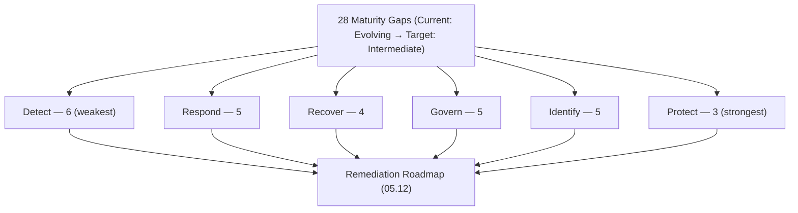

# 05.11 — Maturity Gap Analysis

| Field | Value |
|---|---|
| Document ID | CCB-CSF-GAP-2026-511 |
| Version | 1.0 |
| Date | 2026-06-15 |
| Classification | Confidential — Nonpublic Information (NPI) // Illustrative Portfolio Sample |
| Owner | Rachel Alvarez, CISO |
| Author | Advisory Team (Financial-Services GRC) |
| Status | Approved |

## Purpose

This document is the **consolidated maturity gap register** for Cornerstone Community Bank — the single authoritative list of all **28 maturity gaps** identified across the six NIST CSF 2.0 Functions during the Phase 05 assessment (05.04–05.10). Each gap carries a stable **Gap ID (G-01…G-28)**, its Function and Category, current and target tiers, a description, a priority, and an owner. The register is the direct input to the remediation roadmap (05.12) and the improvement register that carries into Phases 08 and 09.

## Scale and Baseline

Gaps are measured on the **five-level maturity scale** — **Baseline → Evolving → Intermediate → Advanced → Innovative**. The **current profile is mostly "Evolving"**; the **target profile is "Intermediate" (Level 3)** for every gap. A gap is any Category assessed below the Intermediate target. Priority reflects risk exposure and sequencing, not just tier delta: **Detect, Respond, and Recover** gaps are weighted up because they are the weakest Functions and address the Bank's highest incident risks.

## Gap Distribution (Summary Count)

| Function | Gap IDs | Gap Count | High | Med | Low |
|---|---|---|---|---|---|
| Govern (GV) | G-01…G-05 | 5 | 1 | 3 | 1 |
| Identify (ID) | G-06…G-10 | 5 | 0 | 3 | 2 |
| Protect (PR) | G-11…G-13 | 3 | 0 | 2 | 1 |
| Detect (DE) | G-14…G-19 | 6 | 3 | 2 | 1 |
| Respond (RS) | G-20…G-24 | 5 | 3 | 2 | 0 |
| Recover (RC) | G-25…G-28 | 4 | 2 | 1 | 1 |
| **Total** | **G-01…G-28** | **28** | **9** | **13** | **6** |

## Consolidated Gap Register (28 Gaps)

| Gap ID | Function | Category | Current | Target | Gap Description | Priority | Owner |
|---|---|---|---|---|---|---|---|
| G-01 | Govern | GV.RM | Evolving | Intermediate | Risk-appetite statement not fully quantified or cascaded to system owners. | Med | Steven Nakamura (CRO) |
| G-02 | Govern | GV.OV | Evolving | Intermediate | Board cyber reporting lacks a standardized KRI/metrics dashboard. | Med | Rachel Alvarez (CISO) |
| G-03 | Govern | GV.SC | Evolving | Intermediate | Supply-chain tiering not consistently tied to CSF outcomes for all 85 vendors. | Med | Rachel Alvarez (CISO) |
| G-04 | Govern | GV.SC | Baseline | Intermediate | Meridian complementary user-entity controls (CUECs) not tracked to owners. | High | Marcus Doyle |
| G-05 | Govern | GV.RM | Evolving | Intermediate | Risk decisions (accept/transfer) not consistently logged against appetite. | Low | Steven Nakamura (CRO) |
| G-06 | Identify | ID.AM | Evolving | Intermediate | Asset inventory maintained semi-manually; drift between inventory and reality. | Med | Marcus Doyle |
| G-07 | Identify | ID.AM | Evolving | Intermediate | NPI data-flow maps across the 22 systems are incomplete. | Med | Marcus Doyle |
| G-08 | Identify | ID.AM | Evolving | Intermediate | Software/end-of-life tracking not consistently linked to patch program. | Low | IT Operations |
| G-09 | Identify | ID.IM | Evolving | Intermediate | No formal improvement register spanning tests, audits, and incidents. | Med | Rachel Alvarez (CISO) |
| G-10 | Identify | ID.IM | Evolving | Intermediate | Post-incident/post-test lessons not fed back into risk assessment. | Low | Steven Nakamura (CRO) |
| G-11 | Protect | PR.PS | Evolving | Intermediate | Server patch timeliness inconsistent vs SLA for high/critical CVEs. | Med | IT Operations |
| G-12 | Protect | PR.IR | Evolving | Intermediate | Network segmentation coarse; NPI segments not micro-segmented from LAN. | Med | Marcus Doyle |
| G-13 | Protect | PR.AA | Evolving | Intermediate | Privileged access lacks full just-in-time elevation and session recording. | Low | Marcus Doyle |
| G-14 | Detect | DE.CM | Evolving | Intermediate | Log coverage below 100% of the 22 NPI-bearing systems. | High | Marcus Doyle |
| G-15 | Detect | DE.CM | Baseline | Intermediate | Meridian core/digital-banking telemetry not integrated into monitoring. | High | Marcus Doyle |
| G-16 | Detect | DE.AE | Baseline | Intermediate | Correlation use-cases limited; not mapped to the 8 High risks. | High | IT Security |
| G-17 | Detect | DE.AE | Evolving | Intermediate | No formal detection-engineering / use-case lifecycle process. | Med | Marcus Doyle |
| G-18 | Detect | DE.CM | Evolving | Intermediate | Detection performance not measured (no MTTD / coverage KPIs). | Med | Rachel Alvarez (CISO) |
| G-19 | Detect | DE.AE | Evolving | Intermediate | Threat intelligence not systematically fed into detection content. | Low | IT Security |
| G-20 | Respond | RS.MA | Evolving | Intermediate | IR plan not formalized, board-approved, or exercised via annual tabletop. | High | Marcus Doyle |
| G-21 | Respond | RS.MI | Evolving | Intermediate | Scenario playbooks (ransomware, ATO, DLP) not standardized. | High | IT Security |
| G-22 | Respond | RS.CO | Baseline | Intermediate | No documented 36-hour regulatory notification runbook. | High | Rachel Alvarez (CISO) |
| G-23 | Respond | RS.CO | Baseline | Intermediate | Incident communications plan (internal/customer/media/regulator) incomplete. | Med | Angela Foster |
| G-24 | Respond | RS.AN | Evolving | Intermediate | Meridian incident coordination not formalized; forensic readiness immature. | Med | Marcus Doyle |
| G-25 | Recover | RC.RP | Evolving | Intermediate | Backup restoration and DR failover not tested at a defined cadence. | High | Marcus Doyle |
| G-26 | Recover | RC.RP | Evolving | Intermediate | Recovery playbooks not documented for priority systems and NPI data. | Med | IT Operations |
| G-27 | Recover | RC.RP | Evolving | Intermediate | RTO/RPO objectives defined but not validated against actual performance. | High | Marcus Doyle |
| G-28 | Recover | RC.CO | Baseline | Intermediate | Recovery communications not planned or templated for stakeholders. | Low | Angela Foster |

## Cross-Walk to Function Documents

Each consolidated Gap ID maps to the function-level gap notation used in 05.04–05.09.

| Function | Consolidated IDs | Function-Doc IDs | Source Doc |
|---|---|---|---|
| Govern | G-01…G-05 | GV-G1…GV-G5 | 05.04 |
| Identify | G-06…G-10 | ID-G1…ID-G5 | 05.05 |
| Protect | G-11…G-13 | PR-G1…PR-G3 | 05.06 |
| Detect | G-14…G-19 | DE-G1…DE-G6 | 05.07 |
| Respond | G-20…G-24 | RS-G1…RS-G5 | 05.08 |
| Recover | G-25…G-28 | RC-G1…RC-G4 | 05.09 |

## Priority Rationale

The register yields **9 High, 13 Medium, and 6 Low** priority gaps. High-priority gaps concentrate in Detect (3), Respond (3), and Recover (2), plus the single Govern CUEC gap (G-04) — reflecting both the weakest Functions and the controls most tied to the Bank's highest-rated risks (ransomware, account takeover, data exfiltration) and its regulatory obligations (the 36-hour notification rule and Meridian oversight). These High gaps are scheduled first in the roadmap (05.12).

## Cross-References

- **05.04–05.09** — Function-level assessments and source gap detail.
- **05.10** — Maturity scorecard and target profile (current Evolving → target Intermediate).
- **05.12** — Remediation roadmap sequencing these 28 gaps.
- **03.07** — High risks (8 High of 42) driving High-priority gaps.
- **Phase 08 / Phase 09** — Improvement register, exam evidence, and board reporting.

---
[⬅ Previous](05.10-maturity-scoring-and-target-profile.md) · [🏠 Phase README](05.00-README.md) · [Next ➡](05.12-remediation-roadmap.md)
