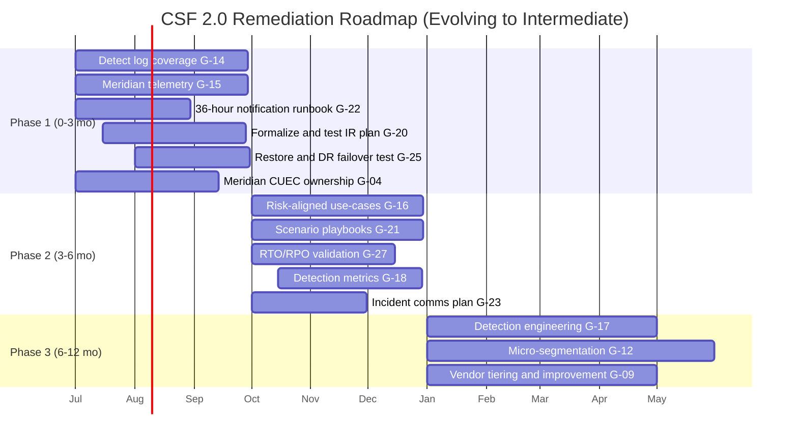
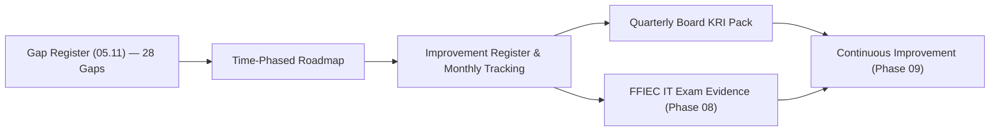

# 05.12 — Remediation Roadmap

| Field | Value |
|---|---|
| Document ID | CCB-CSF-ROADMAP-2026-512 |
| Version | 1.0 |
| Date | 2026-06-15 |
| Classification | Confidential — Nonpublic Information (NPI) // Illustrative Portfolio Sample |
| Owner | Rachel Alvarez, CISO |
| Author | Advisory Team (Financial-Services GRC) |
| Status | Approved |

## Purpose

This document sequences the **28 maturity gaps** from the consolidated register (05.11) into a **time-phased remediation roadmap** that moves Cornerstone Community Bank from its current **"Evolving"** profile to the **"Intermediate"** target across all six NIST CSF 2.0 Functions. The roadmap is prioritized so that the **weakest and highest-risk Functions — Detect, Respond, and Recover — are addressed first**, with owners and dependencies made explicit. It feeds the Bank's continuous-improvement cycle and provides the FFIEC IT examination with a credible, dated plan of action.

## Sequencing Principles

- **Weakest first.** Detect (6 gaps), Respond (5), and Recover (4) contain 15 of 28 gaps and the majority of High-priority items; they lead the schedule.
- **Regulatory-critical first.** The 36-hour notification runbook (G-22) and Meridian CUEC ownership (G-04) are scheduled in the first phase.
- **Respect dependencies.** Detection coverage (G-14/G-15) precedes analytics (G-16); IR formalization (G-20) precedes recovery testing sequencing; data-flow maps (G-07) precede micro-segmentation (G-12) and recovery playbooks (G-26).
- **Risk-weighted, not delta-weighted.** Priority follows the Bank's 8 High risks and Moderate inherent-risk posture, not merely the size of the tier gap.

## Phased Overview

| Phase | Window | Gaps | Theme | Primary Owners |
|---|---|---|---|---|
| Phase 1 | 0–3 months | 6 | Detect coverage, IR &amp; recovery foundations, regulatory runbook | Marcus Doyle, Rachel Alvarez |
| Phase 2 | 3–6 months | 10 | Analytics, playbooks, validation, governance metrics | IT Security, IT Operations, CRO |
| Phase 3 | 6–12 months | 12 | Engineering maturity, segmentation, vendor tiering, improvement loop | IT Ops, CISO, CRO, Compliance |
| **Total** | **12 months** | **28** | Evolving → Intermediate | Program-wide |

## Phase 1 — Foundations (0–3 Months)

Phase 1 establishes visibility and the regulatory-critical response capabilities. It targets the highest-priority gaps and unblocks Phase 2 analytics and validation.

| Gap ID | Function | Action | Priority | Owner | Dependencies |
|---|---|---|---|---|---|
| G-14 | Detect | Onboard all 22 NPI systems to the SIEM; enforce logging baselines. | High | Marcus Doyle | Asset inventory (G-06) |
| G-15 | Detect | Integrate Meridian core/digital-banking telemetry per CUECs. | High | Marcus Doyle | G-04 CUEC mapping |
| G-22 | Respond | Author and test the 36-hour FDIC notification runbook. | High | Rachel Alvarez | Legal/Compliance |
| G-20 | Respond | Formalize, board-approve, and tabletop the IR plan. | High | Marcus Doyle | Audit Committee approval |
| G-25 | Recover | Perform scheduled backup restore and DR failover tests. | High | Marcus Doyle | Meridian coordination (G-24) |
| G-04 | Govern | Map Meridian CUECs to control owners with attestation. | High | Marcus Doyle | Phase 07 vendor program |

## Phase 2 — Analytics, Playbooks &amp; Validation (3–6 Months)

Phase 2 builds the measured, defined capabilities that lift Detect, Respond, Recover, and Govern toward Intermediate.

| Gap ID | Function | Action | Priority | Owner | Dependencies |
|---|---|---|---|---|---|
| G-16 | Detect | Build correlation use-cases mapped to the 8 High risks. | High | IT Security | G-14/G-15 coverage |
| G-21 | Respond | Standardize and test ransomware/ATO/DLP playbooks. | High | IT Security | G-20 IR plan |
| G-27 | Recover | Validate RTO/RPO against test results; close variances. | High | Marcus Doyle | G-25 test data |
| G-18 | Detect | Define and report MTTD, coverage %, alert-quality KPIs. | Med | Rachel Alvarez | G-14 coverage |
| G-23 | Respond | Build tiered incident communications plan with templates. | Med | Angela Foster | G-22 runbook |
| G-26 | Recover | Author per-system recovery runbooks with sequencing. | Med | IT Operations | G-07 data-flow maps |
| G-07 | Identify | Complete NPI data-flow maps incl. Meridian interfaces. | Med | Marcus Doyle | Meridian interface docs |
| G-06 | Identify | Automate asset discovery/reconciliation into the CMDB. | Med | Marcus Doyle | CMDB tooling |
| G-01 | Govern | Publish quantified cyber risk-appetite and tolerances. | Med | Steven Nakamura | CRO risk model |
| G-02 | Govern | Build recurring board cyber KRI/metrics pack. | Med | Rachel Alvarez | G-18 detection metrics |

## Phase 3 — Engineering &amp; Governance Maturity (6–12 Months)

Phase 3 completes the remaining gaps — deeper engineering, architecture, and governance loops — bringing every Function to Intermediate ahead of the examination cycle.

| Gap ID | Function | Action | Priority | Owner | Dependencies |
|---|---|---|---|---|---|
| G-17 | Detect | Adopt detection-engineering lifecycle with tuning/peer review. | Med | Marcus Doyle | G-16 use-cases |
| G-19 | Detect | Integrate FS-ISAC/threat feeds into SIEM enrichment. | Low | IT Security | G-16 use-cases |
| G-24 | Respond | Formalize Meridian incident-coordination and forensic readiness. | Med | Marcus Doyle | Phase 07 |
| G-28 | Recover | Build recovery-status communications plan and templates. | Low | Angela Foster | G-23 comms plan |
| G-11 | Protect | Enforce automated patch orchestration; measure SLA monthly. | Med | IT Operations | G-08 EOL data |
| G-12 | Protect | Advance to micro-segmentation around the 22 NPI systems. | Med | Marcus Doyle | G-07 data flows |
| G-13 | Protect | Implement PAM with JIT elevation and session monitoring. | Low | Marcus Doyle | PAM tooling |
| G-03 | Govern | Extend CSF-aligned due-diligence to all 12 critical vendors. | Med | Rachel Alvarez | Phase 07 |
| G-05 | Govern | Stand up a risk-decision log tied to the risk register. | Low | Steven Nakamura | Risk register |
| G-08 | Identify | Add EOL/EOS flags to inventory feeding vulnerability mgmt. | Low | IT Operations | G-06 inventory |
| G-09 | Identify | Stand up a CSF improvement register with owners/dates. | Med | Rachel Alvarez | Phase 08 outputs |
| G-10 | Identify | Formalize lessons-learned → risk-register workflow. | Low | Steven Nakamura | G-09 register |

## Governance, Tracking &amp; Continuous Improvement

The roadmap is managed as a tracked improvement register (closing gap G-09). Progress is reported to the CISO monthly and to the Board Audit Committee quarterly via the KRI pack (G-02). Each closed gap is validated by evidence and, where relevant, re-tested. This roadmap feeds the **continuous-improvement cycle (Phase 09)** and supplies the **FFIEC IT examination (Phase 08)** with a dated, owner-assigned plan of action that demonstrates a credible path from Evolving to Intermediate.

## Cross-References

- **05.11** — Consolidated gap register (source of the 28 gaps).
- **05.10** — Maturity scorecard and target profile (Evolving → Intermediate).
- **05.13** — Phase summary and transition to SOX ITGC.
- **Phase 07** — Vendor/Meridian oversight and BCP/DR dependencies.
- **Phase 08 / 09** — Examination readiness, improvement register, and board reporting.

---
[⬅ Previous](05.11-maturity-gap-analysis.md) · [🏠 Phase README](05.00-README.md) · [Next ➡](05.13-phase-summary-and-transition.md)
