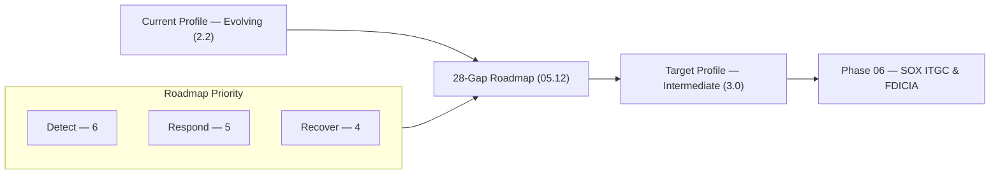

# 05.13 — Phase Summary &amp; Transition

| Field | Value |
|---|---|
| Document ID | CCB-CSF-SUMMARY-2026-513 |
| Version | 1.0 |
| Date | 2026-06-15 |
| Classification | Confidential — Nonpublic Information (NPI) // Illustrative Portfolio Sample |
| Owner | Rachel Alvarez, CISO |
| Author | Advisory Team (Financial-Services GRC) |
| Status | Approved |

## Purpose

This document closes **Phase 05 — FFIEC Cybersecurity Assessment &amp; NIST CSF 2.0 Maturity** for Cornerstone Community Bank. It summarizes the completed assessment, restates the headline results, and hands off to **Phase 06 — SOX IT General Controls (ITGC) &amp; FDICIA**. It is the bridge between the Bank's forward-looking cybersecurity maturity work and the financial-reporting control testing that follows.

## Phase 05 Recap

Phase 05 delivered a complete cybersecurity maturity assessment built on the **NIST CSF 2.0** spine — **6 Functions, 22 Categories, 106 Subcategories** — as the successor structure to the sunset FFIEC CAT (retired Aug 31, 2025). The Bank was scored on a **five-level maturity scale (Baseline → Evolving → Intermediate → Advanced → Innovative)**, establishing a **current profile of "Evolving"** against a **target profile of "Intermediate."** The assessment identified **28 maturity gaps** and sequenced them into a 12-month remediation roadmap.

| Deliverable | Document | Result |
|---|---|---|
| Approach, scope &amp; maturity scale | 05.01 | Five-level scale; Moderate inherent risk |
| CAT → CSF 2.0 transition | 05.02 | CAT structure mapped forward to CSF 2.0 |
| Inherent risk recap | 05.03 | Overall **Moderate** |
| Govern function | 05.04 | Evolving; 5 gaps |
| Identify function | 05.05 | Evolving; 5 gaps |
| Protect function | 05.06 | **Strongest**; 3 gaps |
| Detect function | 05.07 | **Weakest**; 6 gaps |
| Respond function | 05.08 | Weak; 5 gaps |
| Recover function | 05.09 | Weak; 4 gaps |
| Maturity scorecard &amp; target | 05.10 | Evolving → Intermediate |
| Consolidated gap register | 05.11 | **28 gaps** (G-01…G-28) |
| Remediation roadmap | 05.12 | 3 phases over 12 months |

## Headline Results

| Metric | Value |
|---|---|
| Framework | NIST CSF 2.0 (6 Functions / 22 Categories / 106 Subcategories) |
| Maturity scale | Baseline → Evolving → Intermediate → Advanced → Innovative |
| Current profile | **Evolving** (overall ~2.2 / 5) |
| Target profile | **Intermediate** (3.0 / 5) |
| Total maturity gaps | **28** (Govern 5, Identify 5, Protect 3, Detect 6, Respond 5, Recover 4) |
| Priority split | 9 High · 13 Medium · 6 Low |
| Strongest Function | **Protect** (3 gaps) |
| Weakest Functions | **Detect / Respond / Recover** (15 of 28 gaps) |
| Overall inherent risk | **Moderate** |
| Roadmap horizon | 12 months, 3 phases |

## Key Findings

- The program has **sound foundations** — a WISP, 14 core policies, and functioning administrative/technical/physical safeguards — consistent with a Moderate inherent-risk institution.
- **Protect is the strongest Function**; its gaps (patch timeliness, segmentation, PAM) are refinements rather than absences.
- **Detect, Respond, and Recover are the weakest Functions**, holding 15 of 28 gaps. The priorities are monitoring coverage (including Meridian telemetry), a formalized and tested incident-response plan with a **36-hour notification runbook**, and **tested recovery** with validated RTO/RPO.
- The **outsourced Meridian core** shapes several gaps (CUEC ownership, telemetry integration, incident coordination, DR reliance), reinforcing the third-party oversight work in Phase 07.
- None of the 28 gaps indicate a control failure or material weakness; all are addressable within the 12-month roadmap and support a **Satisfactory** examination trajectory.

## Transition to Phase 06 — SOX ITGC &amp; FDICIA

Phase 06 shifts focus from enterprise cybersecurity maturity to **IT general controls over financially significant systems**. Because Cornerstone Community Bank is a subsidiary of **Cornerstone Bancorp, Inc.** (Nasdaq: CCBK) and the institution exceeds **$1B in assets**, both **SOX Section 404** and **FDICIA Part 363** apply. Phase 06 will test **48 key ITGCs** across four domains over the **6 SOX-significant systems**, relying on Meridian's **SOC 1 Type II** report for outsourced controls.

| Phase 05 Output | Feeds Phase 06 As |
|---|---|
| Protect gaps (patch, access, PAM — G-11/G-13) | ITGC Access to Programs &amp; Data and Program Changes context |
| Detect coverage (G-14/G-15) | Evidence for monitoring over financial systems |
| Meridian CUEC mapping (G-04) | SOC 1 Type II complementary user-entity controls |
| Improvement register (G-09) | Deficiency tracking model for ITGC remediation |
| Overall Moderate posture | Control-reliance baseline for ICFR scoping |

| Item | Detail |
|---|---|
| Next phase | 06 — SOX IT General Controls (ITGC) &amp; FDICIA |
| Scope | 48 key ITGCs across 4 domains; 6 SOX-significant systems |
| Frameworks | SOX 404, FDICIA Part 363, SOC 1 Type II (Meridian) |
| Sponsors | CFO (Linda Barrett) &amp; CEO; external audit by Whitmore &amp; Associates, LLP |
| Owner | CISO (Rachel Alvarez) partnering with Internal Audit (Priya Sharma) |

## Cross-References

- **05.10 / 05.11 / 05.12** — Scorecard, consolidated gap register, and remediation roadmap.
- **05.04–05.09** — Function-level assessments (Govern through Recover).
- **03.00** — Inherent risk profile (Moderate) underpinning the assessment.
- **04.00** — WISP and 14 core policies (control-design foundation).
- **Phase 06** — SOX ITGC &amp; FDICIA (next phase).
- **Phase 07 / 08 / 09** — Vendor/BCP, examination readiness, and board reporting.

---
[⬅ Previous](05.12-remediation-roadmap.md) · [🏠 Phase README](05.00-README.md) · [Next ➡](../06-sox-itgc-fdicia/06.00-README.md)
