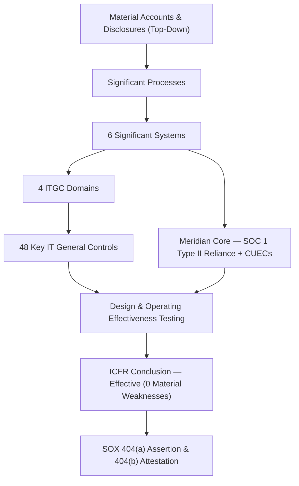

# 06.01 — SOX ITGC Scope & Approach

| Field | Value |
|---|---|
| Document ID | CCB-SOX-SCOP-2026-601 |
| Version | 1.0 |
| Date | 2026-06-15 |
| Classification | Confidential — Nonpublic Information (NPI) // Illustrative Portfolio Sample |
| Owner | Linda Barrett, Chief Financial Officer (SOX 404 Sponsor) |
| Author | Advisory Team (Financial-Services GRC) |
| Status | Approved |

## Purpose

This document establishes the **scope, methodology, and approach** for Cornerstone Community Bank's Sarbanes-Oxley (SOX) **Section 404 IT General Controls (ITGC)** program for fiscal year 2026. It explains why SOX applies to the Bank, defines the ITGC concept and its role in supporting Internal Control over Financial Reporting (ICFR), fixes the in-scope population of **6 financially significant systems** and **4 ITGC domains** yielding **48 key IT general controls**, and describes the top-down, risk-based approach, roles, and testing timeline. It is the entry point for Phase 06; the ICFR/FDICIA linkage is developed in 06.02 and the detailed control framework in 06.03.

## Why SOX Applies to Cornerstone

Cornerstone Community Bank is a wholly-owned subsidiary of **Cornerstone Bancorp, Inc.** ("the Holding Company"), a **publicly traded SEC registrant** (Nasdaq: **CCBK**). Because the Holding Company files periodic reports with the SEC, it is subject to SOX Sections 302 and 404. The Bank is the Holding Company's principal operating subsidiary and originates substantially all of the consolidated revenue, assets, and financial-reporting activity; therefore the Bank's financially significant systems and the controls over them fall squarely within the consolidated SOX 404 assessment.

| Trigger | Requirement | Consequence for Cornerstone |
|---|---|---|
| SEC registrant (CCBK) | SOX §302 & §404 | Management assessment + auditor attestation of ICFR |
| SOX §404(a) | Management assertion on ICFR effectiveness | CFO/CEO certify; management tests key controls |
| SOX §404(b) | External auditor ICFR attestation | Whitmore &amp; Associates opinion on ICFR |
| FDICIA Part 363 (≥$1B) | Management + external ICFR attestation | Runs in parallel; leverages the same ITGCs (see 06.02) |
| Bank as principal subsidiary | Consolidation into parent 10-K | Bank ITGCs are in the consolidated SOX scope |

## The ITGC Concept

**IT General Controls** are the foundational controls over the technology environment that ensure the **integrity, confidentiality, and reliability** of the systems and data underpinning financial reporting. ITGCs do not, by themselves, produce a number in the financial statements. Instead, they provide assurance that the **automated application controls** (e.g., automated three-way match, interest accrual calculations, edit/validation checks) and the **IT-dependent manual controls** (e.g., a reviewer relying on a system-generated report) operate consistently and have not been improperly altered.

If ITGCs are ineffective, reliance on every automated control and system-generated report in that environment is undermined — a concept examiners and external auditors describe as ITGCs being **pervasive** to ICFR. The four ITGC domains map to the lifecycle of a financially significant application:

| Domain | Abbreviation | What It Assures | Key Controls |
|---|---|---|---|
| Access to Programs &amp; Data | APD | Only authorized users access systems/data; segregation of duties enforced | 16 |
| Program Changes | PC | Changes to production financial systems are authorized, tested, approved | 12 |
| Program Development / SDLC | PD | New/replaced financial systems are developed and implemented with controls | 8 |
| Computer Operations | CO | Jobs run completely and accurately; data is backed up and recoverable | 12 |
| **Total** | — | **Foundation supporting ICFR** | **48** |

## Scope — Six Significant Systems

Scope is determined **top-down**: management first identifies material financial-statement accounts and disclosures, then traces them to the business processes and the applications that initiate, authorize, record, process, and report the underlying transactions. Of the **140 systems** in the enterprise inventory (Phase 02), **6 are financially significant** and therefore SOX ITGC in-scope.

| # | Significant System | Primary Financial Reporting Relevance | Hosting |
|---|---|---|---|
| 1 | Meridian Core Banking / General Ledger | Deposits, loans, interest, the GL and trial balance | Outsourced — Meridian (SOC 1 Type II reliance) |
| 2 | Financial Reporting &amp; Consolidation | Consolidation, financial-statement close, disclosures | Internally hosted |
| 3 | Loan Servicing | Loan balances, amortization, allowance inputs, delinquency | Internally hosted |
| 4 | Wire / ACH Payment | Funds movement, cash, settlement, suspense | Internally hosted (Meridian-integrated) |
| 5 | Treasury / Investment Management | Investment securities, borrowings, cash positions | Internally hosted |
| 6 | Reconciliation | GL-to-subledger and bank reconciliations, close controls | Internally hosted |

Because the core banking / GL platform is **outsourced to Meridian Core Services, LLC**, the Bank relies on Meridian's **SOC 1 Type II** report for the controls Meridian operates, and layers **complementary user-entity controls (CUECs)** on top. The SOC 1 reliance model and CUEC allocation are detailed in 06.08.

## The Top-Down, Risk-Based Approach

Cornerstone follows the approach codified in PCAOB **Auditing Standard No. 2201** and the SEC's management guidance: start at the financial statements, focus on the accounts and assertions with a **reasonable possibility of material misstatement**, and calibrate the nature, timing, and extent of testing to **risk**. Higher-risk systems (Meridian core/GL, wire/ACH) receive larger sample sizes and, where appropriate, control-owner plus independent validation.

| Step | Activity | Output |
|---|---|---|
| 1 | Identify material accounts &amp; assertions | Scoping memo (CFO-approved) |
| 2 | Map accounts → processes → systems | Process-to-system matrix |
| 3 | Confirm 6 significant systems &amp; 4 domains | In-scope population |
| 4 | Identify 48 key ITGCs; rate risk | Control framework (06.03) |
| 5 | Test design effectiveness | Design conclusions |
| 6 | Test operating effectiveness | Sample results, exceptions |
| 7 | Evaluate deficiencies &amp; aggregate | Deficiency evaluation (06.02) |
| 8 | Conclude &amp; report | Management assertion + auditor attestation |

## Roles & Responsibilities

| Party | Role in the SOX ITGC Program |
|---|---|
| Linda Barrett (CFO) | SOX 404 sponsor; owns the ICFR management assertion with the CEO |
| Margaret Chen (CEO) | Co-certifies §302/§404 at the Holding Company |
| James Porter (CIO) | Accountable executive for the ITGC control environment |
| Marcus Doyle (IT Security Mgr) | Operational owner of Access and Operations domain controls |
| Priya Sharma (Dir. Internal Audit) | Independent testing of key ITGCs; reports to Audit Committee |
| Robert Hanley (Audit Committee Chair) | Governance oversight of ICFR and external auditor |
| Whitmore &amp; Associates, LLP | External auditor — §404(b) ICFR attestation |
| Meridian Core Services, LLC | Outsourced core; SOC 1 Type II control operator |

## Timeline (FY2026)

| Milestone | Period |
|---|---|
| Scoping &amp; risk assessment refresh | 2026-06 |
| ITGC design walkthroughs | 2026-07 |
| Operating effectiveness testing | 2026-07 → 2026-09 |
| Deficiency evaluation &amp; remediation | 2026-09 |
| Meridian SOC 1 Type II review &amp; CUEC mapping | 2026-09 |
| External auditor integrated audit fieldwork | 2026-11 → 2026-12 |
| Management ICFR assertion (FY2026) | 2027-02 |
| SOX 404(b) opinion in the 10-K | 2027-02 |

Testing (2026-07→09) identified **3 deficiencies** — **1 significant deficiency and 2 control deficiencies, with 0 material weaknesses** — all remediated before year-end, supporting an **ICFR-effective** conclusion and an unqualified external opinion.

## Cross-References

- **06.02** — ICFR and FDICIA Part 363 linkage; deficiency evaluation.
- **06.03** — ITGC control framework and 48-control matrix.
- **06.04–06.07** — The four ITGC domains in detail.
- **06.08** — SOC 1 Type II reliance and complementary user-entity controls (CUECs).
- **Phase 02** — Asset inventory identifying the 6 significant systems.
- **Phase 03** — Risk assessment feeding top-down scoping.
- **Phase 04** — Control design environment supporting ITGCs.

---
[⬅ Previous](06.00-README.md) · [🏠 Phase README](06.00-README.md) · [Next ➡](06.02-icfr-and-fdicia-363-linkage.md)
