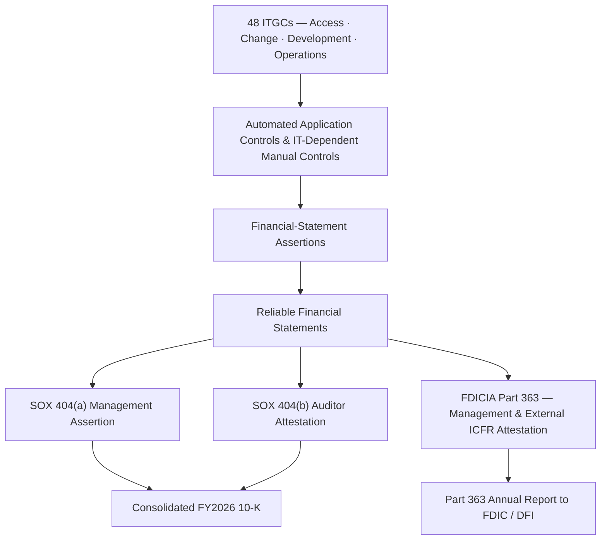

# 06.02 — ICFR & FDICIA Part 363 Linkage

| Field | Value |
|---|---|
| Document ID | CCB-SOX-ICFR-2026-602 |
| Version | 1.0 |
| Date | 2026-06-15 |
| Classification | Confidential — Nonpublic Information (NPI) // Illustrative Portfolio Sample |
| Owner | Linda Barrett, Chief Financial Officer (SOX 404 Sponsor) |
| Author | Advisory Team (Financial-Services GRC) |
| Status | Approved |

## Purpose

This document explains how Cornerstone's **48 key IT general controls** support **Internal Control over Financial Reporting (ICFR)**, and how the two overlapping regulatory regimes — **SOX Section 404** (public Holding Company) and **FDICIA Part 363** (institution ≥ $1B in assets) — align so that a single, well-designed ITGC program satisfies both. It defines the ICFR framework the Bank uses (COSO 2013), the §404(a) management assertion and §404(b) auditor attestation, the FDICIA Part 363 management and external attestation obligations, and the **deficiency evaluation** methodology that classifies findings as control deficiencies, significant deficiencies, or material weaknesses.

## ICFR and the COSO Framework

ICFR is the process — designed and maintained by management and overseen by the Board — that provides **reasonable assurance** regarding the reliability of financial reporting and the preparation of financial statements in accordance with GAAP. Cornerstone evaluates ICFR against the **COSO 2013 Internal Control — Integrated Framework** and its five components. ITGCs primarily reinforce the **Control Activities** and **Information &amp; Communication** components, while providing evidence for **Monitoring**.

| COSO Component | Relationship to ITGCs |
|---|---|
| Control Environment | Board/Audit Committee oversight; IT governance; segregation of duties tone |
| Risk Assessment | Top-down scoping identifies systems whose failure could misstate accounts |
| Control Activities | ITGCs (access, change, development, operations) are control activities |
| Information &amp; Communication | System-generated reports rely on ITGC integrity to be reliable |
| Monitoring | Access reviews, job monitoring, and audit provide ongoing monitoring |

## How ITGCs Support ICFR

The dependency runs in layers. Financial-statement assertions (existence, completeness, accuracy, valuation, presentation) are supported by **automated application controls** and **IT-dependent manual controls**. Those, in turn, can only be relied upon if the **ITGCs** underneath them are effective. A single-ineffective ITGC can cascade upward and invalidate reliance on many application controls.

## SOX §404(a) and §404(b)

| Provision | Who | Obligation | Cornerstone Owner |
|---|---|---|---|
| §404(a) | Management | Assess and assert on ICFR effectiveness annually | CFO &amp; CEO |
| §302 | CEO/CFO | Quarterly certification of disclosure controls &amp; ICFR changes | CFO &amp; CEO |
| §404(b) | External auditor | Independent attestation (opinion) on ICFR | Whitmore &amp; Associates |
| §906 | CEO/CFO | Criminal certification of periodic reports | CFO &amp; CEO |

Management's §404(a) assertion is supported directly by the ITGC testing described in 06.03–06.07. The external auditor performs an **integrated audit** — testing the same key ITGCs (often re-performing a sample) to support the §404(b) opinion. Alignment of management's testing to the auditor's expectations minimizes duplicative effort and reliance gaps.

## FDICIA Part 363

Because Cornerstone Community Bank has **≥ $1 billion in total assets (~$1.2B)**, **FDICIA Part 363** applies. Part 363 imposes an internal-control regime that closely parallels SOX but is administered by the banking agencies (FDIC and, for Cornerstone, coordinated with the Ohio DFI) rather than the SEC.

| Part 363 Requirement | Threshold | Cornerstone Status |
|---|---|---|
| Management report on ICFR effectiveness | ≥ $1B | Prepared by CFO; signed by CEO &amp; CFO |
| Independent public accountant attestation on ICFR | ≥ $1B | Whitmore &amp; Associates attestation |
| Audited comparative financial statements | ≥ $500M | Prepared; audited annually |
| Audit committee of independent directors | ≥ $1B | In place; chaired by Robert Hanley |
| Compliance with designated safety-and-soundness laws | All | Loan-loss allowance &amp; insider-loan attestations |

## SOX and FDICIA Alignment

The two frameworks assess the **same ICFR** and rely on the **same underlying ITGCs**, so Cornerstone runs **one integrated ICFR program** and produces two report packages. The principal differences are the regulator, the reporting vehicle, and a handful of Part 363-specific safety-and-soundness attestations.

| Dimension | SOX §404 | FDICIA Part 363 |
|---|---|---|
| Statutory source | Sarbanes-Oxley Act | Federal Deposit Insurance Corporation Improvement Act |
| Regulator | SEC / PCAOB | FDIC (coordinated with Ohio DFI) |
| Applicability trigger | SEC registrant (CCBK) | ≥ $1B in total assets |
| Control framework | COSO 2013 | COSO 2013 |
| Management assertion | §404(a) | Part 363 management report |
| External attestation | §404(b) | Independent accountant attestation |
| Reporting vehicle | Consolidated 10-K | Part 363 Annual Report to FDIC |
| ITGC reliance | 48 key ITGCs | Same 48 key ITGCs |

## Deficiency Evaluation

Findings from ITGC testing are evaluated for **severity** based on the likelihood and potential magnitude of a resulting financial-statement misstatement. Evaluation considers whether a **compensating control** operates and whether related deficiencies aggregate to a higher severity.

| Classification | Definition | Reporting |
|---|---|---|
| Control Deficiency (CD) | Design or operation does not allow timely prevention/detection of a misstatement | Internal tracking; remediate |
| Significant Deficiency (SD) | Less severe than a material weakness, yet important enough to merit attention by those charged with governance | Report to Audit Committee |
| Material Weakness (MW) | Reasonable possibility that a material misstatement would not be prevented or detected timely | Disclose; ICFR "not effective" |

**FY2026 results:** ITGC testing (2026-07→09) identified **3 deficiencies — 1 significant deficiency and 2 control deficiencies, with 0 material weaknesses.** All three were **remediated and retested** before year-end. The significant deficiency related to the timeliness of a periodic user-access review on the loan-servicing system; a compensating detective control and re-performed access review limited its severity below a material weakness. The result supports an **ICFR-effective** conclusion for both SOX §404 and FDICIA Part 363, with an **unqualified** external opinion.

| Finding | Domain | System | Severity | Status |
|---|---|---|---|---|
| Late quarterly access review | Access to Programs &amp; Data | Loan Servicing | Significant Deficiency | Remediated |
| Change ticket missing test evidence | Program Changes | Reconciliation | Control Deficiency | Remediated |
| Backup restore test not documented | Computer Operations | Treasury | Control Deficiency | Remediated |

## Cross-References

- **06.01** — SOX ITGC scope and top-down approach.
- **06.03** — ITGC control framework mapping controls to systems.
- **06.04–06.07** — Domain-level control detail and testing.
- **06.08** — SOC 1 reliance supporting the Meridian-operated controls.
- **Phase 08** — Independent testing and examination readiness.
- **Phase 09** — Board reporting of ICFR and SOX/Part 363 outcomes.

---
[⬅ Previous](06.01-sox-itgc-scope-and-approach.md) · [🏠 Phase README](06.00-README.md) · [Next ➡](06.03-itgc-control-framework.md)
