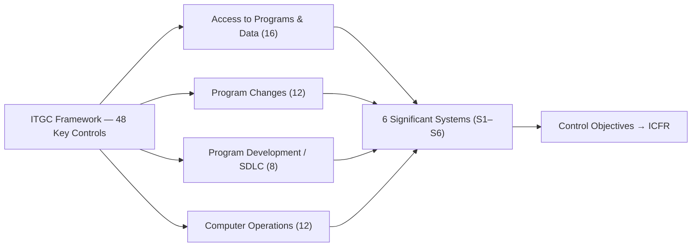

# 06.03 — ITGC Control Framework

| Field | Value |
|---|---|
| Document ID | CCB-SOX-FRWK-2026-603 |
| Version | 1.0 |
| Date | 2026-06-15 |
| Classification | Confidential — Nonpublic Information (NPI) // Illustrative Portfolio Sample |
| Owner | James Porter, Chief Information Officer |
| Author | Advisory Team (Financial-Services GRC) |
| Status | Approved |

## Purpose

This document sets out Cornerstone's **ITGC control framework** — the structured population of **48 key IT general controls** across the **4 ITGC domains**, mapped to the **6 significant systems**, each with a control objective, frequency, control type, and control owner. It provides a representative **control matrix** that serves as the master reference for the domain-level documents (06.04–06.07) and for management and external-auditor testing.

## Framework Structure

Each key control is uniquely identified by a domain prefix and sequence number (e.g., `APD-03`). Controls are classified by **type** (Preventive / Detective / Automated / Manual), **frequency** (per event, daily, monthly, quarterly, annual), and **risk rating** (High / Moderate / Low), which drives sample size during testing.

| Domain | Prefix | Key Controls | Primary Owner |
|---|---|---|---|
| Access to Programs &amp; Data | APD | 16 | Marcus Doyle (IT Security Mgr) |
| Program Changes | PC | 12 | James Porter (CIO) |
| Program Development / SDLC | PD | 8 | James Porter (CIO) |
| Computer Operations | CO | 12 | Marcus Doyle (IT Security Mgr) |
| **Total** | — | **48** | — |

## System Applicability Legend

Controls apply to one or more of the six significant systems. For the Meridian core / GL system, certain controls are **operated by Meridian** and relied upon through the SOC 1 Type II report (marked **SOC 1**), with complementary user-entity controls retained by the Bank.

| Code | System |
|---|---|
| S1 | Meridian Core Banking / General Ledger (SOC 1 reliance) |
| S2 | Financial Reporting &amp; Consolidation |
| S3 | Loan Servicing |
| S4 | Wire / ACH Payment |
| S5 | Treasury / Investment Management |
| S6 | Reconciliation |

## Control Matrix — Access to Programs & Data (APD)

| ID | Control Objective | Type | Frequency | Systems | Risk |
|---|---|---|---|---|---|
| APD-01 | New-user access requires documented approval before provisioning | Preventive/Manual | Per event | S1–S6 | High |
| APD-02 | Access granted matches the approved role (least privilege) | Preventive/Manual | Per event | S1–S6 | High |
| APD-03 | Terminated users are de-provisioned within one business day | Preventive/Manual | Per event | S1–S6 | High |
| APD-04 | Quarterly user-access recertification by system owners | Detective/Manual | Quarterly | S1–S6 | High |
| APD-05 | Privileged/admin access is restricted, logged, and reviewed | Detective/Manual | Quarterly | S1–S6 | High |
| APD-06 | Segregation of duties enforced between conflicting functions | Preventive/Automated | Per event | S2,S3,S4,S6 | High |
| APD-07 | Password/authentication policy enforced (complexity, MFA) | Preventive/Automated | Per event | S1–S6 | Moderate |
| APD-08 | Direct data (database/back-end) access is restricted &amp; monitored | Detective/Automated | Continuous | S2,S3,S5,S6 | High |

## Control Matrix — Program Changes (PC)

| ID | Control Objective | Type | Frequency | Systems | Risk |
|---|---|---|---|---|---|
| PC-01 | Changes are formally requested and business-approved | Preventive/Manual | Per event | S2,S3,S4,S5,S6 | High |
| PC-02 | Changes are tested (functional/UAT) before migration | Preventive/Manual | Per event | S2,S3,S4,S5,S6 | High |
| PC-03 | Changes receive documented approval prior to production migration | Preventive/Manual | Per event | S2,S3,S4,S5,S6 | High |
| PC-04 | Developers cannot migrate their own code to production (SoD) | Preventive/Automated | Per event | S2,S3,S6 | High |
| PC-05 | Emergency changes follow an expedited, retro-approved process | Detective/Manual | Per event | S2,S3,S4,S5,S6 | Moderate |
| PC-06 | Meridian-side core changes are governed by Meridian change control | Preventive/Manual | Per event | S1 (SOC 1) | Moderate |

## Control Matrix — Program Development / SDLC (PD)

| ID | Control Objective | Type | Frequency | Systems | Risk |
|---|---|---|---|---|---|
| PD-01 | New/replaced financial systems follow an approved SDLC methodology | Preventive/Manual | Per project | S2,S3,S5,S6 | Moderate |
| PD-02 | Business &amp; control requirements are documented and approved | Preventive/Manual | Per project | S2,S3,S5,S6 | Moderate |
| PD-03 | User acceptance testing is completed and signed off pre-go-live | Preventive/Manual | Per project | S2,S3,S5,S6 | High |
| PD-04 | Data conversion is reconciled and validated (completeness/accuracy) | Detective/Manual | Per project | S2,S3,S5,S6 | High |
| PD-05 | Go/no-go approval obtained from a steering committee | Preventive/Manual | Per project | S2,S3,S5,S6 | Moderate |

## Control Matrix — Computer Operations (CO)

| ID | Control Objective | Type | Frequency | Systems | Risk |
|---|---|---|---|---|---|
| CO-01 | Financial batch jobs are scheduled, monitored, and validated | Detective/Automated | Daily | S1,S2,S3,S4,S6 | High |
| CO-02 | Job failures are logged, investigated, and resolved | Detective/Manual | Per event | S1,S2,S3,S4,S6 | High |
| CO-03 | Data is backed up per schedule and backups are monitored | Preventive/Automated | Daily | S1–S6 | High |
| CO-04 | Backup restoration is tested periodically | Detective/Manual | Annual | S2,S3,S5,S6 | Moderate |
| CO-05 | IT incidents/problems are logged, prioritized, and resolved | Detective/Manual | Per event | S1–S6 | Moderate |
| CO-06 | Physical &amp; environmental controls protect data-center assets | Preventive/Manual | Continuous | S2,S3,S5,S6 | Moderate |

## Control Objective Coverage Summary

The 48 controls are engineered so that every significant system is covered by each applicable domain, and every high-risk objective has at least one preventive and one detective control (defense in depth).

| Domain | High-Risk Controls | Automated | Manual | Systems Covered |
|---|---|---|---|---|
| Access to Programs &amp; Data | 6 | 3 | 13 | S1–S6 |
| Program Changes | 4 | 1 | 11 | S1–S6 |
| Program Development / SDLC | 2 | 0 | 8 | S2,S3,S5,S6 |
| Computer Operations | 3 | 3 | 9 | S1–S6 |

## Testing and Evidence Approach

Sample sizes scale with control frequency and risk rating. Management (Internal Audit, Priya Sharma) tests all 48 key controls; the external auditor (Whitmore &amp; Associates) re-performs a risk-weighted subset for the §404(b) opinion.

| Frequency | Population | Typical Sample (High Risk) |
|---|---|---|
| Per event / continuous | All occurrences | 25–40 |
| Daily | ~250 occurrences | 25 |
| Monthly | 12 | 2–4 |
| Quarterly | 4 | 2 |
| Annual | 1 | 1 |

## Cross-References

- **06.01** — Scope: 6 systems, 4 domains, 48 controls.
- **06.02** — ICFR/FDICIA linkage and deficiency evaluation.
- **06.04** — Access to Programs &amp; Data domain detail.
- **06.05** — Program Change Management domain detail.
- **06.06** — Program Development / SDLC domain detail.
- **06.07** — Computer Operations domain detail.
- **06.08** — SOC 1 reliance for Meridian-operated (S1) controls.

---
[⬅ Previous](06.02-icfr-and-fdicia-363-linkage.md) · [🏠 Phase README](06.00-README.md) · [Next ➡](06.04-access-to-programs-and-data.md)
