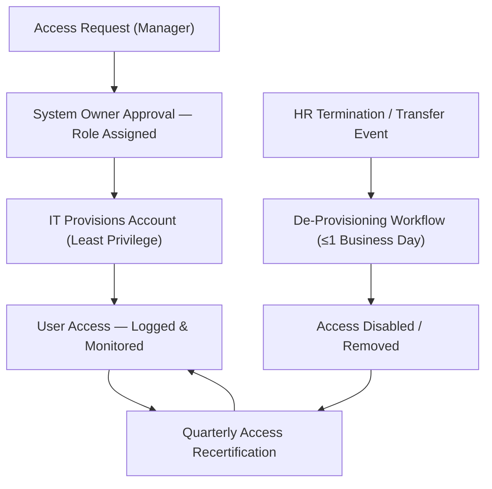

# 06.04 — Access to Programs & Data

| Field | Value |
|---|---|
| Document ID | CCB-SOX-APD-2026-604 |
| Version | 1.0 |
| Date | 2026-06-15 |
| Classification | Confidential — Nonpublic Information (NPI) // Illustrative Portfolio Sample |
| Owner | Marcus Doyle, IT Security Manager |
| Author | Advisory Team (Financial-Services GRC) |
| Status | Approved |

## Purpose

This document details the **Access to Programs &amp; Data (APD)** ITGC domain — the largest of the four domains with **16 key controls**. It covers user provisioning and de-provisioning, periodic access recertification, privileged (administrative) access, segregation of duties (SoD), authentication, and back-end/database access, across the six significant systems. It describes each control objective, how the control is designed to operate, and how it is tested for design and operating effectiveness in the FY2026 SOX 404 / FDICIA Part 363 program.

## Why Access Controls Matter to ICFR

Access controls are the first line of defense for financial-reporting integrity. If unauthorized users can initiate or post transactions, or if a single user can both create and approve a payment, the reliability of every downstream number is compromised. The APD domain assures that **only appropriate, authorized, and properly segregated users** can access financially significant systems and the data within them.

| Sub-Area | Objective | Primary Risk Addressed |
|---|---|---|
| Provisioning | Access granted only with documented approval | Unauthorized access creation |
| De-provisioning | Access removed promptly on termination/transfer | Orphaned/lingering access |
| Access reviews | Access remains appropriate over time | Access creep, stale entitlements |
| Privileged access | Admin rights restricted and monitored | Unlogged high-impact changes |
| Segregation of duties | Conflicting functions separated | Fraud, unauthorized transactions |
| Authentication | Strong identity verification (MFA) | Credential compromise |

## Provisioning and De-Provisioning

Access to significant systems is granted through a **workflow-based request** that requires the requesting manager's approval and the system owner's role assignment before IT provisions the account. On termination or transfer, HR triggers a de-provisioning workflow with a **one-business-day** service-level target for disabling access to financial systems.

## Periodic Access Recertification

System owners perform a **quarterly recertification** of all users and entitlements for each significant system. Reviewers confirm each account is still required and at the appropriate privilege level; flagged accounts are revoked or adjusted, and the completed review is retained as evidence. The FY2026 **significant deficiency** arose here — a late quarterly review on the **loan-servicing system** — and was remediated by re-performing the review and adding a tracking control with automated reminders.

| Review | Cadence | Reviewer | Evidence |
|---|---|---|---|
| Standard user access | Quarterly | System owner | Signed recertification listing |
| Privileged/admin access | Quarterly | IT Security Manager | Admin entitlement report + sign-off |
| Service/interface accounts | Semi-annual | Application owner | Service-account inventory review |
| Segregation-of-duties conflicts | Quarterly | Control owner + Internal Audit | SoD conflict report |

## Privileged Access

Administrative and elevated access carries the highest risk because it can bypass application controls and alter data directly. Cornerstone restricts privileged accounts to a documented, minimal population, logs privileged activity, and reviews it quarterly. Where feasible, privileged sessions on core financial systems require **multi-factor authentication** and are subject to session logging.

| Control | Design |
|---|---|
| Privileged account inventory | Maintained and reconciled quarterly |
| Named admin accounts | No shared admin IDs on significant systems |
| Privileged activity logging | Enabled; logs retained and reviewed |
| Emergency (firecall) access | Break-glass procedure with retro-review |

## Segregation of Duties

SoD controls prevent a single individual from controlling two or more phases of a transaction (e.g., initiating and approving a wire). Conflicts are defined in an **SoD matrix** by system and enforced through role design and, where the system supports it, automated rule checks. The wire/ACH and reconciliation systems carry the tightest SoD requirements.

| Conflict (Illustrative) | System | Mitigation |
|---|---|---|
| Initiate wire vs. approve/release wire | Wire / ACH | Separate roles + dual control |
| Post journal entry vs. approve journal entry | Financial Reporting | Segregated approval workflow |
| Prepare reconciliation vs. review/approve | Reconciliation | Independent reviewer required |
| Modify loan terms vs. approve modification | Loan Servicing | Maker-checker enforcement |

## Authentication

All significant systems enforce the enterprise authentication standard: complexity requirements, lockout thresholds, and **multi-factor authentication** for remote and privileged access. Meridian-hosted access (core/GL and digital banking) is governed by Meridian's authentication controls, relied upon through the SOC 1 Type II report with a complementary user-entity control that the Bank administers its own users appropriately.

## Access to Data (Back-End)

Beyond application-level access, the domain controls **direct access to the underlying data** — databases, back-end tables, and data extracts — which can bypass application controls entirely. Direct database access on significant systems is restricted to a minimal, named population of administrators, is logged, and any changes made outside the application are subject to review. Bulk data extracts containing NPI or financial data require approval and are tracked.

| Data-Access Vector | Control |
|---|---|
| Production database (DBA) access | Restricted, named accounts; activity logged &amp; reviewed |
| Back-end table updates | Prohibited except via authorized change; reviewed if used |
| Report/query tools | Read-only roles; sensitive queries governed |
| Data extracts / downloads | Approval required; NPI extracts tracked |

## Account Types and Governance

Different account types carry different risk and review cadences. The domain distinguishes standard interactive users, privileged administrators, service/interface accounts, and vendor accounts so that each is governed appropriately.

| Account Type | Purpose | Governance |
|---|---|---|
| Standard user | Day-to-day financial processing | Quarterly recertification |
| Privileged/admin | System administration | Quarterly review + logging + MFA |
| Service/interface | Automated system-to-system access | Semi-annual review; secrets rotated |
| Vendor/support | Third-party maintenance access | Time-boxed, monitored, disabled when idle |

## Testing Approach and Results

| Control | Test Procedure | Sample | FY2026 Result |
|---|---|---|---|
| APD-01 Provisioning approval | Inspect approval for a sample of new users | 25 | No exceptions |
| APD-03 De-provisioning timeliness | Trace terminations to disablement date | 25 | No exceptions |
| APD-04 Quarterly recertification | Inspect completed reviews per quarter | 4/system | 1 late (Loan Servicing) — SD, remediated |
| APD-05 Privileged access review | Inspect admin review &amp; entitlements | 4 | No exceptions |
| APD-06 Segregation of duties | Inspect SoD conflict report resolution | 25 | No exceptions |
| APD-07 Authentication config | Inspect password/MFA settings | 6 systems | No exceptions |

## Cross-References

- **06.03** — Full ITGC control matrix (APD-01 … APD-16).
- **06.05** — Program Changes (SoD between dev and prod).
- **06.07** — Computer Operations (physical access complements logical).
- **06.08** — SOC 1 reliance for Meridian-administered authentication.
- **Phase 04** — Access-management policy in the WISP.
- **Phase 05** — CSF 2.0 Protect (PR.AA) access-control alignment.

---
[⬅ Previous](06.03-itgc-control-framework.md) · [🏠 Phase README](06.00-README.md) · [Next ➡](06.05-program-change-management.md)
