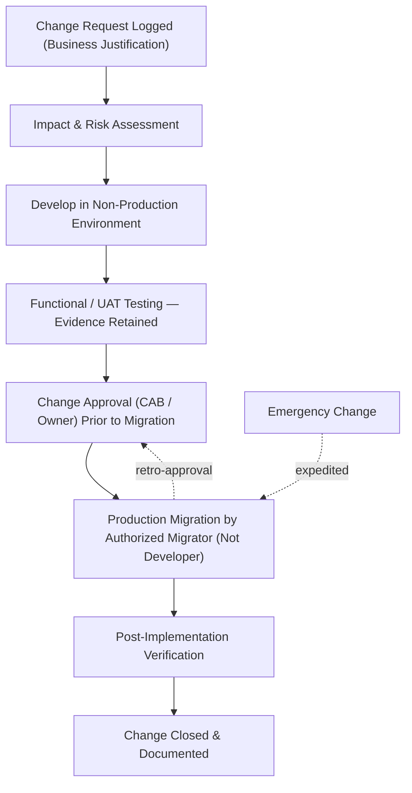

# 06.05 — Program Change Management

| Field | Value |
|---|---|
| Document ID | CCB-SOX-CHG-2026-605 |
| Version | 1.0 |
| Date | 2026-06-15 |
| Classification | Confidential — Nonpublic Information (NPI) // Illustrative Portfolio Sample |
| Owner | James Porter, Chief Information Officer |
| Author | Advisory Team (Financial-Services GRC) |
| Status | Approved |

## Purpose

This document details the **Program Changes (PC)** ITGC domain — **12 key controls** governing how changes to financially significant systems are requested, tested, approved, and migrated to production. It covers the standard change lifecycle, the segregation of duties between development and production, emergency-change handling, and configuration/version management, and describes how these controls are tested in the FY2026 SOX 404 / FDICIA Part 363 program. The domain applies to the five internally maintained significant systems; Meridian-side core/GL changes are governed by Meridian's own change control and relied upon through the SOC 1 Type II report.

## Why Change Controls Matter to ICFR

Uncontrolled changes are one of the most direct threats to financial-reporting integrity: an untested or unauthorized change to an interest calculation, a posting rule, or a reconciliation routine can silently misstate the ledger. The Program Changes domain assures that **every change to a significant system is authorized, tested, independently approved, and migrated by someone other than the developer.**

| Sub-Area | Objective | Primary Risk Addressed |
|---|---|---|
| Change request | Changes are formally logged and business-approved | Unauthorized/undocumented change |
| Testing | Changes are validated before release | Defective logic reaches production |
| Approval | Independent sign-off before migration | Unreviewed change deployed |
| Segregation of duties | Developers cannot self-migrate to production | Fraud/undetected code manipulation |
| Emergency changes | Expedited but controlled with retro-approval | Bypass of standard controls |

## The Standard Change Lifecycle

Every standard change flows through a ticketed workflow with distinct, evidenced control gates. No change reaches production without a request, test evidence, approval, and a migration performed by an authorized migrator separate from the developer.

## Change Types

| Type | Definition | Approval Path |
|---|---|---|
| Standard | Pre-authorized, low-risk, repeatable change | Pre-approved template |
| Normal | Discretionary change requiring assessment | CAB / system owner approval |
| Emergency | Urgent fix to restore service or correct a defect | Expedited approval + retro-review |
| Vendor/Patch | Vendor-supplied update or patch | Change ticket + regression test |

## Segregation Between Development and Production

A cornerstone control (**PC-04**) is that **developers cannot migrate their own code to production**. Cornerstone enforces this through separated environments (dev / test / prod), restricted migration rights, and — where the platform supports it — automated deployment controls that require a distinct approver. This prevents a developer from introducing and deploying an unauthorized change undetected.

| Environment | Purpose | Access |
|---|---|---|
| Development | Coding and unit testing | Developers |
| Test / UAT | Functional and user acceptance testing | Developers + business testers |
| Production | Live financial processing | Restricted migrators + operations |

## Emergency Changes

Emergency changes are permitted when an urgent defect or outage threatens financial processing, but they remain controlled. An emergency ticket is opened, an expedited approval is obtained (verbally if necessary), the fix is deployed, and **retrospective documentation and approval** are completed within a defined window (typically two business days). Emergency changes are reviewed for appropriateness during testing.

| Control | Design |
|---|---|
| Emergency authorization | Manager/on-call approval before or immediately after deployment |
| Retro-documentation | Full ticket, test note, and approval within 2 business days |
| Post-event review | Emergency changes reviewed monthly for appropriateness |
| Segregation preserved | Independent migrator used where feasible |

## Meridian Core Changes

Changes to the outsourced **Meridian core / GL** platform (S1) are executed under **Meridian's** change-management controls. The Bank relies on Meridian's **SOC 1 Type II** report for the design and operating effectiveness of those controls and retains the complementary user-entity control of testing and approving any Bank-configurable parameters or interfaces affected by a Meridian release before it is accepted into production use.

## Configuration and Version Management

Beyond code changes, financially significant systems are governed by **configuration and version management** controls. Configurable parameters that affect financial processing — interest tables, posting rules, GL mapping, reconciliation tolerances — are treated as changes and routed through the same request/approval/migration workflow. Version control preserves the integrity and traceability of migrated code and configuration.

| Control | Design |
|---|---|
| Configuration change control | Parameter changes follow the standard change workflow |
| Version control | Source and configuration versioned; production baseline maintained |
| Migration integrity | Only approved, versioned artifacts promoted to production |
| Change traceability | Ticket links request → test → approval → deployed version |

## Change Advisory and Reporting

Normal and higher-risk changes are reviewed by a **Change Advisory Board (CAB)** that assesses risk, scheduling, and readiness before approval. Change activity is reported periodically to IT management and is available to Internal Audit and the external auditor as SOX evidence.

| Body / Report | Role | Cadence |
|---|---|---|
| Change Advisory Board | Review &amp; approve normal/high-risk changes | Weekly (or as needed) |
| Emergency change review | Confirm appropriateness of emergency changes | Monthly |
| Change activity report | Summarize volume, success, failures, backouts | Monthly |

## Testing Approach and Results

| Control | Test Procedure | Sample | FY2026 Result |
|---|---|---|---|
| PC-01 Change request/approval | Inspect request &amp; business approval | 25 | No exceptions |
| PC-02 Testing evidence | Inspect UAT/functional test evidence | 25 | 1 missing evidence (Reconciliation) — CD, remediated |
| PC-03 Migration approval | Inspect approval prior to migration | 25 | No exceptions |
| PC-04 Developer/migrator SoD | Inspect migrator identity vs. developer | 25 | No exceptions |
| PC-05 Emergency change | Inspect emergency tickets &amp; retro-approval | 10 | No exceptions |
| PC-06 Meridian change reliance | Review SOC 1 change controls + CUECs | SOC 1 | No exceptions |

The FY2026 **control deficiency** in this domain — a change ticket on the **reconciliation system** lacking retained test evidence — was remediated by re-performing and documenting the test and reinforcing the evidence-retention requirement in the change workflow.

## Cross-References

- **06.03** — Full ITGC control matrix (PC-01 … PC-12).
- **06.04** — Access controls enforcing migration segregation.
- **06.06** — Program Development / SDLC (major changes and new systems).
- **06.08** — SOC 1 reliance for Meridian core change control.
- **Phase 04** — Change-management policy in the WISP.
- **Phase 05** — CSF 2.0 Protect (PR.PS) platform-security alignment.

---
[⬅ Previous](06.04-access-to-programs-and-data.md) · [🏠 Phase README](06.00-README.md) · [Next ➡](06.06-program-development-sdlc.md)
