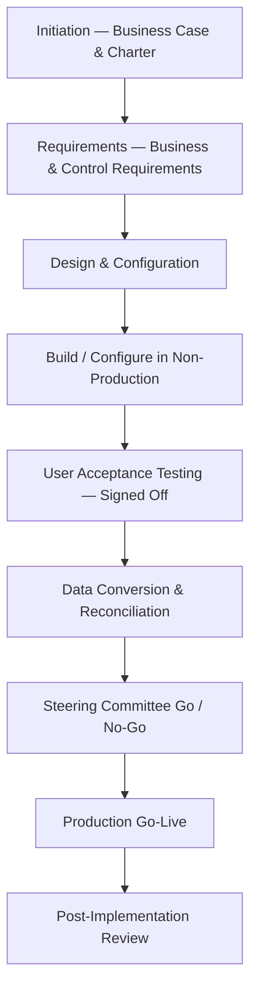

# 06.06 — Program Development / SDLC

| Field | Value |
|---|---|
| Document ID | CCB-SOX-SDLC-2026-606 |
| Version | 1.0 |
| Date | 2026-06-15 |
| Classification | Confidential — Nonpublic Information (NPI) // Illustrative Portfolio Sample |
| Owner | James Porter, Chief Information Officer |
| Author | Advisory Team (Financial-Services GRC) |
| Status | Approved |

## Purpose

This document details the **Program Development / SDLC (PD)** ITGC domain — **8 key controls** governing how **new or replaced financially significant systems** are developed, configured, tested, converted, and implemented. It covers the software development lifecycle methodology, requirements and control design, user acceptance testing, data conversion validation, and project/steering governance. These controls ensure that when a significant system is built, purchased, or materially re-implemented, the resulting environment supports reliable financial reporting from go-live.

## Why Development Controls Matter to ICFR

New-system implementations and major re-platforming projects are inherently high-risk to ICFR: a flawed configuration or a mis-mapped data conversion can misstate opening balances or embed a defective calculation that propagates for years. The PD domain assures that development and implementation follow a **disciplined, documented, and independently validated lifecycle**, with explicit control-design and go-live gates.

| Sub-Area | Objective | Primary Risk Addressed |
|---|---|---|
| SDLC methodology | Development follows an approved lifecycle | Ad hoc, uncontrolled builds |
| Requirements &amp; control design | Business and control needs are captured | Missing/weak embedded controls |
| Testing (UAT) | System validated before go-live | Defects reach production |
| Data conversion | Migrated data is complete and accurate | Misstated opening balances |
| Project governance | Independent go/no-go authorization | Premature or unauthorized launch |

## The SDLC Lifecycle

Cornerstone applies a phase-gated SDLC to significant-system projects, whether internally developed, vendor-configured, or SaaS-adopted. Each gate requires documented deliverables and sign-off before the project proceeds.

## Requirements and Control Design

Before build, projects document business and control requirements, including the financial-reporting assertions the system must support and the automated application controls (edit checks, calculations, interface reconciliations) to be embedded. Internal Audit (Priya Sharma) is consulted on control-design adequacy for high-impact projects so that ICFR-relevant controls are engineered in, not retrofitted.

| Deliverable | Owner | Approver |
|---|---|---|
| Business case &amp; charter | Project sponsor | Steering committee |
| Business &amp; control requirements | Business analyst | System owner |
| Design / configuration spec | Solution architect | CIO / system owner |
| Test strategy &amp; UAT plan | Test lead | System owner |
| Data conversion plan | Data lead | CFO (for financial data) |

## User Acceptance Testing

UAT (**PD-03**) is a high-risk control: business users execute test scripts covering functional and control scenarios, defects are logged and resolved, and the system owner signs off before go-live. UAT sign-off is a mandatory precondition for the go/no-go gate.

## Data Conversion

Data conversion (**PD-04**) is validated for **completeness and accuracy** through reconciliation of source-to-target record counts and control totals (e.g., total loan principal, GL trial-balance agreement). For financial data, the CFO's organization approves the reconciliation before the converted balances are relied upon. Conversion evidence is retained as part of the project record and reviewed during SOX testing where a conversion occurred in the period.

| Validation | Method |
|---|---|
| Record completeness | Source vs. target record counts reconciled |
| Balance accuracy | Control totals (principal, GL balances) agreed |
| Exception handling | Rejects logged, resolved, and re-loaded |
| Sign-off | Finance approval before go-live reliance |

## Project Governance

A **steering committee** provides oversight and the formal **go/no-go** authorization (**PD-05**). Membership for significant financial-system projects includes the CIO (James Porter), CFO (Linda Barrett), the system owner, and — as consulted — Internal Audit. The committee confirms that requirements, UAT, and data conversion are complete and satisfactory before authorizing production go-live.

| Governance Body | Role | Members (Illustrative) |
|---|---|---|
| Steering committee | Go/no-go authorization; scope &amp; risk oversight | CIO, CFO, system owner |
| Project management office | Schedule, budget, deliverable tracking | Project manager |
| Internal Audit (consulted) | Control-design review for high-impact projects | Priya Sharma |

## Project Risk and Delivery Models

The SDLC scales its rigor to project risk. High-impact projects (core-adjacent systems, GL, payments) receive full phase-gating, independent control-design review, and steering oversight; lower-impact configuration projects follow a streamlined but still-documented path. The domain applies regardless of delivery model — internal build, vendor-configured package, or SaaS adoption.

| Delivery Model | Control Emphasis | Example |
|---|---|---|
| Internal build | Full SDLC; code &amp; UAT controls | Custom reconciliation logic |
| Vendor-configured package | Configuration validation; conversion; UAT | Loan-servicing upgrade |
| SaaS / hosted adoption | Vendor due diligence + SOC reliance + CUECs | Treasury platform |
| Core-provider change | Meridian SDLC + Bank acceptance testing | Meridian core release |

## Segregation and Access During Implementation

Development activity occurs in non-production environments, and access to convert data or promote a new system into production is restricted to authorized personnel separate from the developers/configurers — extending the segregation principles of the Program Changes domain (06.05) into the implementation phase. Temporary elevated access granted during a go-live is time-boxed and removed at project close.

| Safeguard | Design |
|---|---|
| Environment separation | Build/test in non-production; validated promotion to production |
| Implementation SoD | Developer/configurer distinct from production migrator |
| Go-live access | Time-boxed elevated access; removed at close |
| Post-go-live handover | Transition to standard change control (06.05) |

## Testing Approach and Results

Because Cornerstone had **no new significant-system implementation** during the FY2026 SOX period, PD controls were tested on a **design-effectiveness** basis (walkthrough of the SDLC methodology and inspection of the most recent qualifying project record) rather than a full operating-effectiveness sample. Where a conversion or go-live occurs in a future period, operating-effectiveness testing is performed on the applicable population.

| Control | Test Procedure | Basis | FY2026 Result |
|---|---|---|---|
| PD-01 SDLC methodology | Inspect approved methodology &amp; recent project | Design | No exceptions |
| PD-03 UAT sign-off | Inspect UAT evidence on last project | Design | No exceptions |
| PD-04 Data conversion validation | Inspect conversion reconciliation on last project | Design | No exceptions |
| PD-05 Go/no-go governance | Inspect steering-committee approval | Design | No exceptions |

## Cross-References

- **06.03** — Full ITGC control matrix (PD-01 … PD-08).
- **06.05** — Program Changes (post-implementation change control).
- **06.04** — Access provisioning for newly implemented systems.
- **06.08** — SOC 1 reliance where Meridian implements core changes.
- **Phase 04** — SDLC and secure-development policy in the WISP.
- **Phase 07** — Third-party/vendor governance for vendor-delivered systems.

---
[⬅ Previous](06.05-program-change-management.md) · [🏠 Phase README](06.00-README.md) · [Next ➡](06.07-computer-operations.md)
