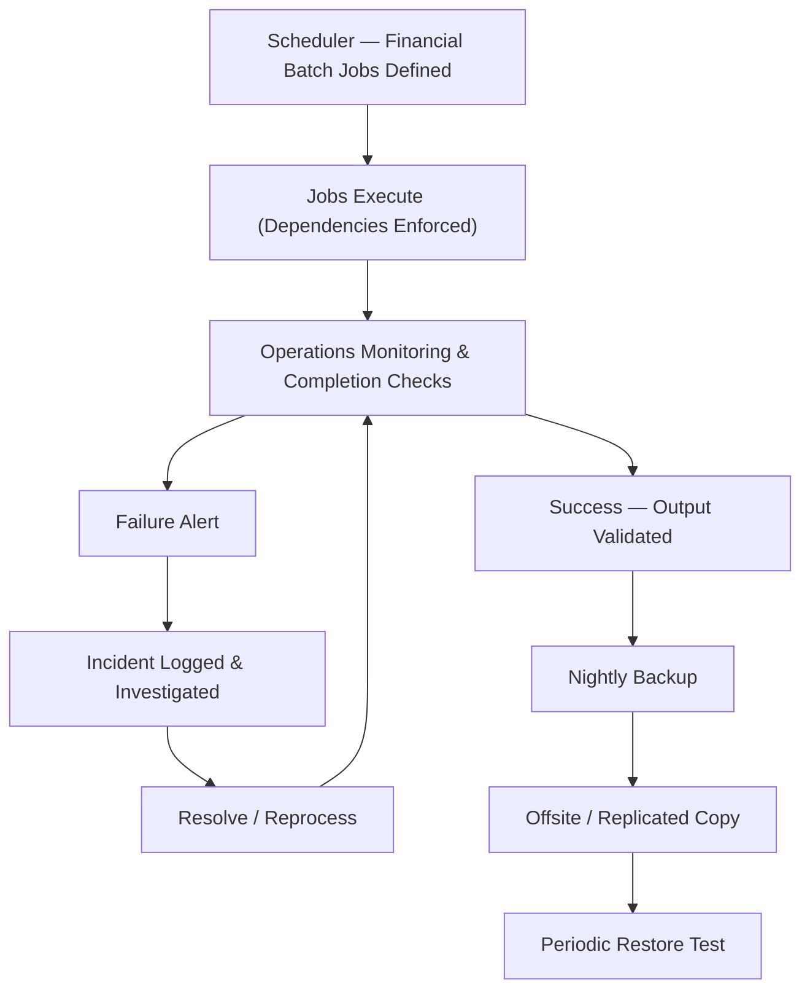

# 06.07 — Computer Operations

| Field | Value |
|---|---|
| Document ID | CCB-SOX-OPS-2026-607 |
| Version | 1.0 |
| Date | 2026-06-15 |
| Classification | Confidential — Nonpublic Information (NPI) // Illustrative Portfolio Sample |
| Owner | Marcus Doyle, IT Security Manager |
| Author | Advisory Team (Financial-Services GRC) |
| Status | Approved |

## Purpose

This document details the **Computer Operations (CO)** ITGC domain — **12 key controls** governing the day-to-day operation of financially significant systems. It covers job scheduling and batch processing, backup and recovery, incident and problem management, and physical and environmental controls. These controls assure that financial data is **processed completely and accurately, protected, and recoverable**, so that the ledgers, reports, and reconciliations relied upon for financial reporting are dependable.

## Why Operations Controls Matter to ICFR

Financial systems depend on scheduled, automated processing — nightly posting, interest accruals, statement generation, interface transfers, and reconciliation feeds. If a batch job fails silently, runs twice, or processes incomplete data, the ledger can be misstated. If backups fail and data cannot be recovered, financial records could be lost. The Computer Operations domain assures the **integrity, completeness, and recoverability** of financial processing.

| Sub-Area | Objective | Primary Risk Addressed |
|---|---|---|
| Job scheduling / batch | Financial jobs run completely, on schedule, once | Incomplete/duplicate processing |
| Job monitoring &amp; failure handling | Failures detected and resolved timely | Undetected processing errors |
| Backup &amp; recovery | Data backed up and restorable | Loss of financial records |
| Incident / problem management | IT issues logged, prioritized, resolved | Recurring, unresolved disruptions |
| Physical &amp; environmental | Facilities protect hardware and data | Physical loss or tampering |

## Job Scheduling and Batch Processing

Financially significant batch jobs (core posting, GL updates, loan servicing accruals, wire/ACH settlement, reconciliation feeds) are defined in an automated scheduler with dependencies and completion checks. Operations monitors job status; failures generate alerts, are logged, investigated, and resolved with reprocessing where required.

## Job Monitoring and Failure Handling

| Control | Design |
|---|---|
| Automated scheduling | Jobs run per defined schedule with dependency control |
| Completion monitoring | Operators confirm successful completion daily |
| Failure alerting | Failures raise alerts and open incident tickets |
| Reprocessing control | Reruns are authorized and validated to avoid duplication |
| Interface reconciliation | System-to-system transfers reconciled for completeness |

## Backup and Recovery

Data on significant systems is backed up on a defined schedule, with backups monitored for success and copies stored offsite or replicated. Restoration is **tested periodically** (**CO-04**) to confirm recoverability. Backup and recovery align with the enterprise BCP/DR objectives (RTO/RPO) documented in Phase 07.

| Element | Standard |
|---|---|
| Backup frequency | Daily (incremental) + periodic full |
| Backup monitoring | Success/failure reviewed each business day |
| Offsite / replication | Encrypted offsite copy or replication |
| Restore testing | Periodic (at least annual) documented restore test |
| Retention | Per record-retention and regulatory requirements |

The FY2026 **control deficiency** in this domain — a **treasury** system restore test performed but **not documented** — was remediated by re-performing and formally documenting a restore test and standardizing the restore-test evidence template.

## Incident and Problem Management

IT incidents affecting significant systems are logged, prioritized by impact, and resolved through a defined process; recurring issues are escalated to **problem management** for root-cause analysis. Incidents with potential financial-reporting impact are flagged for SOX consideration, and qualifying security incidents also feed the 36-hour regulatory notification process (Phase 07/08).

| Priority | Definition | Target Response |
|---|---|---|
| P1 — Critical | Significant system down; financial processing halted | Immediate |
| P2 — High | Degraded processing or partial outage | Same business day |
| P3 — Moderate | Limited impact; workaround available | Next business day |
| P4 — Low | Minor issue; no processing impact | Scheduled |

## Physical and Environmental Controls

Facilities housing significant-system infrastructure (the HQ data center in Riverton and hosting environments) enforce physical access restrictions, environmental protections, and monitoring. For the Meridian-hosted core / GL platform, physical and environmental controls are operated by Meridian and relied upon through the SOC 1 Type II report.

| Control | Design |
|---|---|
| Physical access | Badge-restricted data center; access logged &amp; reviewed |
| Environmental | HVAC, fire suppression, water/leak detection |
| Power | UPS and generator backup |
| Monitoring | 24x7 environmental &amp; access alerting |
| Meridian facilities | Covered by Meridian SOC 1 Type II (S1) |

## Testing Approach and Results

| Control | Test Procedure | Sample | FY2026 Result |
|---|---|---|---|
| CO-01 Batch scheduling/monitoring | Inspect job runs &amp; completion checks | 25 | No exceptions |
| CO-02 Job failure resolution | Inspect failure tickets &amp; resolution | 25 | No exceptions |
| CO-03 Backup monitoring | Inspect backup logs &amp; failure follow-up | 25 | No exceptions |
| CO-04 Restore testing | Inspect documented restore test | 1/system | 1 undocumented (Treasury) — CD, remediated |
| CO-05 Incident/problem mgmt | Inspect incident tickets &amp; escalation | 25 | No exceptions |
| CO-06 Physical &amp; environmental | Inspect access logs &amp; environmental controls | 4 | No exceptions |

## Cross-References

- **06.03** — Full ITGC control matrix (CO-01 … CO-12).
- **06.04** — Logical access complementing physical access.
- **06.05** — Change control for scheduler and configuration changes.
- **06.08** — SOC 1 reliance for Meridian operations &amp; facilities.
- **Phase 07** — Business continuity, DR, and RTO/RPO objectives.
- **Phase 08** — Incident response and 36-hour notification interface.

---
[⬅ Previous](06.06-program-development-sdlc.md) · [🏠 Phase README](06.00-README.md) · [Next ➡](06.08-soc1-reliance-and-cuecs.md)
