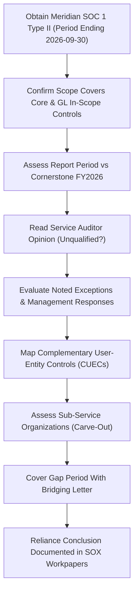

# 06.08 — SOC 1 Reliance & Complementary User-Entity Controls (CUECs)

| Field | Value |
|---|---|
| Document ID | CCB-SOX-SOC1-2026-608 |
| Version | 1.0 |
| Date | 2026-06-15 |
| Classification | Confidential — Nonpublic Information (NPI) // Illustrative Portfolio Sample |
| Owner | Marcus Doyle, IT Security Manager |
| Author | Advisory Team (Financial-Services GRC) |
| Status | Approved |

## Purpose

Cornerstone's core banking and general ledger platform is **outsourced to Meridian Core Services, LLC**. Because Meridian operates a substantial portion of the IT general controls (ITGCs) that support Internal Control over Financial Reporting (ICFR), the Bank cannot test those controls directly. Instead, management relies on Meridian's **SOC 1 Type II** report (a report on controls at a service organization relevant to user entities' internal control over financial reporting, prepared under **SSAE 18 / AT-C 320**). This document defines the SOC 1 reliance model, the review procedures management performs over the report, the **complementary user-entity controls (CUECs)** Cornerstone must operate for Meridian's controls to be effective, the treatment of **sub-service organizations**, gap-period coverage via a **bridging letter**, and how this reliance is documented to satisfy the external auditor's §404(b) integrated audit.

## The Reliance Model — Why a SOC 1 Type II

Of the **6 SOX-significant systems**, the **Meridian Core Banking / General Ledger** platform is hosted and operated entirely by Meridian, and the Wire/ACH payment system is Meridian-integrated. The controls over program access, change management, and computer operations at the Meridian data center are therefore executed by Meridian personnel. A **SOC 1 Type II** report is the appropriate assurance vehicle because it reports on both the **suitability of the design** and the **operating effectiveness** of the service organization's controls **over a period** (here, the 12 months ending 2026-09-30), which aligns with the period over which Cornerstone must conclude on ICFR.

| Report Type | What It Covers | Sufficient for ICFR Reliance? |
|---|---|---|
| SOC 1 Type I | Design of controls at a point in time | No — no operating-effectiveness evidence |
| SOC 1 Type II | Design **and** operating effectiveness over a period | Yes — used for Meridian core reliance |
| SOC 2 Type II | Security, availability, confidentiality (Trust Services) | Supplementary — supports GLBA/vendor oversight, not ICFR |

Meridian provides **both** a SOC 1 Type II and a SOC 2 Type II. The SOC 1 supports the SOX/FDICIA ICFR conclusion; the SOC 2 supports GLBA §501(b) service-provider oversight (Phase 07). This document addresses the SOC 1.

## SOC 1 Report Review Procedures

Internal Audit and the SOX program office perform a structured review of the Meridian SOC 1 Type II each year and document the conclusions in the SOX workpapers. The review confirms the report is fit for reliance before any Meridian control is deemed effective.

| Review Step | Procedure | FY2026 Outcome |
|---|---|---|
| Opinion | Confirm service auditor opinion is unqualified | Unqualified — no modification |
| Scope | Confirm in-scope control objectives cover core/GL, access, change, operations | Covered |
| Period | Confirm coverage of Bank's reliance period | 12 months to 2026-09-30 |
| Exceptions | Evaluate each tested exception for ICFR impact | 2 minor exceptions — no ICFR impact (see below) |
| CUECs | Confirm each CUEC is assigned and operating at the Bank | All 8 CUECs operating |
| Sub-service orgs | Confirm carve-out coverage and monitoring | 2 sub-service orgs — addressed |
| Gap period | Obtain bridging letter for 2026-10-01 → year-end | Bridging letter obtained |

## Exceptions Noted in the Meridian SOC 1

The FY2026 Meridian SOC 1 Type II contained **two exceptions**, each evaluated by Internal Audit for potential impact on Cornerstone's ICFR. Neither related to a control objective on which the Bank places sole reliance for a material assertion, and Meridian remediated both within its own environment. Management concluded there was **no impact on Cornerstone's ICFR conclusion**.

| Meridian Exception | Control Objective | Cornerstone Evaluation |
|---|---|---|
| One terminated-contractor access not disabled within SLA (single instance) | Logical access provisioning/deprovisioning | Mitigated by Cornerstone CUEC-3 (independent access recertification); no financial impact |
| One emergency change lacking retroactive approval evidence | Change management | Mitigated by Cornerstone CUEC-6 (Bank review of Meridian change advisories); isolated, remediated |

## Complementary User-Entity Controls (CUECs)

A SOC 1 report is explicit that Meridian's controls are effective **only if** the user entity (Cornerstone) operates certain complementary controls. These **CUECs** are the Bank's responsibility. Management has assigned an owner to each, confirmed it is designed and operating, and tested it as part of the 48-control ITGC population where applicable. Failure to operate a CUEC would break reliance on the corresponding Meridian control.

| CUEC | Complementary User-Entity Control (Cornerstone Operates) | Owner | Related ITGC Domain |
|---|---|---|---|
| CUEC-1 | Authorize and submit user-access requests for core/GL only through approved workflow | IT Security | Access to Programs &amp; Data |
| CUEC-2 | Timely notify Meridian of terminations/role changes for deprovisioning | HR / IT Security | Access to Programs &amp; Data |
| CUEC-3 | Perform periodic independent recertification of Bank users' core/GL entitlements | Internal Audit / IT Security | Access to Programs &amp; Data |
| CUEC-4 | Safeguard Bank-administered credentials and enforce MFA for core access | IT Security | Access to Programs &amp; Data |
| CUEC-5 | Review and authorize Bank-initiated configuration/parameter changes | IT / Finance | Program Changes |
| CUEC-6 | Review Meridian change advisories and assess impact on Bank processing | IT / Finance | Program Changes |
| CUEC-7 | Reconcile core/GL interface outputs for completeness and accuracy daily | Finance Operations | Computer Operations |
| CUEC-8 | Monitor Meridian batch/processing notifications and follow up on failures | IT Operations | Computer Operations |

## Sub-Service Organizations

Meridian uses **sub-service organizations** to deliver portions of its service. Meridian's SOC 1 uses the **carve-out method**, excluding the sub-service organizations' controls from the description while identifying them and the controls Meridian expects them to perform. Cornerstone assesses residual reliance on these parties through its third-party risk program (Phase 07).

| Sub-Service Organization | Service Provided to Meridian | Cornerstone Treatment |
|---|---|---|
| Cloud infrastructure / hosting provider | Data center, compute, storage for the core platform | Carved out; covered by provider SOC reports reviewed via Meridian oversight |
| Managed network / connectivity provider | Secure connectivity between Bank and Meridian | Carved out; monitored under vendor risk (Phase 07) |

## Bridging (Gap) Letter

The Meridian SOC 1 Type II covers the 12 months ending **2026-09-30**, leaving a **gap period** between the report end date and Cornerstone's fiscal year-end (2026-12-31). To cover this gap, management obtains a **bridging letter** (gap letter) from Meridian affirming that no material changes were made to the control environment and no control deficiencies arose during the gap period. The bridging letter, together with Cornerstone's ongoing vendor monitoring, extends reliance through year-end.

| Element | Detail |
|---|---|
| SOC 1 period covered | 2026-10-01 (prior) → 2026-09-30 (current) |
| Gap period | 2026-10-01 → 2026-12-31 |
| Bridging mechanism | Meridian gap letter + Bank continuous monitoring |
| Bridging letter assertions | No material control changes; no new deficiencies; CUEC expectations unchanged |

## CUEC Testing and Evidence

Because a break in any CUEC would break reliance on the corresponding Meridian control, each CUEC is tested by Internal Audit within the 48-control ITGC population or as a linked complementary procedure. CUEC results feed directly into the overall test results (06.10). In FY2026, all eight CUECs operated effectively.

| CUEC | Test Procedure | FY2026 Result |
|---|---|---|
| CUEC-1 | Inspect access-request workflow authorizations | Effective |
| CUEC-2 | Inspect termination/role-change notifications to Meridian | Effective |
| CUEC-3 | Reperform independent entitlement recertification | Effective (linked to D-1 remediation) |
| CUEC-4 | Inspect MFA enforcement and credential handling | Effective |
| CUEC-5 | Inspect authorization of Bank-initiated config changes | Effective |
| CUEC-6 | Inspect review of Meridian change advisories | Effective |
| CUEC-7 | Reperform daily interface reconciliation | Effective |
| CUEC-8 | Inspect batch-notification monitoring/follow-up | Effective |

## Documentation of Reliance in the SOX Workpapers

The reliance conclusion is memorialized in a **SOC 1 reliance memo** retained in the SOX workpapers and shared with the external auditor. The memo links each relied-upon Meridian control objective to the corresponding Bank CUEC and to the affected significant accounts, and records the review outcomes above.

| Workpaper Element | Content |
|---|---|
| Reliance memo | Report period, opinion, scope fit, exception evaluation |
| CUEC matrix | Meridian objective → Bank CUEC → owner → result |
| Bridging letter | Gap-period coverage affirmation |
| Sub-service assessment | Carve-out orgs and monitoring reference (Phase 07) |
| Auditor sharing | Provided to Whitmore &amp; Associates for §404(b) |

## Cross-References

- **06.01** — Scope: Meridian core/GL among the 6 significant systems.
- **06.04** — Access controls and the recertification CUEC linkage.
- **06.07** — Computer operations and Meridian facilities reliance.
- **06.09** — How SOC 1 reliance integrates with design and operating-effectiveness testing.
- **06.10** — Test results incorporating CUEC testing outcomes.
- **Phase 07** — Third-party/vendor risk oversight of Meridian and sub-service organizations; SOC 2 reliance for GLBA.

---
[⬅ Previous](06.07-computer-operations.md) · [🏠 Phase README](06.00-README.md) · [Next ➡](06.09-control-design-and-testing-methodology.md)
