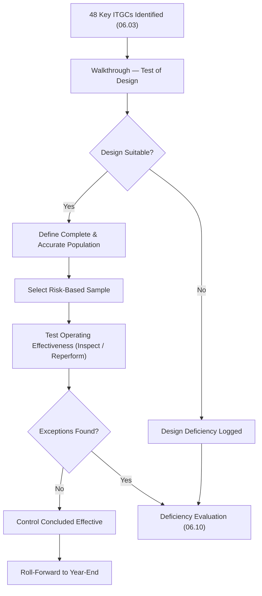

# 06.09 — Control Design & Testing Methodology

| Field | Value |
|---|---|
| Document ID | CCB-SOX-METH-2026-609 |
| Version | 1.0 |
| Date | 2026-06-15 |
| Classification | Confidential — Nonpublic Information (NPI) // Illustrative Portfolio Sample |
| Owner | Priya Sharma, Director of Internal Audit |
| Author | Advisory Team (Financial-Services GRC) |
| Status | Approved |

## Purpose

This document defines the **methodology** by which Cornerstone tests its **48 key IT general controls** across the four ITGC domains (Access to Programs & Data, Program Changes, Program Development/SDLC, Computer Operations) over the **6 SOX-significant systems**. It distinguishes **test of design (TOD)** from **test of operating effectiveness (TOE)**, specifies evidence and sampling conventions calibrated to control risk and frequency, describes the **roll-forward** procedures that extend interim conclusions to year-end, and clarifies the division of labor between **Internal Audit** (independent management testing under Priya Sharma) and the **external auditor** (**Whitmore & Associates, LLP**), including the basis on which the external auditor may rely on the work of others. It is the methodological foundation for the results reported in 06.10.

## Two Tests: Design and Operating Effectiveness

Every key control is subjected to two distinct evaluations. **Test of design** asks whether the control, *if operated as described*, would prevent or detect a material misstatement on a timely basis. **Test of operating effectiveness** asks whether the control *actually operated* consistently throughout the period. A control can be well-designed but fail in operation, or operate consistently while being poorly designed; both must pass.

| Dimension | Test of Design (TOD) | Test of Operating Effectiveness (TOE) |
|---|---|---|
| Question answered | Is the control capable of achieving its objective? | Did the control operate consistently over the period? |
| Timing | Interim (walkthroughs, 2026-07) | Interim + roll-forward (2026-07 → 09) |
| Primary technique | Walkthrough of one transaction end-to-end | Sampling across the period |
| Evidence | Narrative, process maps, single-instance corroboration | Populations, samples, reperformance |
| Failure meaning | Deficiency in design | Deficiency in operation |

## Sampling Approach

Sample sizes follow a **risk- and frequency-based** convention consistent with common PCAOB/audit-guide practice. Higher control risk and higher-risk systems (Meridian core/GL, Wire/ACH) draw the top of the range; automated controls that are configuration-dependent may be tested with a **test of one** plus supporting evidence that the configuration did not change (a "benchmarking" strategy).

| Control Frequency | Baseline Sample (Lower Risk) | Baseline Sample (Higher Risk) |
|---|---|---|
| Many times per day / automated (config) | Test of 1 + change-integrity evidence | Test of 1 + change-integrity evidence |
| Daily | 15 | 25 |
| Weekly | 5 | 10 |
| Monthly | 2 | 5 |
| Quarterly | 2 | 2 |
| Annual / ad hoc | 1 | 1 |

Populations are validated for **completeness and accuracy** before selection (e.g., system-generated user lists reconciled to source, change tickets reconciled to the deployment log). A sample drawn from an unreliable population is not reliable evidence, so population validation is itself documented in the workpapers.

## Evidence and Testing Techniques

| Technique | Description | Strength |
|---|---|---|
| Inquiry | Ask the control owner how the control operates | Weakest — corroboration required |
| Observation | Watch the control being performed | Point-in-time only |
| Inspection | Examine documents/records/system evidence | Strong — primary TOE technique |
| Reperformance | Independently re-execute the control | Strongest — used for key/high-risk controls |

Evidence is retained in the SOX workpaper repository with a clear audit trail: control reference, population source, selection method, samples, results, and reviewer sign-off. Screenshots and system extracts are dated and attributed to source systems.

## Roll-Forward to Year-End

Operating-effectiveness testing is performed at **interim** (2026-07 → 09) for efficiency, then **rolled forward** to the fiscal year-end (2026-12-31). Roll-forward procedures gather evidence that the control continued to operate between interim testing and year-end and that no significant changes occurred. For the Meridian core, roll-forward pairs the SOC 1 Type II with the **bridging letter** (06.08).

| Roll-Forward Consideration | Procedure |
|---|---|
| Elapsed period | ~3 months (interim to year-end) |
| Control changes | Confirm no changes to control design/owner/system |
| Additional sampling | Small supplemental sample for higher-risk controls |
| Meridian core | SOC 1 Type II + bridging letter (06.08) |
| Deficiencies | Confirm remediated controls continued to operate post-fix |

## Exception and Deficiency Handling During Testing

When a sample item fails, the tester does not immediately conclude a deficiency exists. A defined protocol governs how exceptions are investigated, whether the population can be re-scoped, and how the exception is escalated to the deficiency-evaluation process (06.10). Extrapolation is considered where an exception may indicate a broader control failure.

| Step | Action |
|---|---|
| Identify exception | Document the failed attribute and evidence gap |
| Investigate | Confirm it is a true exception, not a documentation/testing artifact |
| Assess extent | Consider whether the exception is isolated or systemic (extrapolation) |
| Compensating controls | Identify controls that mitigate the failure |
| Escalate | Route confirmed exceptions to deficiency evaluation (06.10) |
| Track | Log in the deficiency tracker with owner and remediation target |

## Documentation and Quality Review

Every workpaper is subject to a **preparer/reviewer** model: the tester prepares, and a senior Internal Audit reviewer independently reviews the population validation, sample selection, evidence, and conclusion before the control is signed off. The SOX Program Office performs a final quality review before results are shared with the external auditor.

| Review Layer | Performed By | Focus |
|---|---|---|
| Preparer | Internal Audit tester | Execute test; document evidence |
| Reviewer | Senior Internal Audit | Population, sampling, evidence, conclusion |
| Program QA | SOX Program Office | Consistency, completeness, deficiency logic |
| External reliance | Whitmore &amp; Associates | Reperformance of a portion of IA work |

## Who Tests — Internal Audit vs External Auditor

**Internal Audit**, led by Priya Sharma and reporting functionally to the Audit Committee, performs the independent **management testing** of the 48 key ITGCs that supports the §404(a) assertion. **Whitmore & Associates, LLP** performs the **§404(b) integrated audit** and forms its own opinion; under PCAOB **AS 2605 / AS 2201**, the external auditor may **rely on the work of others** (including Internal Audit) to the extent it evaluates their **competence and objectivity** and reperforms a portion of the work. Reliance is greater for lower-risk, objective controls and lower (more direct auditor testing) for higher-risk, judgmental controls.

| Party | Responsibility | Independence Basis |
|---|---|---|
| Control owners (IT, Finance) | Operate controls; provide evidence | First line |
| Internal Audit (Priya Sharma) | Independent management testing of 48 ITGCs | Reports to Audit Committee |
| SOX Program Office | Coordinate scope, workpapers, deficiency evaluation | Second line / CFO sponsor |
| Whitmore &amp; Associates, LLP | §404(b) integrated audit; may rely on IA work | Independent registered public accounting firm |
| Audit Committee (R. Hanley, Chair) | Oversight of ICFR, IA, and external auditor | Governance |

## Cross-References

- **06.03** — The 48-control framework tested under this methodology.
- **06.04–06.07** — Domain-level control designs (APD, PC, PD, CO).
- **06.08** — SOC 1 reliance integrated into the testing plan and roll-forward.
- **06.10** — Test results and deficiency evaluation produced by this methodology.
- **06.11** — Remediation and retest of identified deficiencies.
- **Phase 08** — Independent testing and examination readiness leveraging these workpapers.

---
[⬅ Previous](06.08-soc1-reliance-and-cuecs.md) · [🏠 Phase README](06.00-README.md) · [Next ➡](06.10-test-results-and-deficiencies.md)
