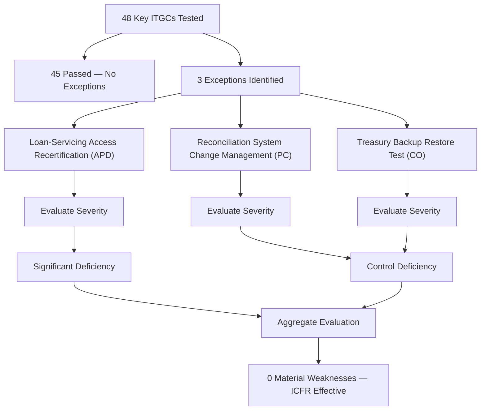

# 06.10 — Test Results & Deficiencies

| Field | Value |
|---|---|
| Document ID | CCB-SOX-RSLT-2026-610 |
| Version | 1.0 |
| Date | 2026-06-15 |
| Classification | Confidential — Nonpublic Information (NPI) // Illustrative Portfolio Sample |
| Owner | Priya Sharma, Director of Internal Audit |
| Author | Advisory Team (Financial-Services GRC) |
| Status | Approved |

## Purpose

This is the **keystone results document** for Phase 06. It reports the outcome of testing all **48 key IT general controls** across the four ITGC domains and the **6 SOX-significant systems** for FY2026, summarizes pass/exception results by domain, and documents the **three deficiencies** identified — **1 significant deficiency and 2 control deficiencies, with 0 material weaknesses** — together with the **deficiency-evaluation logic** (severity classification based on whether a reasonable possibility of a material misstatement exists). The three deficiencies are the **loan-servicing access-recertification** significant deficiency, the **reconciliation-system change-management** control deficiency, and the **treasury backup restore-test** control deficiency. All three were remediated (06.11), supporting management's conclusion that **ICFR is effective**.

## Testing Summary — 48 Controls

Internal Audit tested all 48 key ITGCs under the methodology in 06.09 (test of design plus test of operating effectiveness, with roll-forward). Of the 48 controls, **45 passed with no exceptions** and **3 had exceptions** that were evaluated as deficiencies. No deficiency, individually or in aggregate, rose to the level of a **material weakness**.

| ITGC Domain | Key Controls | Passed | Exceptions | Deficiency Severity |
|---|---|---|---|---|
| Access to Programs &amp; Data (APD) | 16 | 15 | 1 | 1 Significant Deficiency |
| Program Changes (PC) | 12 | 11 | 1 | 1 Control Deficiency |
| Program Development / SDLC (PD) | 8 | 8 | 0 | — |
| Computer Operations (CO) | 12 | 11 | 1 | 1 Control Deficiency |
| **Total** | **48** | **45** | **3** | **1 SD + 2 CD; 0 MW** |

## Deficiency-Evaluation Logic

Each exception is classified by **severity**, which turns on **magnitude** (could the deficiency, alone or combined with others, result in a misstatement) and **likelihood** (is there a *reasonable possibility* that the control's failure would fail to prevent or detect a misstatement of a given size). The three-tier scale below follows PCAOB **AS 2201** and SEC guidance. The presence of **compensating controls** is central: a deficiency mitigated by an effective compensating control is less severe because a misstatement is less likely to reach the financial statements undetected.

| Severity Tier | Definition | Reasonable Possibility of… |
|---|---|---|
| Control Deficiency (CD) | Control fails to operate as designed | A misstatement that is **less than significant** |
| Significant Deficiency (SD) | Important enough to merit attention by those charged with governance | A misstatement **more than inconsequential but less than material** |
| Material Weakness (MW) | Reasonable possibility that a **material** misstatement would not be prevented/detected | A **material** misstatement |

For each of the three exceptions, management asked: *given the failure and any compensating controls, could a material misstatement occur and go undetected?* In every case the answer was **no material misstatement was reasonably possible**, so **no material weakness** was concluded. One APD exception was elevated to **significant deficiency** because it affected a higher-risk access domain over loan balances and lacked a fully independent compensating detective control during the exception window.

## The Three Deficiencies

| # | Deficiency | Domain / Control | System | Root Cause | Compensating Control | Severity |
|---|---|---|---|---|---|---|
| D-1 | User access **recertification not completed** timely for one review cycle; two transferred users retained residual entitlements | APD — access recertification | Loan Servicing | Manual recert tracking; owner transition missed a cycle | Preventive provisioning + supervisory transaction review (partial, not fully independent) | **Significant Deficiency** |
| D-2 | A production change lacked documented **testing/approval evidence** before deployment | PC — change management | Reconciliation | Emergency-change path used without retroactive documentation | Post-implementation review; GL-to-subledger recon detected no error | **Control Deficiency** |
| D-3 | A backup **restore test** was performed but **not formally documented** | CO — backup/restore testing | Treasury / Investment | No standardized restore-test evidence template | Successful daily backups; replication monitoring | **Control Deficiency** |

### D-1 — Loan-Servicing Access Recertification (Significant Deficiency)

The periodic recertification of user entitlements over the **Loan Servicing** system was **not completed** for one review cycle during the year, and two users who changed roles retained access no longer aligned to their duties. No misstatement resulted, and no evidence of misuse was found; the preventive provisioning control and supervisory review remained in place. However, because Loan Servicing feeds **loan balances and allowance inputs** (higher-risk accounts) and the detective compensating control was not fully independent, management classified this as a **significant deficiency** — more than inconsequential but **not material** and **not a material weakness**.

### D-2 — Reconciliation System Change Management (Control Deficiency)

One production change to the **Reconciliation** system was deployed through the emergency-change path **without retained testing and approval evidence**. A post-implementation review confirmed the change functioned correctly and the GL-to-subledger reconciliation detected no error, so the magnitude and likelihood were low. Classified as a **control deficiency**.

### D-3 — Treasury Backup Restore Test (Control Deficiency)

A backup **restore test** for the **Treasury / Investment Management** system was performed during the year but **not formally documented**, so operating effectiveness of the restore-test control could not be evidenced for that instance. Daily backups succeeded and replication was monitored throughout. Classified as a **control deficiency** (also referenced in 06.07).

## Results by System

Because reliance is placed on the 6 significant systems, results are also viewed by system to confirm that no single system concentrated an unacceptable level of deficiency. The Meridian core/GL results reflect **SOC 1 Type II reliance plus CUEC testing** (06.08); the CUECs operated effectively.

| Significant System | Controls / Reliance | Exceptions | Deficiency |
|---|---|---|---|
| Meridian Core Banking / General Ledger | SOC 1 Type II + 8 CUECs | 0 (Bank-side) | None |
| Financial Reporting &amp; Consolidation | ITGCs across 4 domains | 0 | None |
| Loan Servicing | ITGCs across 4 domains | 1 | D-1 (SD) |
| Wire / ACH Payment | ITGCs across 4 domains | 0 | None |
| Treasury / Investment Management | ITGCs across 4 domains | 1 | D-3 (CD) |
| Reconciliation | ITGCs across 4 domains | 1 | D-2 (CD) |

## Impact on Reliance on Automated and IT-Dependent Controls

ITGCs are pervasive: a deficiency in an ITGC can undermine reliance on the automated application controls and IT-dependent manual controls that operate in the same environment. For each deficiency, management assessed whether dependent business-process controls could still be relied upon during the exception window.

| Deficiency | Dependent Controls Considered | Reliance Impact |
|---|---|---|
| D-1 (Loan Servicing access) | Loan-balance and allowance-input controls | Limited — preventive provisioning intact; no unauthorized activity found |
| D-2 (Reconciliation change) | GL-to-subledger reconciliation control | None — reconciliation detected no error |
| D-3 (Treasury restore test) | Recoverability of Treasury records | None — backups and replication succeeded |

## Aggregation and Overall Conclusion

Management evaluated the three deficiencies **individually and in aggregate**, considering whether deficiencies affecting the **same account, assertion, or process** could combine into a more severe finding. The deficiencies affect **different systems** (Loan Servicing, Reconciliation, Treasury), **different domains** (APD, PC, CO), and **different assertions**, so they do not aggregate into a material weakness.

| Evaluation Question | Conclusion |
|---|---|
| Any single deficiency a material weakness? | No |
| Do deficiencies aggregate to a material weakness? | No — different systems/domains/assertions |
| Reasonable possibility of a material misstatement? | No |
| Overall ICFR conclusion (pre-remediation) | Effective, with 1 SD + 2 CD to remediate |
| Material weaknesses | **0** |

## Cross-References

- **06.02** — ICFR/FDICIA linkage and deficiency-severity framework.
- **06.04** — APD domain (loan-servicing access recertification, D-1).
- **06.05** — PC domain (reconciliation change management, D-2).
- **06.07** — CO domain (treasury restore test, D-3).
- **06.09** — Testing methodology producing these results.
- **06.11** — Remediation and retest of all three deficiencies.
- **06.12** — Management assertion and external auditor opinion.

---
[⬅ Previous](06.09-control-design-and-testing-methodology.md) · [🏠 Phase README](06.00-README.md) · [Next ➡](06.11-deficiency-remediation.md)
