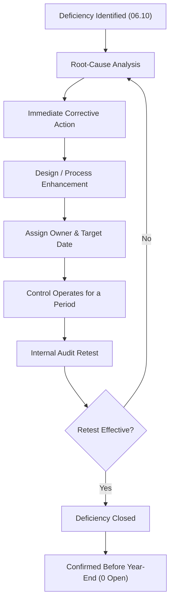

# 06.11 — Deficiency Remediation

| Field | Value |
|---|---|
| Document ID | CCB-SOX-REMD-2026-611 |
| Version | 1.0 |
| Date | 2026-06-15 |
| Classification | Confidential — Nonpublic Information (NPI) // Illustrative Portfolio Sample |
| Owner | Priya Sharma, Director of Internal Audit |
| Author | Advisory Team (Financial-Services GRC) |
| Status | Approved |

## Purpose

This document records the **remediation** of the three ITGC deficiencies identified in 06.10 — the **loan-servicing access-recertification significant deficiency (D-1)**, the **reconciliation-system change-management control deficiency (D-2)**, and the **treasury backup restore-test control deficiency (D-3)**. For each, it documents the corrective-action plan, the control-design improvement, the owner and timeline, the **retest** performed by Internal Audit, and the retest conclusion. **All three deficiencies were remediated and retested effective** before fiscal year-end, so that no deficiency remained open at the date of management's ICFR assertion (06.12).

## Remediation Approach

Remediation for each deficiency followed a consistent lifecycle: perform an **immediate corrective action** to close the specific exception, implement a **design/process enhancement** to prevent recurrence, and then **retest** a fresh sample (or the corrected instance) to confirm the control now operates effectively. Because all deficiencies were identified at interim, there was sufficient time for the remediated controls to **operate for a period** before year-end, allowing Internal Audit to conclude on operating effectiveness of the fix — not merely its implementation.

## Remediation Plans and Retest Results

| # | Deficiency | Owner | Immediate Corrective Action | Design Enhancement | Retest Result |
|---|---|---|---|---|---|
| D-1 | Loan-servicing access recertification (SD) | Marcus Doyle (IT Security Mgr) | Recertification re-performed; residual access for two transferred users revoked | Automated recert workflow with tracked due dates, escalation, and independent Internal Audit sign-off | **Remediated — Effective** |
| D-2 | Reconciliation change management (CD) | James Porter (CIO) | Retroactive testing/approval documented; change validated | Emergency-change procedure updated to require retroactive approval and evidence within 3 business days; ticket-to-deploy reconciliation added | **Remediated — Effective** |
| D-3 | Treasury backup restore test (CD) | Marcus Doyle (IT Security Mgr) | Restore test re-performed and formally documented | Standardized restore-test evidence template; restore tests scheduled and tracked in operations calendar | **Remediated — Effective** |

## D-1 — Loan-Servicing Access Recertification

The missed recertification cycle was **re-performed** immediately, and the two transferred users' residual entitlements were **revoked** and confirmed. To prevent recurrence, IT Security implemented an **automated recertification workflow** for the Loan Servicing system (and the other in-scope systems) with tracked due dates, automated reminders, escalation for overdue reviews, and a required **independent Internal Audit sign-off** that closes the fully-independent detective-control gap noted in 06.10. Internal Audit retested a subsequent recertification cycle and found **no exceptions**; the significant deficiency is **remediated and effective**.

## D-2 — Reconciliation System Change Management

The undocumented emergency change was **retroactively documented** with the testing and approval evidence, and its correctness was re-confirmed against the reconciliation output. The **emergency-change procedure** was updated to require retroactive approval and complete evidence within **3 business days**, and a periodic **ticket-to-deployment reconciliation** was added so any change lacking a matched, approved ticket is flagged. Internal Audit retested a new sample of production changes to the Reconciliation system with **no exceptions**; the control deficiency is **remediated and effective**.

## D-3 — Treasury Backup Restore Test

The Treasury restore test was **re-performed and formally documented** using a new **standardized restore-test evidence template** capturing scope, date, personnel, steps, and results. Restore tests for all in-scope systems were **scheduled and tracked** in the operations calendar to ensure timely performance and documentation. Internal Audit inspected the documented restore test and confirmed the evidence standard; the control deficiency is **remediated and effective**.

## Root-Cause Themes and Preventive Lessons

Although the three deficiencies affected different systems and domains, management performed a cross-cutting root-cause review to identify systemic themes and prevent recurrence beyond the individual fixes. Two themes emerged: **reliance on manual tracking** (recertification cycles, restore-test scheduling) and **incomplete evidence discipline** on exception paths (emergency changes, ad hoc restore tests). Both were addressed by adding automation, tracking, and standardized evidence templates.

| Theme | Deficiencies Affected | Systemic Corrective Measure |
|---|---|---|
| Manual tracking of periodic controls | D-1, D-3 | Automated workflows and operations-calendar tracking with escalation |
| Incomplete evidence on exception paths | D-2, D-3 | Standardized evidence templates; mandatory retroactive documentation windows |
| Fully-independent detective coverage | D-1 | Independent Internal Audit sign-off added to recertification |

## Retest Scope and Evidence

Internal Audit's retest was not a re-inspection of the original exception alone; for each remediated control it selected a **fresh sample** drawn from the post-remediation period (or, for annual/ad hoc controls, inspected the corrected instance plus the enhanced process evidence). This confirms the control operates effectively going forward, not merely that the single exception was closed.

| # | Retest Population | Retest Technique | Exceptions on Retest |
|---|---|---|---|
| D-1 | Subsequent recertification cycle (all in-scope systems) | Inspection + reperformance of independent sign-off | 0 |
| D-2 | New sample of production changes to Reconciliation | Inspection of testing/approval evidence; ticket-to-deploy match | 0 |
| D-3 | Documented Treasury restore test | Inspection against standardized template | 0 |

## Remediation Timeline and Status

| # | Identified | Remediation Completed | Retested | Status at Year-End |
|---|---|---|---|---|
| D-1 | 2026-08 | 2026-09 | 2026-09 → roll-forward | Closed — Effective |
| D-2 | 2026-08 | 2026-09 | 2026-09 → roll-forward | Closed — Effective |
| D-3 | 2026-08 | 2026-09 | 2026-09 | Closed — Effective |

At the date of the management assertion, **zero deficiencies remained open**. All remediated controls were confirmed to have **operated effectively for a period** through year-end via roll-forward (06.09), and the external auditor (**Whitmore & Associates, LLP**) evaluated the remediation as part of the integrated audit.

## Governance and Tracking

Remediation progress was tracked in the SOX **deficiency tracker** and reported to the Audit Committee (Robert Hanley, Chair) and the CFO (Linda Barrett) until every item was closed. No deficiency was accepted as a residual risk; all three were fully remediated rather than merely mitigated.

| Governance Body | Role in Remediation | Cadence |
|---|---|---|
| SOX Program Office | Maintain deficiency tracker; validate closure evidence | Continuous |
| Internal Audit (Priya Sharma) | Retest and confirm operating effectiveness | Per remediation |
| CFO (Linda Barrett) | Sponsor; confirm remediation before assertion | Monthly |
| Audit Committee (R. Hanley) | Oversight; review status to closure | Quarterly |
| External Auditor (Whitmore &amp; Associates) | Evaluate remediation in integrated audit | Fieldwork |

## Effect on the ICFR Conclusion

Because all three deficiencies were remediated and retested effective before year-end, and none was a material weakness at any point, the deficiencies had **no adverse effect** on management's year-end ICFR conclusion. The remediation strengthened the control environment going into FY2027, reducing the likelihood of recurrence through automation and standardized evidence.

| Consideration | Outcome |
|---|---|
| Deficiencies open at year-end | 0 |
| Material weaknesses | 0 |
| Effect on ICFR conclusion | None — ICFR effective |
| Forward-looking benefit | Automated recert, change evidence, restore-test standardization |

## Cross-References

- **06.10** — The three deficiencies and their severity evaluation.
- **06.04** — APD control design (D-1 recertification).
- **06.05** — PC control design (D-2 change management).
- **06.07** — CO control design (D-3 restore testing).
- **06.09** — Roll-forward methodology supporting retest conclusions.
- **06.12** — Management assertion reflecting fully remediated deficiencies.

---
[⬅ Previous](06.10-test-results-and-deficiencies.md) · [🏠 Phase README](06.00-README.md) · [Next ➡](06.12-management-assertion-and-signoff.md)
