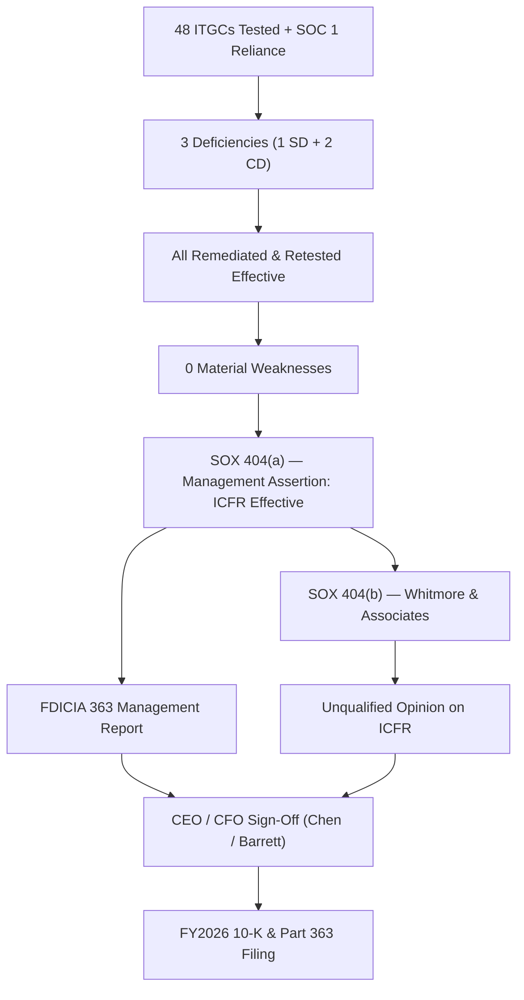

# 06.12 — Management Assertion & Sign-Off

| Field | Value |
|---|---|
| Document ID | CCB-SOX-ASRT-2026-612 |
| Version | 1.0 |
| Date | 2026-06-15 |
| Classification | Confidential — Nonpublic Information (NPI) // Illustrative Portfolio Sample |
| Owner | Linda Barrett, Chief Financial Officer |
| Author | Advisory Team (Financial-Services GRC) |
| Status | Approved |

## Purpose

This document records management's formal conclusion on the effectiveness of **Internal Control over Financial Reporting (ICFR)** for FY2026 and the associated attestations. It presents the **SOX §404(a) management assertion** that ICFR is **effective**, the basis for that conclusion (48 key ITGCs tested; 3 deficiencies — 1 significant deficiency and 2 control deficiencies — **all remediated**; **0 material weaknesses**; SOC 1 Type II reliance on Meridian), the **SOX §404(b) external auditor** position (**Whitmore & Associates, LLP** issues an **unqualified opinion** on ICFR), the parallel **FDICIA Part 363** management report, and the **CEO/CFO sign-off** block (**Margaret Chen** and **Linda Barrett**).

## Basis for the Assertion

Management's conclusion rests on the top-down, risk-based assessment documented across Phase 06: identification of the 6 significant systems and 48 key ITGCs, testing of design and operating effectiveness by Internal Audit, evaluation of deficiencies, and confirmation of remediation. Reliance on Meridian's controls is supported by its **SOC 1 Type II** report, the bridging letter, and Cornerstone's complementary user-entity controls (CUECs).

| Basis Element | Evidence | Reference |
|---|---|---|
| Scope | 6 significant systems; 4 domains; 48 key ITGCs | 06.01, 06.03 |
| Testing | Design + operating effectiveness; roll-forward | 06.09 |
| Results | 45 of 48 passed; 3 deficiencies | 06.10 |
| Severity | 1 significant deficiency + 2 control deficiencies; **0 material weaknesses** | 06.10 |
| Remediation | All 3 deficiencies remediated and retested effective | 06.11 |
| Service org | Meridian SOC 1 Type II + CUECs + bridging letter | 06.08 |

## SOX §404(a) — Management Assertion

Management is responsible for establishing and maintaining adequate ICFR and for assessing its effectiveness. Management conducted its assessment using the **COSO 2013 Internal Control — Integrated Framework**. Based on that assessment, **management concluded that Cornerstone's ICFR was effective as of December 31, 2026.** The three deficiencies identified during the year were remediated prior to year-end, and management identified **no material weaknesses**.

| §404(a) Element | Statement |
|---|---|
| Responsibility | Management is responsible for establishing and maintaining ICFR |
| Framework | COSO 2013 Internal Control — Integrated Framework |
| Assessment | Design and operating effectiveness of key controls, including ITGCs |
| Deficiencies | 1 significant deficiency + 2 control deficiencies — all remediated |
| Material weaknesses | None identified |
| **Conclusion** | **ICFR is effective as of December 31, 2026** |

## SOX §404(b) — External Auditor Attestation

**Whitmore & Associates, LLP**, the independent registered public accounting firm, performed an **integrated audit** of Cornerstone Bancorp's consolidated financial statements and the effectiveness of ICFR under PCAOB **AS 2201**. The external auditor concurred with management and issued an **unqualified (clean) opinion** on the effectiveness of ICFR, consistent with the unqualified opinion on the financial statements.

| §404(b) Element | Outcome |
|---|---|
| Auditor | Whitmore &amp; Associates, LLP |
| Standard | PCAOB AS 2201 — Integrated Audit |
| Reliance on others | Evaluated and reperformed portions of Internal Audit's work |
| Opinion on ICFR | **Unqualified** |
| Material weaknesses reported | None |

## FDICIA Part 363 — Management Report

Because Cornerstone has ≥$1B in total assets (~$1.2B), **FDICIA Part 363** applies and runs in parallel with SOX. Management prepares an annual **Part 363 report** on the institution's ICFR, and the independent public accountant attests to it. The same ITGC evidence base supports both the SOX and FDICIA conclusions.

| FDICIA 363 Element | Statement |
|---|---|
| Applicability | Total assets ≥ $1B (~$1.2B) |
| Management report | Statement of management's responsibility and ICFR effectiveness conclusion |
| Conclusion | ICFR effective as of December 31, 2026 |
| Independent attestation | Whitmore &amp; Associates, LLP — consistent with §404(b) opinion |
| Audit Committee | Reviews and receives the report (R. Hanley, Chair) |

## Disclosure Controls and §302 Certification Linkage

Beyond the annual §404 assessment, the CEO and CFO provide quarterly **§302 certifications** covering disclosure controls and procedures. The ITGC conclusions support these certifications by evidencing that the systems producing financial data are controlled. Any deficiency with potential disclosure impact is escalated to the Disclosure Committee; for FY2026, the three remediated deficiencies were evaluated as **not requiring disclosure** because none constituted a material weakness.

| Certification | Frequency | Scope | FY2026 Outcome |
|---|---|---|---|
| §302 | Quarterly | Disclosure controls &amp; procedures | Certified — effective |
| §404(a) | Annual | ICFR effectiveness (management) | Effective |
| §404(b) | Annual | ICFR effectiveness (auditor) | Unqualified |
| FDICIA 363 | Annual | ICFR (management + attestation) | Effective |

## Audit Committee Review

The **Audit Committee** (Robert Hanley, Chair) reviewed the ITGC testing results, the deficiency evaluation, the remediation status, and the management assertion, and discussed the integrated audit with **Whitmore & Associates, LLP** in executive session. The Committee concurred with management's conclusion and recommended the assertion and Part 363 report for inclusion in the FY2026 filings.

| Review Item | Committee Action |
|---|---|
| ITGC test results (48 controls) | Reviewed |
| 3 deficiencies + remediation | Reviewed; confirmed all closed |
| Management assertion (ICFR effective) | Concurred |
| External auditor opinion (unqualified) | Received; discussed in executive session |
| FDICIA 363 report | Recommended for filing |

## CEO / CFO Sign-Off

The following officers certify management's conclusion on ICFR effectiveness for FY2026. (Illustrative signature block — portfolio sample.)

| Role | Name | Certification | Signature / Date |
|---|---|---|---|
| President &amp; CEO, Cornerstone Bancorp | Margaret Chen | Certifies ICFR effectiveness (§302/§404) | ______________ / 2026-06-15 |
| Chief Financial Officer | Linda Barrett | Certifies ICFR effectiveness (§302/§404); SOX 404 sponsor | ______________ / 2026-06-15 |
| Director of Internal Audit | Priya Sharma | Confirms independent testing performed | ______________ / 2026-06-15 |
| Audit Committee Chair | Robert Hanley | Acknowledges governance oversight | ______________ / 2026-06-15 |

## Cross-References

- **06.02** — ICFR/FDICIA Part 363 linkage.
- **06.10** — Test results supporting the assertion.
- **06.11** — Remediation confirming zero open deficiencies.
- **06.13** — Phase summary and transition to Phase 07.
- **Phase 08** — External audit and examination readiness.
- **Phase 09** — Board reporting incorporating the ICFR conclusion.

---
[⬅ Previous](06.11-deficiency-remediation.md) · [🏠 Phase README](06.00-README.md) · [Next ➡](06.13-phase-summary-and-transition.md)
