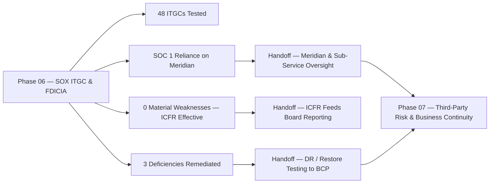

# 06.13 — Phase Summary & Transition

| Field | Value |
|---|---|
| Document ID | CCB-SOX-SUMM-2026-613 |
| Version | 1.0 |
| Date | 2026-06-15 |
| Classification | Confidential — Nonpublic Information (NPI) // Illustrative Portfolio Sample |
| Owner | James Porter, Chief Information Officer |
| Author | Advisory Team (Financial-Services GRC) |
| Status | Approved |

## Purpose

This document closes **Phase 06 — SOX IT General Controls (ITGC) & FDICIA** and transitions the program to **Phase 07 — Third-Party / Vendor Risk & Business Continuity**. It recaps the phase's scope and outcomes (48 key ITGCs tested; 3 deficiencies — 1 significant deficiency and 2 control deficiencies — **all remediated**; **0 material weaknesses**; **ICFR effective**; SOC 1 Type II reliance on Meridian; unqualified auditor opinion), confirms the deliverables produced, and hands off the open threads — Meridian oversight, sub-service organizations, and business-continuity/DR objectives — into the third-party risk and continuity work of Phase 07.

## Phase 06 Recap

Phase 06 established Cornerstone's SOX §404 ITGC program, tied it to **FDICIA Part 363**, tested the control environment supporting ICFR, remediated the deficiencies found, and reached a formal, attested conclusion. The phase demonstrates a well-controlled financial-reporting technology environment with a modest, fully-remediated deficiency profile.

| Outcome | Result |
|---|---|
| Significant systems in scope | 6 |
| ITGC domains | 4 (APD, PC, PD, CO) |
| Key ITGCs tested | 48 |
| Controls passed | 45 |
| Deficiencies | 3 (1 significant deficiency + 2 control deficiencies) |
| Material weaknesses | 0 |
| Deficiency status | All remediated and retested effective |
| Service-organization reliance | Meridian SOC 1 Type II + CUECs + bridging letter |
| Management ICFR conclusion | **Effective** |
| External auditor opinion (Whitmore &amp; Associates) | **Unqualified** |

## Deliverables Produced

| Document | Title | Owner |
|---|---|---|
| 06.01 | SOX ITGC Scope &amp; Approach | Linda Barrett (CFO) |
| 06.02 | ICFR &amp; FDICIA 363 Linkage | Linda Barrett (CFO) |
| 06.03 | ITGC Control Framework | James Porter (CIO) |
| 06.04–06.07 | The four ITGC domains (APD, PC, PD, CO) | Marcus Doyle / James Porter |
| 06.08 | SOC 1 Reliance &amp; CUECs | Marcus Doyle |
| 06.09 | Control Design &amp; Testing Methodology | Priya Sharma |
| 06.10 | Test Results &amp; Deficiencies | Priya Sharma |
| 06.11 | Deficiency Remediation | Priya Sharma |
| 06.12 | Management Assertion &amp; Sign-Off | Linda Barrett (CFO) |
| 06.13 | Phase Summary &amp; Transition | James Porter (CIO) |

## Open Threads Handed to Phase 07

Several Phase 06 conclusions depend on, or feed into, the third-party and continuity work of Phase 07. These threads are explicitly transitioned so nothing is dropped.

| Open Thread | Origin in Phase 06 | Phase 07 Treatment |
|---|---|---|
| Meridian oversight | SOC 1 reliance; core/GL outsourced | Enhanced vendor oversight; Meridian among 12 critical/high-risk vendors |
| Sub-service organizations | Carve-out method in Meridian SOC 1 | Extended vendor due diligence and monitoring |
| SOC 2 reliance | Meridian SOC 2 Type II noted (GLBA) | GLBA §501(b) service-provider oversight |
| Backup / restore &amp; DR | D-3 remediation; CO-04 restore testing | BCP/DR with RTO/RPO objectives and DR testing |
| Incident escalation | CO incident/problem management | IR plan, tabletop, and 36-hour notification interface |

## Metrics Snapshot

| Metric | Value |
|---|---|
| Significant systems | 6 |
| ITGC domains | 4 |
| Key controls tested | 48 |
| Pass rate | 45 / 48 (94%) |
| Significant deficiencies | 1 (remediated) |
| Control deficiencies | 2 (remediated) |
| Material weaknesses | 0 |
| Open deficiencies at year-end | 0 |
| Service-org reports relied upon | Meridian SOC 1 Type II (+ SOC 2 Type II) |
| ICFR conclusion | Effective |

## Residual Posture and Continuous Monitoring

Cornerstone's financial-reporting control environment exits Phase 06 in a **well-managed, low-to-moderate residual posture**. The remediated controls (automated recertification, emergency-change evidence discipline, standardized restore-test evidence) are embedded and subject to ongoing monitoring, and the SOX program will re-scope and re-test annually. The ICFR conclusion feeds forward into board reporting (Phase 09) and examination readiness (Phase 08).

| Continuous Monitoring Activity | Cadence | Owner |
|---|---|---|
| ITGC key-control re-testing | Annual (interim + roll-forward) | Internal Audit |
| Access recertification | Periodic per system | IT Security |
| Meridian SOC 1 review + bridging letter | Annual | SOX Program Office |
| Deficiency tracking to closure | Continuous | Internal Audit |

## Transition to Phase 07

Phase 07 — **Third-Party / Vendor Risk & Business Continuity** — inventories the Bank's **85 third parties**, designates the **12 critical/high-risk** relationships (with **Meridian under enhanced oversight**), and establishes the business-continuity and disaster-recovery program (RTO/RPO objectives, DR testing) and the incident-response plan and tabletop. It operationalizes the service-provider oversight that Phase 06's SOC 1 reliance depends on and extends the operations/recovery controls into a full continuity program.

| Phase 07 Focus | Connection to Phase 06 |
|---|---|
| Vendor inventory &amp; risk tiering | Confirms reliance on Meridian and sub-service orgs |
| Enhanced oversight of critical vendors | Deepens the SOC 1/SOC 2 reliance model |
| BCP / DR (RTO/RPO, DR testing) | Extends CO backup/restore controls (D-3) |
| Incident response &amp; tabletop | Extends incident/problem management |

## Cross-References

- **06.08** — SOC 1 reliance and CUECs handed to vendor oversight.
- **06.10** — Results underpinning the ICFR conclusion.
- **06.12** — Management assertion and unqualified opinion.
- **Phase 07** — Third-party/vendor risk and business continuity.
- **Phase 08** — Independent testing, audit, and examination readiness.
- **Phase 09** — Board reporting incorporating the ICFR outcome.

---
[⬅ Previous](06.12-management-assertion-and-signoff.md) · [🏠 Phase README](06.00-README.md) · [Next ➡](../07-third-party-risk-business-continuity/07.00-README.md)
