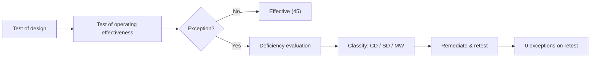

# Diagram — ITGC Testing & Deficiency Flow

| Field | Value |
|---|---|
| Version | 1.0 |
| Date | 2026-06-15 |
| Classification | Confidential — Nonpublic Information (NPI) // Illustrative Portfolio Sample |
| Institution | Cornerstone Community Bank (parent: Cornerstone Bancorp, Inc. — Nasdaq: CCBK) |
| Regulators | FDIC · Ohio DFI · SEC |
| Phase | 06 — SOX ITGC & FDICIA |
| Author | Advisory Team (Financial-Services GRC) |
| Status | Approved |

Result: 3 deficiencies (1 SD + 2 CD), **0 material weaknesses**, all remediated.

## Cross-References
`06.10-test-results-and-deficiencies.md`, `06.11-deficiency-remediation.md`.
