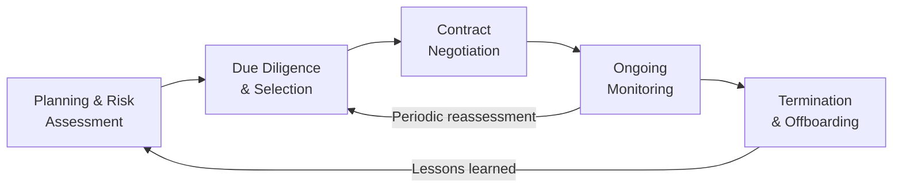

# 07.01 — Third-Party Risk Management (TPRM) Program

| Field | Value |
|---|---|
| Document ID | CCB-TPRM-PROG-2026-701 |
| Version | 1.0 |
| Date | 2026-06-15 |
| Classification | Confidential — Nonpublic Information (NPI) // Illustrative Portfolio Sample |
| Owner | Steven Nakamura, Chief Risk Officer (CRO) |
| Author | Advisory Team (Financial-Services GRC) |
| Status | Approved |

## Purpose

Cornerstone Community Bank ("Cornerstone," "the Bank") relies on **85 third-party relationships** to deliver banking services, of which **12 are classified critical or high-risk**. The most significant of these is **Meridian Core Services, LLC**, which operates the outsourced core banking and digital-banking platform. This document establishes the Bank's **Third-Party Risk Management (TPRM) Program** — the enterprise framework that governs how Cornerstone plans for, selects, contracts with, monitors, and terminates third-party relationships.

The program is aligned to the **Interagency Guidance on Third-Party Relationships: Risk Management (2023)** issued jointly by the FDIC, Federal Reserve, and OCC, which frames third-party risk as a **lifecycle**. It also operationalizes the Bank's obligation under **GLBA §501(b)** and the **Interagency Guidelines Establishing Information Security Standards** to exercise **service-provider oversight** over any third party with access to customer **nonpublic personal information (NPI)** — data that resides across **22 systems** in the Bank's environment. Where a relationship involves sharing of NPI, **Regulation P** governs the permissible sharing and required disclosures.

## Scope and Guiding Principles

The TPRM Program applies to every relationship in which a third party performs an activity on Cornerstone's behalf, provides a product or service the Bank uses, or accesses Bank or customer data — regardless of whether a contract or payment exists. The 2023 Interagency Guidance is explicit that the use of third parties **does not diminish** the Bank's responsibility to operate in a safe and sound manner and to comply with applicable law; management and the Board remain accountable for outcomes.

| Principle | How Cornerstone Applies It |
|---|---|
| Risk-based tailoring | Oversight intensity scales to criticality and NPI exposure; the 12 critical/high vendors receive enhanced diligence and monitoring |
| Lifecycle management | Each relationship is managed across the five lifecycle stages, not just at onboarding |
| Board & management accountability | The Board sets risk appetite; the CRO owns the program; business owners own individual relationships |
| GLBA §501(b) oversight | Any third party touching NPI is subject to security due diligence and contractual safeguards |
| Independence in assurance | Internal Audit independently validates the program; SOC reports provide third-party control assurance |

## The Third-Party Risk Lifecycle (2023 Interagency Guidance)

Cornerstone structures its program around the five lifecycle stages described in the 2023 Interagency Guidance. Each stage has defined activities, owners, and evidence, cross-referenced to the detailed documents in this phase.

| Lifecycle Stage | Key Activities | Primary Owner | Reference |
|---|---|---|---|
| Planning | Define need, assess inherent risk, confirm strategic fit, alternatives analysis | Business Owner + CRO | 07.02 |
| Due Diligence & Selection | Financial, security, SOC, insurance, BCP, subcontractor review | Vendor Risk + CISO | 07.03 |
| Contract Negotiation | Security, NPI, right-to-audit, breach notice, SLA, termination clauses | Legal + CRO | 07.04 |
| Ongoing Monitoring | Performance, SOC review, financial health, adverse media, KRIs | Vendor Risk + Business Owner | 07.05, 07.06 |
| Termination | Exit strategy, data return/destruction, transition, contingency | CRO + Business Owner | 07.06, 07.07 |

## Governance and Roles

Third-party risk is governed through the Bank's enterprise risk structure. The **Board of Directors** (via the Risk and Audit Committees) approves the program and the third-party risk appetite and receives at least annual reporting on the critical vendor portfolio. The **Chief Risk Officer** owns the program end-to-end. A **Vendor Risk Management** function (within the risk organization) administers the inventory, coordinates due diligence, and tracks monitoring cadence. **Business relationship owners** are accountable for the performance and risk of their assigned vendors.

| Role / Body | TPRM Responsibility |
|---|---|
| Board of Directors (Risk / Audit Committees) | Approve program & risk appetite; receive critical-vendor reporting; oversight of Meridian concentration |
| Steven Nakamura — CRO | Program owner; escalation authority; signs critical-vendor risk acceptances |
| Rachel Alvarez — CISO | Security due diligence, SOC 2 review, NPI safeguards, incident coordination |
| Marcus Doyle — IT Security Manager | Technical/SOC evaluation, CUEC operation, security control validation |
| Angela Foster — Chief Compliance Officer | Regulatory compliance of relationships; Reg P sharing review; consumer-impact assessment |
| Karen Ellis — Privacy Officer | NPI sharing permissibility, privacy-notice alignment |
| Vendor Risk Management | Inventory, tiering, diligence coordination, monitoring calendar, KRI tracking |
| Business Relationship Owners | Day-to-day relationship, performance, SLA follow-up, reassessment inputs |
| Priya Sharma — Internal Audit | Independent validation of TPRM program design and operation |

## GLBA §501(b) Service-Provider Oversight Linkage

The GLBA Safeguards requirement obligates the Bank to (1) exercise **due diligence** in selecting service providers, (2) **require by contract** that providers implement appropriate safeguards for customer information, and (3) where indicated by the risk assessment, **monitor** providers to confirm safeguards remain effective. The TPRM lifecycle maps directly onto these three obligations, ensuring that every NPI-touching vendor is covered.

| GLBA §501(b) Oversight Duty | TPRM Lifecycle Stage | Evidence |
|---|---|---|
| Due diligence in selection | Due Diligence & Selection | Security questionnaires, SOC 2 review, risk assessment memo (07.03) |
| Require safeguards by contract | Contract Negotiation | Information-security & NPI clauses, breach-notification terms (07.04) |
| Monitor as risk indicates | Ongoing Monitoring | Annual SOC review, KRIs, reassessment records (07.05, 07.06) |

## Risk Appetite and Escalation

The Board has set a **low-to-moderate** appetite for third-party risk, consistent with the Bank's overall residual posture. Concentration in a single core provider (Meridian) is an accepted but actively managed exposure requiring enhanced oversight (07.07). Residual risks exceeding appetite are escalated to the CRO for formal risk acceptance or remediation, and material items are reported to the Risk Committee.

| Escalation Trigger | Action | Escalation Path |
|---|---|---|
| Critical vendor SOC exception affecting NPI | Impact assessment; remediation plan tracking | Vendor Risk → CISO → CRO |
| SLA breach beyond threshold | Service credit / remediation; monitoring intensified | Business Owner → Vendor Risk → CRO |
| Vendor financial deterioration / adverse media | Reassessment; contingency review | Vendor Risk → CRO → Risk Committee |
| Residual risk above appetite | Formal risk acceptance or exit decision | CRO → Risk Committee → Board |

## Program Documentation Set

This program document is the parent of the Phase 07 third-party risk document set. Each subordinate document operationalizes a component of the lifecycle.

| Document | Function |
|---|---|
| 07.02 | Vendor inventory (85 vendors) and risk-tiering methodology |
| 07.03 | Due diligence procedures by tier |
| 07.04 | Contract and SLA control requirements |
| 07.05 | SOC 1 / SOC 2 report review |
| 07.06 | Ongoing monitoring, KRIs, and offboarding |
| 07.07 | Meridian core provider enhanced oversight |

## Cross-References

- **07.02** — Vendor inventory and tiering methodology feeding the lifecycle.
- **07.03** — Due diligence executed in the selection stage.
- **07.04** — Contractual controls established in the negotiation stage.
- **07.05 / 07.06** — Ongoing monitoring mechanisms.
- **07.07** — Enhanced oversight of Meridian as the critical core provider.
- **Phase 03** — Enterprise risk assessment informing inherent third-party risk.
- **Phase 06** — SOC 1 reliance and CUECs for ICFR (Meridian).
- **Phase 08** — Independent testing and audit validation of vendor controls.

---
[⬅ Previous](07.00-README.md) · [🏠 Phase README](07.00-README.md) · [Next ➡](07.02-vendor-inventory-and-tiering.md)
