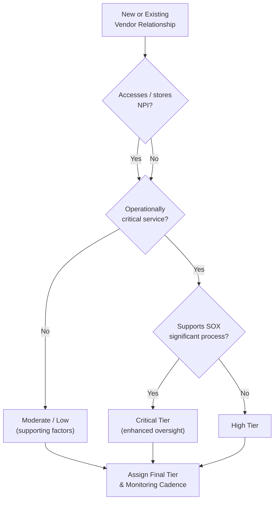

# 07.02 — Vendor Inventory & Risk Tiering

| Field | Value |
|---|---|
| Document ID | CCB-TPRM-INV-2026-702 |
| Version | 1.0 |
| Date | 2026-06-15 |
| Classification | Confidential — Nonpublic Information (NPI) // Illustrative Portfolio Sample |
| Owner | Steven Nakamura, Chief Risk Officer (CRO) |
| Author | Advisory Team (Financial-Services GRC) |
| Status | Approved |

## Purpose

A complete and accurate inventory is the foundation of third-party risk management. This document defines Cornerstone Community Bank's **vendor inventory** — the authoritative register of all **85 third-party relationships** — and the **risk-tiering methodology** used to classify each relationship so that oversight effort is proportionate to risk. Tiering drives the depth of due diligence (07.03), the contract controls required (07.04), and the cadence of ongoing monitoring (07.06).

Of the 85 relationships, **12 are classified critical or high-risk**, including the core provider **Meridian Core Services, LLC**. Tiering is driven principally by three factors: **access to NPI** (nonpublic personal information residing across 22 systems), **operational criticality** (impact on the Bank's ability to serve customers), and **financial-reporting relevance** (whether the vendor supports a SOX-significant process).

## The Vendor Inventory

The inventory is maintained by Vendor Risk Management as the single source of truth. Each record captures the attributes needed to tier, contract, and monitor the relationship. New relationships cannot proceed to contracting until an inventory record and inherent-risk rating exist.

| Inventory Attribute | Purpose |
|---|---|
| Vendor legal name & relationship owner | Accountability and contact of record |
| Service description & business process supported | Establishes criticality and dependency |
| NPI access (Yes/No, data elements, systems) | Drives GLBA §501(b) security scope |
| Financial-reporting relevance (SOX in-scope?) | Links to Phase 06 ITGC/SOC reliance |
| Subcontractor / fourth-party dependency | Extends oversight to the supply chain |
| Assigned risk tier | Sets diligence & monitoring intensity |
| Contract dates & renewal / termination | Drives reassessment and exit planning |
| SOC report type & date | Drives SOC review cadence (07.05) |

## Risk-Tiering Methodology

Each relationship is scored on the three primary risk drivers plus supporting factors. The **highest** applicable driver generally sets the floor for the tier (for example, any vendor with direct access to NPI cannot be rated below Moderate). The methodology yields four tiers: **Critical, High, Moderate, and Low**.

| Risk Driver | Weighting Consideration | Example Signal |
|---|---|---|
| NPI access | Volume, sensitivity, systems touched (of 22 NPI systems) | Core processor, digital-banking, statement/print vendor |
| Operational criticality | Impact & recovery difficulty if vendor fails | Core banking, payments, network connectivity |
| Financial-reporting relevance | Support of a SOX-significant system/process | Core/GL processor (SOC 1 reliance) |
| Data location / offshoring | Cross-border or concentration exposure | Cloud hosting sub-service organizations |
| Substitutability | Availability of alternatives / switching cost | Single-source core provider (concentration) |

## Tier Definitions and Oversight Intensity

Each tier carries a defined oversight package. Critical vendors receive the most rigorous diligence, the fullest contract control set, and the most frequent monitoring; low-tier vendors receive streamlined treatment.

| Tier | Definition | Due Diligence | Monitoring Cadence |
|---|---|---|---|
| Critical | NPI + operationally critical + often SOX-relevant; failure materially harms the Bank | Full — financials, SOC 1/2, insurance, BCP, subcontractors, on-site as needed | Continuous; formal annual reassessment |
| High | Significant NPI access or high operational impact | Full financial, SOC 2, insurance, BCP | Semi-annual review; annual reassessment |
| Moderate | Limited NPI or moderate operational role | Targeted — security questionnaire, insurance, financial screen | Annual review |
| Low | No NPI, low operational impact | Streamlined — basic screening, contract confirmation | Biennial / event-driven |

## Portfolio Composition

The 85-relationship portfolio is distributed across the four tiers. The **12 critical/high-risk** relationships are the focus of enhanced oversight and consume the majority of program effort.

| Tier | Count | % of Portfolio | NPI Access (typical) |
|---|---|---|---|
| Critical | 4 | 5% | Yes — high volume |
| High | 8 | 9% | Yes — moderate/high |
| Moderate | 33 | 39% | Some limited access |
| Low | 40 | 47% | Generally none |
| **Total** | **85** | **100%** | — |

*Critical (4) + High (8) = the **12 critical/high-risk** relationships receiving enhanced oversight.*

## The 12 Critical / High-Risk Relationships

The following representative relationships constitute the critical and high tiers. Meridian is the single Critical-tier core provider and receives dedicated oversight (07.07).

| # | Vendor (Illustrative) | Service | Tier | NPI | SOX-Relevant |
|---|---|---|---|---|---|
| 1 | Meridian Core Services, LLC | Core banking / GL / digital banking | Critical | Yes | Yes |
| 2 | Payments & wire/ACH processor | Payment processing (Meridian-integrated) | Critical | Yes | Yes |
| 3 | Cloud hosting / data-center provider | Infrastructure hosting (sub-service org) | Critical | Yes | Yes |
| 4 | Managed network / connectivity provider | Secure Bank-to-core connectivity | Critical | Yes | Indirect |
| 5 | Statement print & mail vendor | Customer statements (NPI print/mail) | High | Yes | No |
| 6 | Card production / debit processor | Debit card issuance & processing | High | Yes | No |
| 7 | Loan origination / document platform | Lending workflow & imaging | High | Yes | No |
| 8 | Managed security services / SOC provider | Security monitoring & detection | High | Yes | No |
| 9 | Fraud / AML monitoring provider | Transaction monitoring & alerts | High | Yes | No |
| 10 | Backup & disaster-recovery provider | Data backup and DR services | High | Yes | Indirect |
| 11 | HR / payroll SaaS provider | Employee data & payroll | High | Yes | No |
| 12 | Digital marketing / analytics (NPI-limited) | Customer analytics | High | Yes | No |

## Inventory Governance and Maintenance

The inventory is reviewed for completeness at least quarterly and refreshed whenever a relationship is added, materially changed, or terminated. Tier assignments are revalidated at reassessment and whenever a triggering event (breach, financial deterioration, service change) occurs. Any tier upgrade automatically escalates the diligence and monitoring package.

| Maintenance Trigger | Action |
|---|---|
| New relationship | Create record, inherent-risk rating, assign tier before contracting |
| Service scope change | Re-score drivers; adjust tier if warranted |
| Adverse event | Interim reassessment; possible tier upgrade |
| Contract renewal | Confirm attributes, refresh diligence, revalidate tier |
| Termination | Update status; trigger offboarding (07.06) |

## Cross-References

- **07.01** — TPRM program and lifecycle that tiering supports.
- **07.03** — Due diligence procedures keyed to each tier.
- **07.04** — Contract controls required by tier.
- **07.05** — SOC review cadence driven by tier and SOC availability.
- **07.06** — Monitoring cadence and reassessment by tier.
- **07.07** — Enhanced oversight of the Critical-tier core provider.
- **Phase 02** — Asset inventory and the 22 NPI systems referenced in tiering.
- **Phase 06** — SOX-significant systems and SOC 1 reliance.

---
[⬅ Previous](07.01-third-party-risk-management-program.md) · [🏠 Phase README](07.00-README.md) · [Next ➡](07.03-vendor-due-diligence.md)
