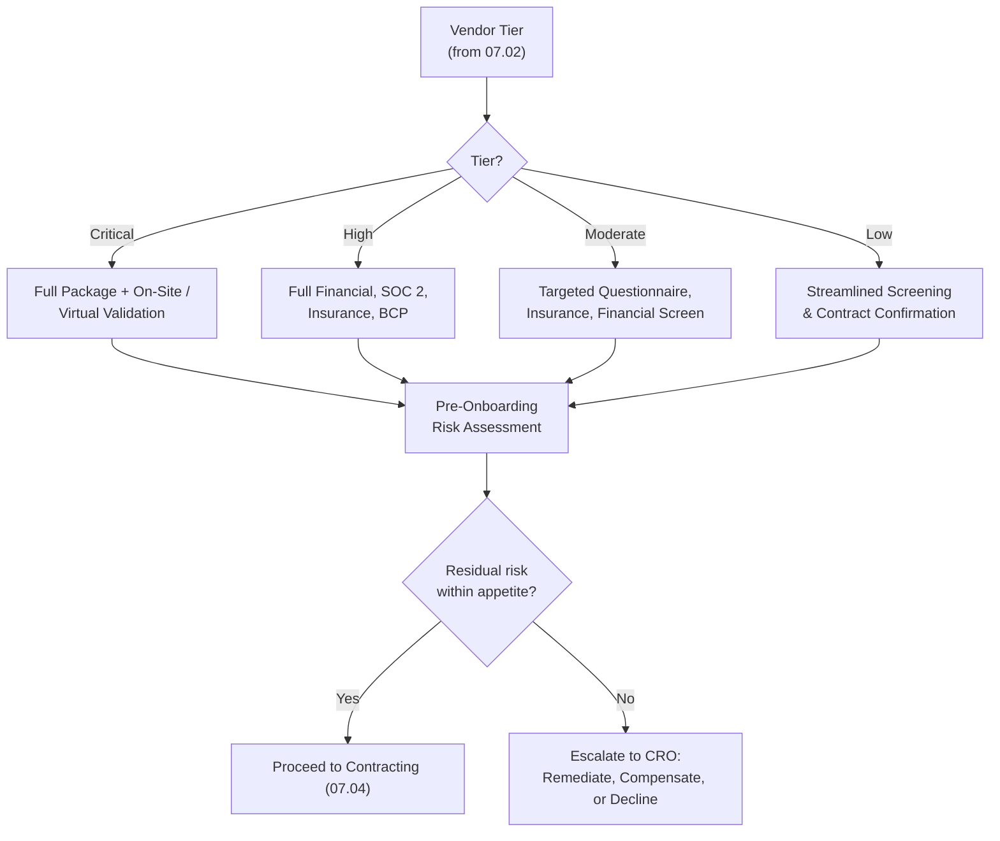

# 07.03 — Vendor Due Diligence

| Field | Value |
|---|---|
| Document ID | CCB-TPRM-DD-2026-703 |
| Version | 1.0 |
| Date | 2026-06-15 |
| Classification | Confidential — Nonpublic Information (NPI) // Illustrative Portfolio Sample |
| Owner | Steven Nakamura, Chief Risk Officer (CRO) |
| Author | Advisory Team (Financial-Services GRC) |
| Status | Approved |

## Purpose

Due diligence is the second stage of the third-party risk lifecycle and the point at which the Bank forms an evidence-based view of a prospective or renewing vendor before commitment. This document defines Cornerstone Community Bank's **vendor due diligence** procedures — what is assessed, the depth required by risk tier, and how findings are consolidated into a **pre-onboarding risk assessment** that must be completed before any vendor with access to **nonpublic personal information (NPI)** is engaged.

Due diligence directly satisfies the **GLBA §501(b)** obligation to exercise due diligence in selecting service providers and is calibrated to the tiering established in 07.02. For the **12 critical/high-risk** relationships — led by **Meridian Core Services, LLC** — the full diligence package is mandatory; lower tiers receive proportionate, streamlined review as prescribed by the **2023 Interagency Guidance**.

## Due Diligence Domains

The Bank assesses each vendor across six core domains. Each domain has defined evidence and acceptance criteria. Gaps are documented and either remediated pre-contract, addressed by compensating controls, or escalated for risk acceptance by the CRO.

| Domain | What Is Assessed | Primary Evidence |
|---|---|---|
| Financial condition | Solvency, viability, going-concern risk | Audited financials, credit/financial-health rating, D&amp;B |
| Security posture | Controls protecting NPI and systems | Security questionnaire, policies, pen-test summary, certifications |
| SOC reports | Independent control assurance | SOC 1 Type II and/or SOC 2 Type II (07.05) |
| Insurance | Risk transfer adequacy | Certificates: cyber/tech E&amp;O, crime, general liability |
| Subcontractors (fourth parties) | Downstream dependencies & concentration | Subcontractor list, flow-down attestations |
| Business continuity | Resilience and recovery capability | BCP/DR plan, test results, RTO/RPO commitments |

## Due Diligence by Risk Tier

The intensity of each domain scales with tier. Critical and High vendors receive the deepest review, including SOC report analysis and, where warranted, on-site or virtual control validation.

| Diligence Element | Critical | High | Moderate | Low |
|---|---|---|---|---|
| Audited financial statements | Required | Required | Screen | No |
| Security questionnaire | Extended | Extended | Standard | Basic |
| SOC 1 Type II | If SOX-relevant | If applicable | No | No |
| SOC 2 Type II | Required | Required | If available | No |
| Insurance certificates | Required | Required | Required | Confirm |
| Subcontractor review | Required | Required | Limited | No |
| BCP/DR plan & test results | Required | Required | Summary | No |
| On-site / virtual validation | As warranted | Optional | No | No |

## Security Posture Assessment (NPI Focus)

For any vendor touching NPI, the CISO and IT Security Manager evaluate the vendor's administrative, technical, and physical safeguards against the Bank's expectations, which are anchored to the Interagency Safeguards standard and NIST CSF 2.0. Deficiencies affecting NPI must be resolved or formally accepted before onboarding.

| Security Area | Expectation |
|---|---|
| Access control & MFA | Least-privilege, MFA for privileged and remote access |
| Encryption | NPI encrypted in transit and at rest |
| Vulnerability & patch mgmt | Defined program; periodic testing; timely remediation |
| Incident response & breach notice | Documented IR plan; contractual breach-notification commitment |
| Data segregation & retention | Logical separation of Bank data; defined retention/destruction |
| Personnel security | Background checks, security awareness training |

## Pre-Onboarding Risk Assessment

Findings across all domains are consolidated into a **pre-onboarding risk assessment memo** that assigns a residual-risk rating and a recommendation. No NPI-touching relationship is approved without this memo. Critical/High approvals require CRO sign-off; residual risk above appetite requires formal risk acceptance and, for material items, Risk Committee awareness.

| Assessment Element | Content |
|---|---|
| Inherent risk summary | Tier, NPI exposure, criticality, SOX relevance |
| Domain findings | Financial, security, SOC, insurance, subcontractor, BCP outcomes |
| Gaps & mitigations | Open items, compensating controls, remediation commitments |
| Residual risk rating | Post-mitigation rating vs risk appetite |
| Recommendation & approver | Proceed / conditional / decline; CRO sign-off for Critical/High |

## Reassessment Diligence

Due diligence is not a one-time event. At each reassessment cycle (07.06) the relevant domains are refreshed — most importantly the current SOC report, insurance renewals, and updated financials — so that the residual-risk view remains current throughout the relationship.

| Cycle | Refreshed Elements | Trigger |
|---|---|---|
| Annual (Critical/High) | SOC report, financials, insurance, BCP test results | Scheduled reassessment |
| Annual (Moderate) | Questionnaire attestation, insurance, financial screen | Scheduled reassessment |
| Event-driven | Affected domain(s) | Breach, financial deterioration, service change |

## Cross-References

- **07.01** — Lifecycle stage this document operationalizes.
- **07.02** — Tiering that sets diligence depth.
- **07.04** — Contract controls that codify diligence commitments.
- **07.05** — SOC report review feeding the security and control assessment.
- **07.06** — Reassessment cadence refreshing diligence.
- **07.07** — Enhanced diligence applied to Meridian.
- **Phase 04** — Safeguards expectations used to benchmark vendor security.

---
[⬅ Previous](07.02-vendor-inventory-and-tiering.md) · [🏠 Phase README](07.00-README.md) · [Next ➡](07.04-contract-and-sla-controls.md)
