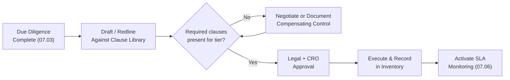

# 07.04 — Contract & SLA Controls

| Field | Value |
|---|---|
| Document ID | CCB-TPRM-CON-2026-704 |
| Version | 1.0 |
| Date | 2026-06-15 |
| Classification | Confidential — Nonpublic Information (NPI) // Illustrative Portfolio Sample |
| Owner | Angela Foster, Chief Compliance Officer |
| Author | Advisory Team (Financial-Services GRC) |
| Status | Approved |

## Purpose

The contract is where third-party risk controls become enforceable obligations. This document defines the **required contract clauses** and **service-level agreement (SLA) controls** that Cornerstone Community Bank negotiates into third-party agreements, and the process for monitoring performance against those commitments. Contracting is the third stage of the lifecycle and the mechanism by which the **GLBA §501(b)** requirement to "require by contract" that service providers safeguard customer **NPI** is satisfied.

Clause requirements scale with risk tier (07.02). For the **12 critical/high-risk** relationships — most importantly **Meridian Core Services, LLC** — the full clause set is mandatory, and any omission requires documented risk acceptance by the CRO. The clause library is aligned to the **2023 Interagency Guidance**, which identifies the contract provisions supervisors expect for significant relationships.

## Required Contract Clauses

The Bank maintains a standard clause library. Legal and Vendor Risk map each required clause to the relationship's tier during negotiation; gaps are tracked to closure or escalated.

| Clause | Purpose | Tier Requirement |
|---|---|---|
| Information security & safeguards | Bind vendor to protect Bank/customer data to defined standards | Critical / High / Moderate (NPI) |
| Confidentiality & NPI handling | Restrict use/disclosure of NPI; align to Reg P | Any vendor touching NPI |
| Right-to-audit | Bank/regulator access to vendor controls & records | Critical / High |
| Breach & incident notification | Timely notice of security incidents affecting Bank data | Any vendor touching NPI |
| Service levels (SLA) & remedies | Define performance commitments and credits | Critical / High / Moderate |
| Subcontractor / fourth-party limits | Consent, flow-down, and notice for subcontracting | Critical / High |
| Business continuity & DR | Commit vendor to resilience and recovery targets | Critical / High |
| Termination & termination assistance | Orderly exit, transition support, data return/destruction | Critical / High |
| Regulatory compliance & examination | Vendor cooperation with Bank's regulators | Critical / High |
| Insurance & indemnification | Risk transfer and liability allocation | Critical / High / Moderate |
| Foreign-based / location of data | Consent and controls for data location | As applicable |

## Clause-to-Regulation Mapping

Key clauses trace directly to the Bank's legal and supervisory obligations, providing an audit trail from contract language to requirement.

| Clause | Regulatory / Framework Driver |
|---|---|
| Information security & safeguards | GLBA §501(b) Interagency Safeguards |
| Confidentiality & NPI handling | GLBA §501(b); Regulation P sharing limits |
| Breach notification | Interagency Safeguards; supports 36-hour notification rule readiness |
| Right-to-audit & examination | 2023 Interagency Guidance; FFIEC Outsourcing booklet |
| Business continuity & DR | FFIEC Business Continuity Management booklet |
| Termination assistance | 2023 Interagency Guidance (exit strategy) |

## Contract Control Workflow

Contracts move through a defined control gate before execution. No agreement covering NPI or a critical service is signed without a completed clause checklist and the required approvals.

## Service-Level Agreements and Monitoring

SLAs convert performance expectations into measurable, enforceable commitments. Each critical/high relationship defines SLA metrics with targets, measurement methods, reporting frequency, and remedies (typically service credits) for breaches. Vendor Risk and the business owner track actual performance against target and escalate sustained or severe breaches.

| SLA Metric (Illustrative) | Target | Measurement | Remedy on Breach |
|---|---|---|---|
| Core platform availability | ≥ 99.9% monthly uptime | Vendor + Bank monitoring | Service credit; escalation |
| Critical incident notification | Within contractual window | Incident records | Escalation; remediation plan |
| Transaction/batch processing timeliness | Defined daily windows | Processing logs | Credit; root-cause review |
| Support response (Severity 1) | Within defined minutes/hours | Ticketing data | Escalation to relationship owner |
| Recovery objectives (RTO/RPO) | Per BCP commitment | DR test results | Remediation; reassessment |

## SLA Governance and Escalation

SLA performance is reviewed on a defined cadence and feeds the ongoing-monitoring KRIs (07.06). Breaches beyond threshold trigger escalation through the governance chain, and repeated breaches inform renewal and exit decisions.

| Condition | Response | Escalation |
|---|---|---|
| Single minor SLA miss | Log; note in monitoring record | Business Owner |
| Breach beyond threshold | Service credit; remediation plan; intensified monitoring | Vendor Risk → CRO |
| Repeated / systemic breaches | Formal performance review; renewal/exit consideration | CRO → Risk Committee |
| Breach with NPI/security impact | Security assessment; incident coordination | CISO → CRO |

## Termination and Termination-Assistance Provisions

Because exit is part of the lifecycle, contracts for critical/high vendors include termination rights (for cause and convenience), transition-assistance obligations, and explicit data-return-or-destruction terms consistent with **NIST SP 800-88** sanitization expectations. These provisions underpin the exit strategy detailed for Meridian in 07.07.

| Termination Element | Contractual Requirement |
|---|---|
| Termination rights | For cause and for convenience with defined notice |
| Transition assistance | Vendor support during migration to successor/insourcing |
| Data return / destruction | Return in usable format then certified destruction (SP 800-88) |
| Records & knowledge transfer | Documentation and configuration handover |
| Continuity during exit | No degradation of service through transition period |

## Cross-References

- **07.01** — Contract stage within the lifecycle.
- **07.02** — Tiering that sets clause requirements.
- **07.03** — Due diligence findings codified into contract terms.
- **07.05** — Right-to-audit exercised via SOC report review.
- **07.06** — SLA metrics feeding KRIs and monitoring.
- **07.07** — Meridian SLAs, exit strategy, and termination assistance.
- **Phase 04** — Safeguards standards referenced in security clauses.

---
[⬅ Previous](07.03-vendor-due-diligence.md) · [🏠 Phase README](07.00-README.md) · [Next ➡](07.05-soc-report-review.md)
