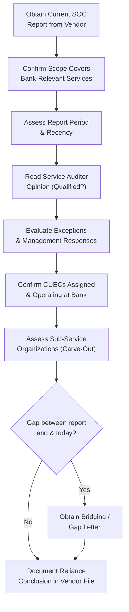

# 07.05 — SOC Report Review

| Field | Value |
|---|---|
| Document ID | CCB-TPRM-SOC-2026-705 |
| Version | 1.0 |
| Date | 2026-06-15 |
| Classification | Confidential — Nonpublic Information (NPI) // Illustrative Portfolio Sample |
| Owner | Marcus Doyle, IT Security Manager |
| Author | Advisory Team (Financial-Services GRC) |
| Status | Approved |

## Purpose

Independent assurance over a service provider's control environment is obtained primarily through **System and Organization Controls (SOC) reports**. This document defines how Cornerstone Community Bank **reviews SOC 1 and SOC 2 reports** for its critical and high-risk vendors — evaluating scope, the service auditor's opinion, exceptions, **complementary user-entity controls (CUECs)**, **sub-service organizations**, and gap-period coverage through **bridging letters** — and the cadence on which reviews recur.

SOC review is the assurance backbone of ongoing monitoring for the **12 critical/high-risk** relationships. **Meridian Core Services, LLC** provides **both a SOC 1 Type II and a SOC 2 Type II** report: the SOC 1 supports SOX/FDICIA ICFR reliance (Phase 06), while the SOC 2 Type II supports **GLBA §501(b)** service-provider oversight of NPI safeguards. Both are reviewed under this procedure; other critical vendors typically provide SOC 2 Type II reports.

## SOC Report Types and Their Use

The Bank distinguishes the SOC report types and applies each to the correct purpose. Type II reports (operating effectiveness over a period) are required for reliance; Type I (design at a point in time) is not sufficient for critical-vendor assurance.

| Report | Focus | Cornerstone Use |
|---|---|---|
| SOC 1 Type II | Controls relevant to user ICFR (SSAE 18 / AT-C 320) | ICFR reliance on Meridian core/GL (Phase 06) |
| SOC 2 Type II | Trust Services: security, availability, confidentiality | GLBA §501(b) NPI safeguard assurance |
| SOC 3 | Public summary of SOC 2 | General assurance only; not sufficient for critical reliance |
| SOC 1 / SOC 2 Type I | Design at a point in time | Interim only; insufficient for reliance |

## SOC Review Procedure

Each report is reviewed against a standard checklist and the conclusion documented in the vendor file. The IT Security Manager leads technical review of SOC 2 reports; Internal Audit and the SOX office lead SOC 1 review (Phase 06). Findings that affect NPI or a relied-upon control are escalated to the CISO and CRO.

| Review Step | Procedure | Escalation if Adverse |
|---|---|---|
| Scope | Confirm in-scope systems/services match Bank usage | Request supplemental assurance |
| Period & recency | Confirm coverage; report < 12 months old | Obtain updated report / bridging |
| Opinion | Confirm unqualified opinion | Assess qualification impact; CRO review |
| Exceptions | Evaluate each for NPI / reliance impact | Track vendor remediation |
| CUECs | Confirm Bank operates each complementary control | Assign owner; remediate gap |
| Sub-service orgs | Confirm carve-out treatment & monitoring | Extend oversight to fourth party |
| Gap coverage | Obtain bridging letter for gap period | Escalate if vendor declines |

## Complementary User-Entity Controls (CUECs)

SOC reports state that the vendor's controls are effective **only if** the Bank operates certain complementary controls. For each critical vendor, the Bank extracts the CUECs, assigns an owner, and confirms operation. The Meridian SOC 1 CUECs are managed in Phase 06 (eight CUECs); the SOC 2 CUECs for NPI safeguards are managed here.

| CUEC Category (SOC 2 / NPI) | Bank Responsibility | Owner |
|---|---|---|
| User access administration | Provision/deprovision Bank users; enforce MFA | IT Security |
| Termination notification | Notify vendor of terminations timely | HR / IT Security |
| Data classification & handling | Send/receive NPI per agreed controls | Business Owner / Privacy |
| Configuration authorization | Approve Bank-side configuration changes | IT / Business Owner |
| Monitoring & incident coordination | Act on vendor alerts/advisories | IT Security |

## Exceptions and Bridging Letters

Where a SOC report notes exceptions, the Bank evaluates each for impact on NPI safeguards or relied-upon controls, and tracks the vendor's remediation. Because reports cover a fixed historical period, a **bridging (gap) letter** is obtained from the vendor for the interval between the report end date and the Bank's review date, affirming no material control changes or new deficiencies.

| Element | Meridian Treatment (Illustrative) |
|---|---|
| SOC 2 Type II opinion | Unqualified |
| Exceptions | Minor exceptions evaluated; no NPI-safeguard impact; vendor-remediated |
| CUECs | Assigned and operating at the Bank |
| Sub-service organizations | Carve-out (cloud hosting, connectivity) monitored via vendor risk |
| Bridging letter | Obtained for gap period; affirms no material control changes |

## Review Cadence

SOC reports are reviewed at least annually for critical/high vendors, with a bridging letter obtained between the report end date and the next annual report. Reviews are also triggered by adverse events. The cadence is coordinated with vendor reporting cycles so that reliance is continuous.

| Vendor Tier | SOC Review Cadence | Bridging Letter |
|---|---|---|
| Critical (incl. Meridian) | Annual full review + interim event-driven | Yes — each gap period |
| High | Annual full review | Yes — if gap exists |
| Moderate | SOC reviewed if provided; else questionnaire | As applicable |
| Low | Not typically SOC-based | N/A |

## Cross-References

- **07.01** — Assurance within the monitoring stage.
- **07.02** — Tiering that drives SOC review depth and cadence.
- **07.03** — SOC review as a due-diligence input.
- **07.04** — Right-to-audit clause underpinning SOC access.
- **07.06** — SOC outcomes feeding ongoing monitoring and KRIs.
- **07.07** — Meridian SOC reliance in enhanced oversight.
- **Phase 06 (06.08)** — Meridian SOC 1 reliance and CUECs for ICFR.

---
[⬅ Previous](07.04-contract-and-sla-controls.md) · [🏠 Phase README](07.00-README.md) · [Next ➡](07.06-ongoing-vendor-monitoring.md)
