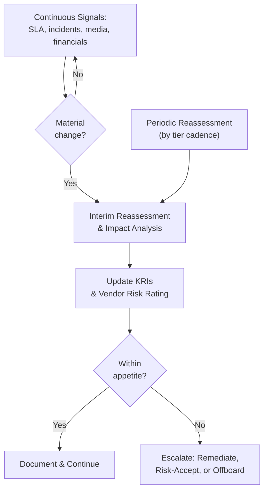

# 07.06 — Ongoing Vendor Monitoring

| Field | Value |
|---|---|
| Document ID | CCB-TPRM-MON-2026-706 |
| Version | 1.0 |
| Date | 2026-06-15 |
| Classification | Confidential — Nonpublic Information (NPI) // Illustrative Portfolio Sample |
| Owner | Steven Nakamura, Chief Risk Officer (CRO) |
| Author | Advisory Team (Financial-Services GRC) |
| Status | Approved |

## Purpose

Third-party risk does not end at onboarding; it evolves over the life of the relationship. This document defines Cornerstone Community Bank's **ongoing vendor monitoring** — the continuous and periodic activities that confirm each vendor continues to perform, remain financially sound, protect **NPI**, and comply with contractual and regulatory expectations — together with the **key risk indicators (KRIs)**, **periodic reassessment** cadence, and **offboarding** procedures that close the lifecycle.

Ongoing monitoring is the fourth stage of the lifecycle under the **2023 Interagency Guidance** and satisfies the **GLBA §501(b)** obligation to monitor service providers as indicated by risk. Monitoring intensity scales with tier (07.02); the **12 critical/high-risk** relationships — led by **Meridian Core Services, LLC** — are monitored most closely.

## Monitoring Dimensions

The Bank monitors four dimensions for each in-scope vendor. Signals from any dimension can trigger reassessment, intensified oversight, or escalation.

| Dimension | What Is Monitored | Source |
|---|---|---|
| Performance | SLA attainment, service quality, incident volume | SLA reports, ticketing, business-owner feedback |
| Security | Control health, SOC results, incidents, vulnerabilities | SOC reports (07.05), incident notices, attestations |
| Financial health | Solvency, ratings, going-concern signals | Financial statements, credit/rating updates |
| News / adverse media | Litigation, breaches, sanctions, leadership/ownership change | Adverse-media screening, regulatory notices |

## Continuous vs Periodic Monitoring

Monitoring blends **continuous** signal-watching (event-driven, always on) with **periodic reassessment** (scheduled by tier). Continuous monitoring detects change between formal cycles; periodic reassessment re-forms the full risk view.

| Reassessment Cadence | Tier |
|---|---|
| Continuous + formal annual | Critical (incl. Meridian) |
| Semi-annual review + annual reassessment | High |
| Annual review | Moderate |
| Biennial / event-driven | Low |

## Key Risk Indicators (KRIs)

The Bank tracks a set of KRIs across the vendor portfolio, with thresholds that trigger action. KRIs are reported to the CRO and, in summary, to the Risk Committee.

| KRI | Definition | Green | Amber | Red |
|---|---|---|---|---|
| Critical-vendor SLA attainment | % of SLA targets met | ≥ 99% | 95–99% | < 95% |
| Overdue reassessments | Count past due date | 0 | 1–2 | ≥ 3 |
| Open SOC exceptions (unremediated) | Critical-vendor exceptions | 0 | 1–2 | ≥ 3 |
| Expired vendor insurance | Certificates lapsed | 0 | 1 | ≥ 2 |
| Adverse-media / financial alerts | Unresolved on critical vendors | 0 | 1 | ≥ 2 |
| Fourth-party concentration flags | Unmonitored key subcontractors | 0 | 1 | ≥ 2 |

## Periodic Reassessment

Reassessment refreshes the full due-diligence view (07.03): current SOC report, updated financials, insurance renewals, BCP test results, and any change in subcontractors or NPI scope. Reassessment confirms or revises the vendor's tier and residual-risk rating.

| Reassessment Input | Purpose |
|---|---|
| Current SOC 1/2 report + bridging letter | Confirm control assurance (07.05) |
| Updated financial statements / ratings | Confirm ongoing solvency |
| Insurance certificate renewals | Confirm risk transfer remains adequate |
| BCP/DR test results | Confirm resilience commitments |
| Subcontractor / NPI scope changes | Detect new fourth-party or data exposure |
| SLA performance history | Inform renewal / exit decisions |

## Offboarding and Termination

When a relationship ends — by expiry, decision, or for cause — the Bank executes a controlled offboarding that enforces the termination-assistance and data-handling provisions negotiated in the contract (07.04). Offboarding is verified and documented before the vendor record is closed.

| Offboarding Step | Control |
|---|---|
| Transition planning | Migrate service to successor or insource with no disruption |
| Access revocation | Disable all vendor access to Bank systems and NPI |
| Data return | Recover Bank data in usable format |
| Data destruction | Certified destruction per NIST SP 800-88 |
| Records handover | Obtain documentation, configurations, knowledge transfer |
| Closure & lessons learned | Update inventory; feed lessons into planning (07.01) |

## Monitoring Governance

Monitoring outputs are consolidated into a vendor-risk dashboard reviewed by the CRO and reported to the Risk Committee. Critical-vendor status — especially Meridian — is a standing agenda item, ensuring Board-level visibility of concentration and performance.

| Reporting Layer | Content | Frequency |
|---|---|---|
| Vendor Risk dashboard | KRIs, reassessment status, open items | Monthly |
| Risk Committee summary | Critical-vendor posture, exceptions, escalations | Quarterly |
| Board reporting | Concentration, critical-vendor health | At least annually |

## Cross-References

- **07.01** — Monitoring stage within the lifecycle.
- **07.02** — Tiering that sets monitoring cadence.
- **07.03** — Diligence refreshed at reassessment.
- **07.04** — SLA and termination clauses enforced in monitoring/offboarding.
- **07.05** — SOC review feeding security monitoring.
- **07.07** — Enhanced, continuous monitoring of Meridian.
- **Phase 08** — Independent audit of monitoring effectiveness.

---
[⬅ Previous](07.05-soc-report-review.md) · [🏠 Phase README](07.00-README.md) · [Next ➡](07.07-meridian-core-provider-oversight.md)
