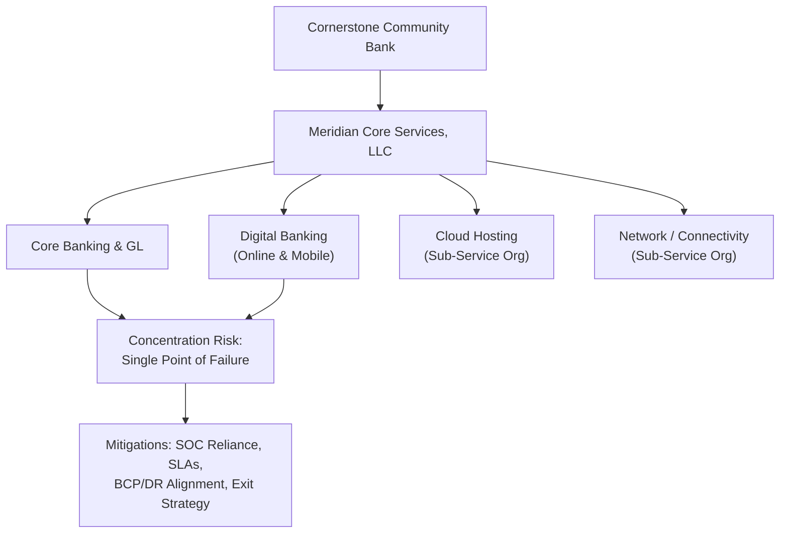

# 07.07 — Meridian Core Provider Oversight

| Field | Value |
|---|---|
| Document ID | CCB-TPRM-MERIDIAN-2026-707 |
| Version | 1.0 |
| Date | 2026-06-15 |
| Classification | Confidential — Nonpublic Information (NPI) // Illustrative Portfolio Sample |
| Owner | Steven Nakamura, Chief Risk Officer (CRO) |
| Author | Advisory Team (Financial-Services GRC) |
| Status | Approved |

## Purpose

**Meridian Core Services, LLC** is Cornerstone Community Bank's single most important third-party relationship. Meridian operates the **outsourced core banking and general-ledger platform** and delivers the Bank's **digital banking** (online and mobile) capability. Because so much of the Bank's operations, customer data, and financial reporting depends on one provider, Meridian is placed under **enhanced oversight** as a Critical-tier vendor. This document defines that enhanced oversight program: concentration-risk management, SOC reliance, SLA governance, BCP/DR alignment, exit strategy, and governance cadence.

Meridian is one of the **12 critical/high-risk** relationships and the sole Critical-tier core provider. It provides **both a SOC 1 Type II and a SOC 2 Type II** report — the SOC 1 supporting SOX/FDICIA ICFR reliance (Phase 06) and the SOC 2 supporting **GLBA §501(b)** NPI-safeguard oversight. Meridian touches NPI across a substantial portion of the Bank's **22 NPI systems**, making its oversight central to the entire third-party program.

## Why Enhanced Oversight

The 2023 Interagency Guidance directs the most rigorous oversight at relationships that are **critical** — those whose failure would materially impair the Bank's operations, reputation, or financial condition. Meridian meets every criterion, so its oversight package exceeds that of any other vendor.

| Criticality Factor | Meridian Exposure |
|---|---|
| Operational dependence | Core processing, GL, and digital banking all run on the Meridian platform |
| NPI exposure | Customer NPI processed and stored across the core / digital platform |
| Financial-reporting reliance | Core/GL is a SOX-significant system; ICFR relies on Meridian SOC 1 |
| Substitutability | Single-source core provider; high switching cost and lead time |
| Customer impact | Outage directly affects ~85,000 customers and ~62,000 digital users |

## Concentration Risk

Reliance on one provider for core, GL, and digital banking creates **concentration risk** — a single point of failure spanning operations, data, and financial reporting. The Bank accepts this exposure as an informed, Board-level decision but actively manages it through the mitigations below and monitors it as a standing KRI.

| Concentration Mitigation | Description |
|---|---|
| Contractual resilience | Strong SLA, BCP/DR, and termination-assistance terms (07.04) |
| SOC assurance | Annual SOC 1 + SOC 2 Type II review with bridging letters (07.05) |
| BCP/DR alignment | Bank RTO/RPO aligned to Meridian recovery commitments |
| Exit strategy | Maintained, tested-on-paper plan to transition core if required |
| Governance cadence | Formal relationship governance with defined escalation |

## SOC Reliance

Meridian's dual SOC reports are the primary independent assurance over its control environment. The Bank reviews both annually under 07.05, extracts and operates the CUECs, evaluates exceptions, and covers gap periods with bridging letters.

| Report | Supports | Owner | Cadence |
|---|---|---|---|
| SOC 1 Type II | ICFR reliance (Phase 06) — access, change, operations | Internal Audit / SOX office | Annual + bridging |
| SOC 2 Type II | GLBA §501(b) NPI safeguards (security, availability, confidentiality) | IT Security / CISO | Annual + bridging |

## SLA Governance

Meridian's SLAs are the most closely tracked in the portfolio, covering availability, processing timeliness, incident notification, and recovery objectives. Performance is reviewed monthly and escalated on breach.

| SLA Metric | Target (Illustrative) | Remedy / Action on Breach |
|---|---|---|
| Core platform availability | ≥ 99.9% monthly | Service credit; root-cause review; CRO escalation |
| Digital banking availability | ≥ 99.9% monthly | Service credit; customer-impact assessment |
| Batch / posting timeliness | Defined daily windows | Reconciliation (CUEC); remediation plan |
| Critical incident notification | Within contractual window | Incident coordination; supports 36-hour rule readiness |
| Recovery objectives (RTO/RPO) | Per BCP commitment | DR remediation; reassessment |

## BCP / DR Alignment

Because Meridian hosts the core, the Bank's business-continuity posture is inseparable from Meridian's. The Bank aligns its recovery objectives to Meridian's commitments, reviews Meridian's DR test results, and where feasible participates in or observes recovery exercises. This alignment feeds directly into the Bank's own Business Continuity Plan (07.08).

| BCP/DR Element | Bank Expectation of Meridian |
|---|---|
| Recovery objectives | Documented RTO/RPO meeting Bank requirements |
| DR testing | Periodic tests with results shared to the Bank |
| Redundancy | Geographically resilient hosting (sub-service orgs) |
| Communication | Defined outage-notification and status protocols |
| Bank participation | Observe/participate in recovery exercises where feasible |

## Exit Strategy

Regulators expect a viable exit strategy for critical relationships. Cornerstone maintains a documented plan to transition core services should Meridian become unavailable, be terminated, or fail to perform — recognizing that a core conversion is a major, multi-month undertaking requiring board awareness and dedicated resourcing.

| Exit Strategy Component | Content |
|---|---|
| Trigger scenarios | Insolvency, material breach, sustained non-performance, strategic change |
| Alternative providers | Identified candidate core platforms and feasibility notes |
| Data portability | Contractual data return in usable format (07.04) |
| Transition assistance | Meridian obligation to support migration and knowledge transfer |
| Resourcing & timeline | Recognition of multi-month conversion; board-level decision |
| Contingency operations | Interim measures to sustain service during transition |

## Governance Cadence

Meridian oversight is governed through a defined meeting and reporting rhythm, ensuring management and the Board maintain visibility into the Bank's most significant vendor.

| Forum | Participants | Frequency | Focus |
|---|---|---|---|
| Operational service review | Vendor Risk, IT, business owner, Meridian | Monthly | SLA performance, incidents, changes |
| Executive relationship review | CRO, CISO, CIO, Meridian leadership | Quarterly | Strategic issues, risk, roadmap |
| Risk Committee update | CRO, Risk Committee | Quarterly | Concentration, SOC, KRIs, escalations |
| Board reporting | CRO / management, Board | At least annually | Concentration risk, resilience, exit readiness |

## Cross-References

- **07.01** — Program governance and GLBA §501(b) linkage.
- **07.02** — Meridian as the Critical-tier core provider.
- **07.03** — Enhanced due diligence applied to Meridian.
- **07.04** — Meridian SLA, termination, and exit clauses.
- **07.05** — Meridian SOC 1 / SOC 2 review and CUECs.
- **07.06** — Continuous monitoring and KRIs for Meridian.
- **07.08** — Business Continuity Plan aligned to Meridian recovery.
- **Phase 06 (06.08)** — Meridian SOC 1 reliance and CUECs for ICFR.

---
[⬅ Previous](07.06-ongoing-vendor-monitoring.md) · [🏠 Phase README](07.00-README.md) · [Next ➡](07.08-business-continuity-plan.md)
