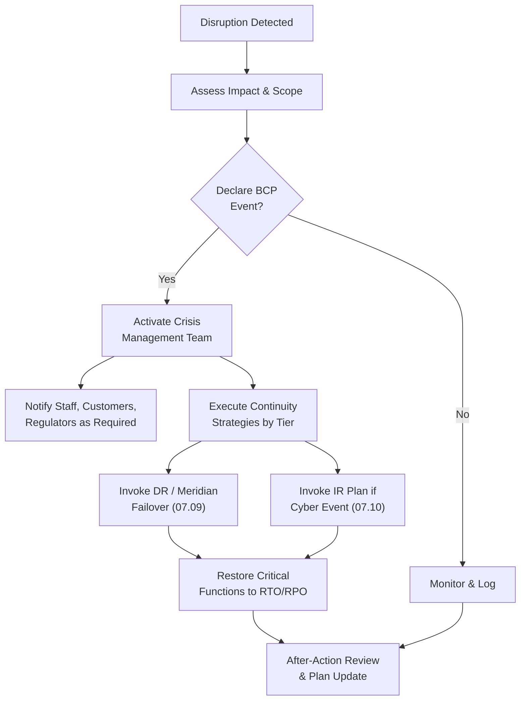

# 07.08 — Business Continuity Plan

| Field | Value |
|---|---|
| Document ID | CCB-BCM-BCP-2026-708 |
| Version | 1.0 |
| Date | 2026-06-15 |
| Classification | Confidential — Nonpublic Information (NPI) // Illustrative Portfolio Sample |
| Owner | Steven Nakamura, Chief Risk Officer (CRO) |
| Author | Advisory Team (Financial-Services GRC) |
| Status | Approved |

## Purpose

This Business Continuity Plan (BCP) establishes how Cornerstone Community Bank sustains, and where necessary recovers, its critical business functions during a disruption — whether a technology outage, a natural event, a pandemic, a facilities loss, or the unavailability of a critical third party. The plan is built on the **FFIEC Business Continuity Management (BCM) booklet** and is deliberately aligned to the recovery commitments of **Meridian Core Services, LLC**, because the Bank's core banking, general ledger, and digital banking all run on Meridian's platform (07.07).

The BCP directly addresses the **Detect / Respond / Recover** maturity gaps identified in the Phase 05 FFIEC / NIST CSF 2.0 assessment. It is a management-owned, board-reviewed program spanning **18 branches**, **~240 employees**, and the **~85,000 customers** (including **~62,000 digital-banking users**) who depend on continuous service. Business continuity, disaster recovery (07.09), and incident response (07.10) together form Cornerstone's operational-resilience discipline.

## Scope and Objectives

The BCP covers all critical business functions, supporting technology, facilities, people, and third-party dependencies required to serve customers and meet regulatory obligations. It integrates four lifecycle phases consistent with FFIEC BCM: **Business Impact Analysis (BIA)**, **risk management / continuity strategy**, **plan development**, and **exercise, testing & improvement**.

| Objective | Description |
|---|---|
| Protect people | Life-safety first; account for staff during any event |
| Preserve customer service | Sustain deposit, payment, and digital-banking access |
| Meet recovery objectives | Restore critical functions within approved RTO/RPO (07.09) |
| Safeguard NPI | Maintain GLBA §501(b) protections through the disruption |
| Meet regulatory duties | Sustain reporting, notification (07.12), and exam obligations |
| Manage third-party risk | Coordinate recovery with Meridian and other critical vendors |

## Business Impact Analysis (BIA)

The BIA identifies critical business functions, the maximum tolerable downtime for each, the resources they depend on, and the financial, operational, reputational, and regulatory impact of their loss. The BIA is the analytical foundation from which RTO and RPO targets (07.09) are derived. Impact is scored over time to reflect that disruption severity escalates the longer a function is unavailable.

| Impact Category | How Assessed |
|---|---|
| Financial | Lost revenue, penalties, extra operating cost, liquidity strain |
| Operational | Backlog, manual workarounds, staffing, downstream dependencies |
| Customer / reputational | Service loss to ~85,000 customers, trust and franchise damage |
| Regulatory / legal | Reporting failure, GLBA/BCM findings, 36-hour rule exposure |
| Financial reporting | Impact to SOX/FDICIA ICFR-significant processing |

## Critical Business Functions and Recovery Objectives

The BIA prioritizes functions by maximum tolerable downtime. The RTO/RPO summarized below is defined authoritatively, with system-level detail, in the Disaster Recovery plan (07.09); the two documents are kept consistent.

| Critical Business Function | Primary Dependency | RTO (Target) | RPO (Target) | Priority |
|---|---|---|---|---|
| Core banking / deposit processing | Meridian core platform | 4 hours | 15 minutes | Tier 1 |
| Digital banking (online &amp; mobile) | Meridian digital platform | 4 hours | 15 minutes | Tier 1 |
| Payments (ACH, wire, card) | Core + payment rails | 4 hours | 15 minutes | Tier 1 |
| Branch teller / cash services | Core + branch network | 8 hours | 4 hours | Tier 2 |
| Contact center / customer support | Telephony + core access | 8 hours | 4 hours | Tier 2 |
| General ledger / financial reporting | Meridian GL | 24 hours | 4 hours | Tier 2 |
| Loan origination / servicing | Loan systems + core | 24 hours | 24 hours | Tier 3 |
| Corporate email / collaboration | Productivity platform | 24 hours | 24 hours | Tier 3 |

## Continuity Strategies

For each critical function the Bank maintains a continuity strategy that bridges the gap between disruption and full recovery. Strategies favor prevention and rapid failover for Tier 1 functions and documented manual workarounds for lower tiers.

| Disruption Type | Continuity Strategy |
|---|---|
| Core / digital platform outage | Rely on Meridian DR/failover; align Bank RTO/RPO (07.09) |
| Facility loss (HQ or branch) | Redistribute work to alternate branches / remote work |
| Workforce unavailability | Cross-training, remote access, succession for key roles |
| Cyber incident / ransomware | Invoke IR plan (07.10); isolate, recover from backups (R-08) |
| Critical vendor failure | Invoke exit / contingency plan (07.07) |
| Extended power / telecom loss | Backup power, redundant connectivity, alternate sites |

## Continuity Organization and Roles

Business continuity is governed by a standing crisis-management structure that activates on declaration of an event. Roles are pre-assigned with named alternates to avoid single points of dependence.

| Role | Holder | Responsibility |
|---|---|---|
| Crisis Management Team lead | Steven Nakamura, CRO | Declare events; direct response; board liaison |
| Executive sponsor | David Okonkwo, Bank President | Strategic decisions, external stakeholders |
| Technology recovery lead | Marcus Doyle, IT Security Manager | Execute DR (07.09); coordinate Meridian recovery |
| Information security lead | Rachel Alvarez, CISO | Security of recovery; IR interface (07.10) |
| Communications lead | Angela Foster, CCO | Customer, employee, regulator messaging |
| Business unit coordinators | Function owners | Execute unit continuity procedures |

## Plan Governance, Testing and Maintenance

The BCP is reviewed and approved at least annually and after any material change or significant event. Testing validates that recovery strategies work and that staff can execute them; results feed a continuous-improvement loop back into the BIA and strategies. This governance cadence is a direct remediation of the Recover-function maturity gaps from Phase 05.

| Activity | Frequency | Owner |
|---|---|---|
| BIA refresh | Annually / on material change | CRO / business owners |
| Full BCP review &amp; board approval | Annually | CRO / Board |
| Tabletop exercise (incl. IR, 07.11) | At least annually | CRO / CISO |
| DR functional test (07.09) | At least annually | IT Security Manager |
| Meridian recovery-result review | Annually + on test | IT Security / Vendor Risk |
| After-action review &amp; plan update | After each test / event | Crisis Management Team |

## Alignment to FFIEC BCM and Meridian

The plan maps to the FFIEC BCM lifecycle and explicitly integrates Meridian's continuity posture. Because Meridian hosts the Tier 1 platforms, the Bank cannot recover core or digital banking independently — the BCP therefore treats Meridian's recovery commitments as controls the Bank monitors and depends upon.

| FFIEC BCM Element | Cornerstone Implementation |
|---|---|
| Business Impact Analysis | BIA above; drives RTO/RPO (07.09) |
| Risk management | Continuity strategies per disruption type |
| Continuity strategies | Failover, alternate sites, manual workarounds |
| Exercise / testing | Annual tabletop (07.11) + DR test (07.09) |
| Third-party resilience | Meridian RTO/RPO alignment &amp; result review (07.07) |
| Board oversight | Annual approval; resilience reporting to Board |

## Cross-References

- **07.07** — Meridian oversight, concentration risk, BCP/DR alignment, exit strategy.
- **07.09** — Disaster Recovery, authoritative RTO/RPO targets, backup strategy (R-08).
- **07.10** — Incident Response Plan invoked for cyber-driven disruptions.
- **07.11** — Business continuity / incident response tabletop exercise.
- **07.12** — 36-hour regulatory notification runbook.
- **Phase 05** — Detect / Respond / Recover maturity gaps this plan remediates.

---
[⬅ Previous](07.07-meridian-core-provider-oversight.md) · [🏠 Phase README](07.00-README.md) · [Next ➡](07.09-disaster-recovery-and-rto-rpo.md)
