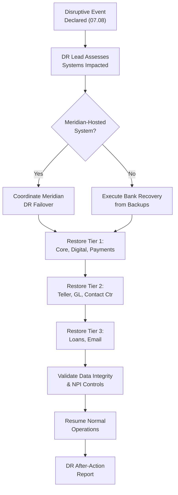

# 07.09 — Disaster Recovery &amp; RTO/RPO

| Field | Value |
|---|---|
| Document ID | CCB-BCM-DR-2026-709 |
| Version | 1.0 |
| Date | 2026-06-15 |
| Classification | Confidential — Nonpublic Information (NPI) // Illustrative Portfolio Sample |
| Owner | Marcus Doyle, IT Security Manager |
| Author | Advisory Team (Financial-Services GRC) |
| Status | Approved |

## Purpose

This Disaster Recovery (DR) plan defines how Cornerstone Community Bank recovers the technology that underpins its critical business functions after a disruptive event. It is the technical companion to the Business Continuity Plan (07.08): the BCP sets business priorities and the BIA; this document translates them into **system-level Recovery Time Objectives (RTO)** and **Recovery Point Objectives (RPO)**, backup strategy, failover design, and DR testing.

Because core banking, general ledger, and digital banking are **outsourced to Meridian Core Services, LLC**, the Bank's DR posture for its Tier 1 systems is inseparable from Meridian's — the plan therefore documents both Bank-controlled recovery and the Meridian dependency it monitors (07.07). This document treats risk **R-08 (backup and recovery)** from the Phase 03 risk register and remediates Recover-function maturity gaps from Phase 05. A DR functional test was performed as part of Phase 07 (≈ 2026-09); results are summarized below.

## DR Strategy and Governance

Cornerstone's DR strategy combines **vendor-delivered resilience** for outsourced platforms with **Bank-controlled recovery** for on-premises and Bank-hosted systems. RTO/RPO targets are derived from the BIA, approved by the CRO and CIO, and reviewed at least annually.

| Principle | Application |
|---|---|
| Tiered recovery | Recovery sequence follows BIA priority tiers (07.08) |
| Vendor resilience | Meridian DR/failover for core, GL, digital banking |
| Bank-controlled backup | Independent backups for Bank-hosted data and configs |
| Geographic separation | Production and recovery sites in separate locations |
| Tested recovery | At least annual DR test; results feed improvement |
| Security in recovery | NPI protections maintained throughout (GLBA §501(b)) |

## RTO / RPO Targets by System

The following targets are authoritative for the Bank and are kept consistent with the BIA in 07.08. For Meridian-hosted Tier 1 systems, the Bank's RTO/RPO is aligned to — and cannot be shorter than — Meridian's contractual recovery commitments (07.04, 07.07).

| System | Tier | Recovery Owner | RTO | RPO | Recovery Method |
|---|---|---|---|---|---|
| Core banking / deposits | 1 | Meridian | 4 hours | 15 minutes | Vendor DR failover |
| Digital banking (online &amp; mobile) | 1 | Meridian | 4 hours | 15 minutes | Vendor DR failover |
| Payments (ACH / wire / card) | 1 | Meridian + Bank | 4 hours | 15 minutes | Vendor DR + rail failover |
| General ledger / fin. reporting | 2 | Meridian | 24 hours | 4 hours | Vendor DR failover |
| Branch teller platform | 2 | Bank | 8 hours | 4 hours | Restore + core reconnect |
| Contact-center telephony | 2 | Bank | 8 hours | 4 hours | Redundant / re-route |
| Loan origination / servicing | 3 | Bank | 24 hours | 24 hours | Restore from backup |
| Email / collaboration | 3 | Bank (SaaS) | 24 hours | 24 hours | Cloud provider resilience |
| Identity / directory services | 2 | Bank | 8 hours | 4 hours | Redundant controllers |

## Backup Strategy (Risk R-08)

The backup program directly mitigates R-08. Cornerstone follows a **3-2-1 approach** — three copies of data, on two media types, with one copy off-site and logically isolated — with immutable/air-gapped protection to defend against ransomware (07.10). Restores are tested, not assumed.

| Backup Attribute | Standard |
|---|---|
| Backup frequency | Aligned to each system's RPO (15 min → daily) |
| Retention | Operational + regulatory retention schedule |
| Off-site / isolation | Off-site copy; immutable / air-gapped for critical data |
| Encryption | Encrypted in transit and at rest (NPI protection) |
| Restore testing | Periodic restore tests; results logged |
| Vendor backups | Meridian responsible for core/GL/digital backups (CUEC verified) |

## Failover and Recovery Sequence

Recovery follows the BIA tier order so that customer-facing Tier 1 services are restored first. The sequence below is exercised in DR testing and coordinated with Meridian for the platforms it hosts.

## DR Testing — Phase 07 Result

A DR functional test was conducted in Phase 07 (≈ 2026-09) to validate recovery procedures, RTO/RPO achievability, and Meridian coordination. The exercise combined a Bank-side restore test with a review of Meridian's most recent DR test results and a coordination walkthrough.

| Test Element | Result (Illustrative) |
|---|---|
| Scope | Tier 1 failover coordination + Bank restore of Tier 2/3 backups |
| Meridian coordination | DR results reviewed; recovery commitments confirmed |
| RTO achievement | Tier 1/2 recovery met targets in the exercise |
| RPO achievement | Restore points within target windows |
| Backup restore | Sample restores successful; integrity validated |
| Findings | Minor runbook clarifications; contact-list refresh |
| Disposition | Action items tracked to closure; plan updated |

| DR Test Governance | Detail |
|---|---|
| Frequency | At least annually and after material change |
| Owner | Marcus Doyle, IT Security Manager |
| Participants | IT, business owners, Vendor Risk, Meridian (coordination) |
| Evidence | Test plan, logs, results retained for exam / audit (Phase 08) |
| Improvement | Findings feed BCP/BIA and DR runbook updates |

## Recovery Site and Data Integrity

DR recovery is only credible if the recovery environment is protected and the restored data is trustworthy. The plan therefore treats site separation, environment hardening, and integrity validation as explicit controls rather than assumptions.

| Control | Standard |
|---|---|
| Site separation | Recovery capacity geographically separate from production |
| Environment hardening | Recovery systems patched, hardened, access-controlled |
| Integrity validation | Post-restore checks before returning to service |
| Clean-source restore | Restore from isolated/immutable backups after cyber events (07.10) |
| Access controls in recovery | Least-privilege maintained during DR (GLBA §501(b)) |
| Documentation | Runbooks maintained and version-controlled |

## Assumptions and Dependencies

The plan's targets rest on stated assumptions; where an assumption fails, the CRO and CIO reassess objectives. This transparency supports exam review (Phase 08).

| Assumption / Dependency | Impact if Unmet |
|---|---|
| Meridian meets its recovery commitments | Tier 1 RTO/RPO at risk; invoke escalation (07.07) |
| Backups are recoverable and current | R-08 risk realized; extend recovery time |
| Recovery site capacity available | Delayed restoration; prioritize Tier 1 |
| Key recovery staff available | Cross-training / alternates engaged (07.08) |
| Connectivity to Meridian restored | Digital/core access delayed |

## Cross-References

- **07.07** — Meridian recovery commitments, concentration risk, exit strategy.
- **07.08** — Business Continuity Plan, BIA, and business-tier RTO/RPO source.
- **07.10** — Incident Response Plan (ransomware recovery uses isolated backups).
- **07.11** — Tabletop exercise validating recovery coordination.
- **Phase 03 (R-08)** — Backup and recovery risk this plan treats.
- **Phase 05** — Recover-function maturity gaps remediated.

---
[⬅ Previous](07.08-business-continuity-plan.md) · [🏠 Phase README](07.00-README.md) · [Next ➡](07.10-incident-response-plan.md)
