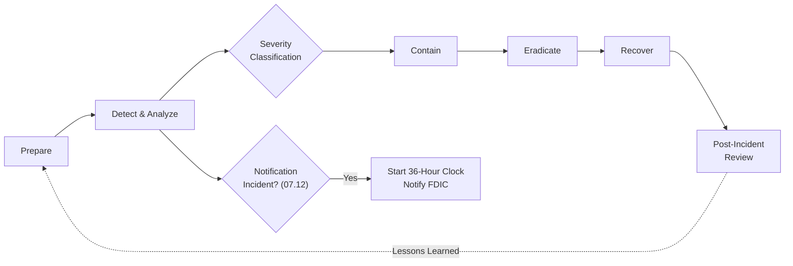

# 07.10 — Incident Response Plan

| Field | Value |
|---|---|
| Document ID | CCB-BCM-IRP-2026-710 |
| Version | 1.0 |
| Date | 2026-06-15 |
| Classification | Confidential — Nonpublic Information (NPI) // Illustrative Portfolio Sample |
| Owner | Rachel Alvarez, Chief Information Security Officer (CISO) |
| Author | Advisory Team (Financial-Services GRC) |
| Status | Approved |

## Purpose

This Incident Response Plan (IRP) defines how Cornerstone Community Bank prepares for, detects, contains, eradicates, recovers from, and learns from information-security incidents — including any that compromise the confidentiality, integrity, or availability of customer **nonpublic personal information (NPI)**. It satisfies the incident-response obligations of **GLBA §501(b)** and the **Interagency Guidelines Establishing Information Security Standards**, and it operationalizes the regulatory-notification duties that follow, including the **Computer-Security Incident Notification Rule (2022)** whose **36-hour** FDIC notification runbook is detailed in 07.12.

The IRP is a primary remediation of the **Detect** and **Respond** maturity gaps from the Phase 05 FFIEC / NIST CSF 2.0 assessment. It integrates with the Business Continuity Plan (07.08) and Disaster Recovery plan (07.09) so that a cyber event triggering an outage is handled as one coordinated response. Because core and digital banking run on **Meridian Core Services, LLC**, the plan defines how the Bank and Meridian coordinate during a shared incident (07.07).

## Incident Response Lifecycle

Cornerstone follows a six-phase lifecycle consistent with NIST SP 800-61 and the NIST CSF 2.0 Respond/Recover functions. Every incident moves through these phases with evidence preserved at each step for audit and potential legal use.

| Phase | Objective | Key Activities |
|---|---|---|
| 1. Prepare | Readiness | Policy, tooling, training, tabletop (07.11), contacts |
| 2. Detect &amp; Analyze | Identify &amp; scope | Alerting, triage, severity classification, NPI assessment |
| 3. Contain | Limit damage | Isolate systems, block access, preserve evidence |
| 4. Eradicate | Remove threat | Remove malware, close vectors, reset credentials |
| 5. Recover | Restore service | Restore from clean backups (07.09), validate integrity |
| 6. Post-Incident | Learn &amp; improve | Root cause, lessons learned, control &amp; plan updates |

## Severity Classification

Every incident is assigned a severity that drives escalation, response tempo, and notification analysis. Severity is reassessed as facts develop; an incident can escalate or de-escalate.

| Severity | Definition | Examples | Response |
|---|---|---|---|
| SEV-1 Critical | Major NPI breach or core/digital outage | Ransomware, confirmed NPI exfiltration, core down | CSIRT + executives; 36-hour analysis (07.12) |
| SEV-2 High | Significant impact, contained scope | Targeted intrusion, malware on key system | CSIRT activation; executive brief |
| SEV-3 Moderate | Limited impact, no confirmed NPI loss | Isolated malware, policy violation | IT Security response; monitor |
| SEV-4 Low | Minimal impact, routine | Blocked phishing, single-endpoint alert | Standard handling; log |

## Roles — Computer Security Incident Response Team (CSIRT)

The CSIRT is a standing, cross-functional team activated by the CISO (or delegate) for SEV-1 and SEV-2 incidents. Roles are pre-assigned with alternates.

| CSIRT Role | Holder | Responsibility |
|---|---|---|
| Incident Commander | Rachel Alvarez, CISO | Direct response; declare severity; approve notifications |
| Technical lead | Marcus Doyle, IT Security Manager | Containment, eradication, recovery execution |
| IT operations | James Porter, CIO | Systems, DR coordination (07.09), Meridian interface |
| Risk &amp; regulatory | Steven Nakamura, CRO | Notification decisions; 36-hour clock (07.12) |
| Privacy | Karen Ellis, Privacy Officer | NPI/breach assessment; customer-notice analysis |
| Communications / compliance | Angela Foster, CCO | Internal, customer, regulator, SEC-materiality coordination |
| Legal / counsel | Engaged counsel | Privilege, legal obligations, law enforcement |

## Escalation and Communications

Escalation is time-bound and severity-driven. Communications are coordinated centrally to ensure consistency and to protect legal privilege and NPI. For the **publicly traded parent (Nasdaq: CCBK)**, the CSIRT coordinates with the Holding Company on **SEC materiality** assessment (07.12).

| Trigger | Escalates To | Timeframe |
|---|---|---|
| SEV-3/4 detected | IT Security Manager | Same business day |
| SEV-2 declared | CISO + CSIRT | Immediately |
| SEV-1 declared | CISO, CRO, CIO, President, Counsel | Immediately |
| Potential notification incident | CRO + Counsel (07.12) | Immediately — 36-hr clock |
| Meridian-involved incident | Vendor Risk + Meridian | Per contract window (07.07) |
| Potential SEC materiality | Holding Company / CFO | Promptly on SEV-1 |

## Regulatory Notification Triggers

The IRP includes a decision gate to determine whether an incident is a **"notification incident"** under the 2022 Computer-Security Incident Notification Rule, requiring FDIC notification within **36 hours**. This analysis begins as soon as a qualifying event is suspected; the full procedure is in 07.12.

| Notification Obligation | Trigger | Timing | Reference |
|---|---|---|---|
| FDIC (primary federal regulator) | Qualifying "notification incident" | Within 36 hours | 07.12 |
| Customer breach notice | Reasonable likelihood of NPI misuse | Per guidance / state law | Privacy Officer |
| SEC (via Holding Company) | Material cybersecurity incident | Per SEC rules | 07.12 |
| State (Ohio DFI) | Per applicable expectations | As required | CCO |
| Law enforcement | Criminal activity (e.g., ransomware) | As appropriate | Counsel |

## Preparation and Continuous Improvement

Readiness is maintained through tooling, training, and exercises. The **tabletop exercise (07.11)** is the principal validation that the plan works and that responders know their roles; findings feed back into the plan. This closes the loop on the Phase 05 Detect/Respond gaps.

| Preparedness Activity | Frequency | Owner |
|---|---|---|
| IRP review &amp; approval | Annually / on change | CISO |
| Tabletop exercise (07.11) | At least annually | CISO |
| CSIRT contact-list refresh | Quarterly | IT Security Manager |
| Detection tuning (SIEM/alerts) | Ongoing | IT Security |
| 36-hour runbook rehearsal | Annually | CRO / CISO |
| Post-incident lessons capture | After each SEV-1/2 | Incident Commander |

## Cross-References

- **07.07** — Meridian incident coordination and contractual notification windows.
- **07.08** — Business Continuity Plan for cyber-driven disruption.
- **07.09** — Disaster Recovery; clean-backup restoration during eradication/recovery.
- **07.11** — Incident Response tabletop exercise validating this plan.
- **07.12** — 36-hour FDIC notification runbook and SEC-materiality coordination.
- **Phase 05** — Detect / Respond maturity gaps this plan remediates.

---
[⬅ Previous](07.09-disaster-recovery-and-rto-rpo.md) · [🏠 Phase README](07.00-README.md) · [Next ➡](07.11-incident-response-tabletop.md)
