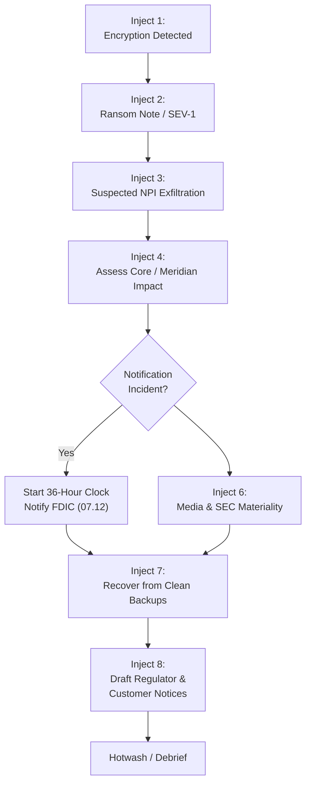

# 07.11 — Incident Response Tabletop

| Field | Value |
|---|---|
| Document ID | CCB-BCM-TTX-2026-711 |
| Version | 1.0 |
| Date | 2026-06-15 |
| Classification | Confidential — Nonpublic Information (NPI) // Illustrative Portfolio Sample |
| Owner | Rachel Alvarez, Chief Information Security Officer (CISO) |
| Author | Advisory Team (Financial-Services GRC) |
| Status | Approved |

## Purpose

This document records the design and results of Cornerstone Community Bank's **incident-response tabletop exercise (TTX)**, conducted in **Phase 07 (≈ 2026-09)**. A tabletop is a facilitated, discussion-based walkthrough in which the response team works a realistic scenario in real time to validate that the Incident Response Plan (07.10), the 36-hour notification runbook (07.12), and the continuity/recovery plans (07.08, 07.09) function together under pressure.

The scenario chosen was a **ransomware event with suspected NPI exfiltration** — the most consequential and most likely severe scenario for a community bank whose core is outsourced. The exercise deliberately tested the **Detect / Respond / Recover** capabilities that Phase 05 flagged as maturity gaps, and it validated readiness for the **36-hour FDIC notification** obligation. This record captures participants, injects, observations, findings, and tracked action items, providing exam-ready evidence for Phase 08.

## Exercise Overview

| Attribute | Detail |
|---|---|
| Type | Discussion-based tabletop exercise |
| Date | ≈ 2026-09 (Phase 07) |
| Duration | Approximately half a day |
| Scenario | Ransomware with suspected NPI exfiltration |
| Facilitator | Advisory Team (Financial-Services GRC) |
| Objectives | Validate IRP (07.10), 36-hour runbook (07.12), BCP/DR coordination |
| Scope | CSIRT, executives, Privacy, Compliance, Vendor Risk, Meridian liaison |
| Classification | Confidential; results for internal &amp; exam use |

## Participants

| Role in Exercise | Participant |
|---|---|
| Incident Commander | Rachel Alvarez, CISO |
| Technical lead | Marcus Doyle, IT Security Manager |
| IT operations / Meridian interface | James Porter, CIO |
| Risk &amp; regulatory notification | Steven Nakamura, CRO |
| Privacy / NPI assessment | Karen Ellis, Privacy Officer |
| Communications / compliance | Angela Foster, CCO |
| Executive sponsor | David Okonkwo, Bank President |
| Internal Audit (observer) | Priya Sharma, Director of Internal Audit |
| Facilitator | Advisory Team (Financial-Services GRC) |

## Scenario and Injects

The scenario unfolded through timed injects that escalated from an initial detection to a confirmed encryption event with data-theft indicators, forcing severity classification, containment, notification analysis, and recovery decisions.

| # | Inject | Decision / Response Tested |
|---|---|---|
| 1 | EDR flags anomalous encryption on a file server; users report locked files | Detection, triage, initial severity (07.10) |
| 2 | Ransom note discovered; multiple servers affected | SEV-1 declaration; CSIRT activation |
| 3 | Evidence of outbound transfer of files containing NPI | NPI/breach assessment (Privacy); scope |
| 4 | Question: is core/digital banking affected? | Meridian coordination (07.07); BCP activation (07.08) |
| 5 | Legal/regulatory clock — is this a "notification incident"? | 36-hour analysis; start clock (07.12) |
| 6 | Media inquiry received; parent stock (CCBK) sensitivity | Comms control; SEC-materiality coordination |
| 7 | Recovery decision — restore vs. pay | Restore from isolated backups (07.09); no-pay stance |
| 8 | Regulator and customer notification drafting | FDIC notice content; customer-notice trigger |

## Findings and Lessons Learned

The exercise confirmed the team understood the plan and could execute the core response, while surfacing improvement areas typical of a maturing program. Findings are rated by priority.

| # | Finding | Priority | Theme |
|---|---|---|---|
| F-1 | 36-hour clock start point needed clearer decision criteria | High | Notification |
| F-2 | Meridian contact/escalation path should be pre-staged in runbook | High | Third-party |
| F-3 | SEC-materiality coordination with Holding Company to be documented | Medium | Regulatory |
| F-4 | Customer-notification templates to be pre-drafted and approved | Medium | Communications |
| F-5 | Backup-isolation assumptions should be re-verified against R-08 | Medium | Recovery |
| F-6 | Executive notification tree needed a refresh of alternates | Low | Escalation |

| Lesson Learned | Improvement |
|---|---|
| Time pressure is the hardest variable | Pre-stage decisions, contacts, and templates |
| Notification analysis must start early | Embed 36-hour gate at detection (07.10 / 07.12) |
| Third-party coordination is decisive | Formalize Meridian incident interface (07.07) |
| Public-parent status raises the stakes | Standing SEC-materiality coordination protocol |

## Action Items

Each finding was converted to a tracked action item with an owner and target, feeding the continuous-improvement loop and directly closing residual Phase 05 Detect/Respond/Recover gaps. Closure evidence is retained for Phase 08 exam readiness.

| ID | Action | Owner | Target |
|---|---|---|---|
| A-1 | Add explicit 36-hour clock-start criteria to runbook (07.12) | CRO / CISO | Post-exercise |
| A-2 | Pre-stage Meridian escalation contacts in IR/notification runbooks | IT Security Manager | Post-exercise |
| A-3 | Document SEC-materiality coordination with Holding Company | CCO / CFO | Post-exercise |
| A-4 | Draft and approve customer-notification templates | Privacy Officer | Post-exercise |
| A-5 | Re-verify backup isolation/immutability (R-08) | IT Security Manager | Post-exercise |
| A-6 | Refresh executive/CSIRT notification tree | CISO | Post-exercise |

## Cross-References

- **07.08** — Business Continuity Plan activated in the scenario.
- **07.09** — Disaster Recovery / backup restoration (R-08) exercised.
- **07.10** — Incident Response Plan validated by this tabletop.
- **07.12** — 36-hour notification runbook rehearsed in injects 5 and 8.
- **07.07** — Meridian coordination surfaced as finding F-2.
- **Phase 05** — Detect / Respond / Recover gaps this exercise helps close.

---
[⬅ Previous](07.10-incident-response-plan.md) · [🏠 Phase README](07.00-README.md) · [Next ➡](07.12-36-hour-notification-runbook.md)
