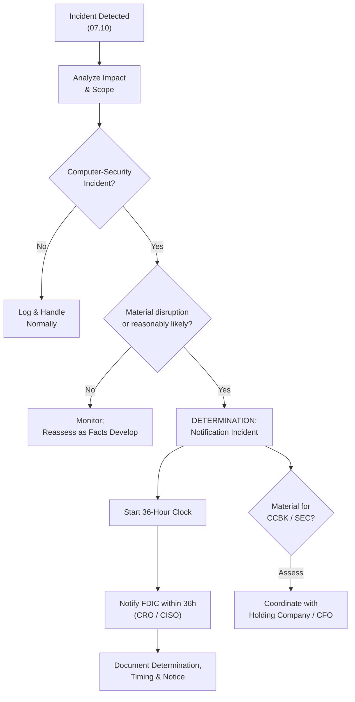

# 07.12 — 36-Hour Notification Runbook

| Field | Value |
|---|---|
| Document ID | CCB-BCM-NOTIF36-2026-712 |
| Version | 1.0 |
| Date | 2026-06-15 |
| Classification | Confidential — Nonpublic Information (NPI) // Illustrative Portfolio Sample |
| Owner | Rachel Alvarez, Chief Information Security Officer (CISO) |
| Author | Advisory Team (Financial-Services GRC) |
| Status | Approved |

## Purpose

This runbook operationalizes the **Computer-Security Incident Notification Rule (2022)** issued jointly by the FDIC, OCC, and Federal Reserve. Under that rule, a banking organization must notify its **primary federal regulator** as soon as possible and **no later than 36 hours** after determining that a **"notification incident"** has occurred. For Cornerstone Community Bank — a **state non-member, FDIC-insured** institution — the primary federal regulator is the **FDIC**.

The runbook removes ambiguity under time pressure: it defines what qualifies as a notification incident, when the 36-hour clock starts, who decides, who notifies the FDIC and how, what the notification contains, and how the Bank coordinates with **Meridian Core Services, LLC** (as a bank service provider) and with customers. It also addresses the separate **SEC materiality** assessment for the **publicly traded parent, Cornerstone Bancorp, Inc. (Nasdaq: CCBK)**. It is invoked from the Incident Response Plan (07.10) and was rehearsed in the tabletop (07.11), closing Phase 05 Respond-function gaps.

## What Qualifies as a "Notification Incident"

A **computer-security incident** is an occurrence that jeopardizes the confidentiality, integrity, or availability of an information system or the information it processes. It becomes a **notification incident** — triggering the 36-hour duty — only when it has materially disrupted or degraded, or is reasonably likely to materially disrupt or degrade, the Bank's operations, its ability to deliver services to a material portion of its customer base, or its line of business the failure of which would threaten the viability of the institution.

| Test | Qualifying? |
|---|---|
| Confirmed ransomware materially disrupting core/digital banking | Yes — notification incident |
| Confirmed large-scale NPI breach affecting many customers | Yes — assess materiality; likely qualifies |
| Sustained outage degrading service to a material customer base | Yes |
| Failure threatening a viability-critical line of business | Yes |
| Blocked phishing, single-endpoint malware, no material impact | No — log; not a notification incident |
| Brief, self-recovered glitch with no material degradation | No |

## The 36-Hour Clock

The clock starts on **determination**, not detection. The Bank makes a **good-faith determination** that a notification incident has occurred as soon as reasonably possible; from that moment, notification is due within 36 hours.

## Who Notifies and How

Notification authority and execution are pre-assigned so no time is lost debating ownership during an incident.

| Step | Owner | Action |
|---|---|---|
| Declare determination | CRO (Steven Nakamura) with CISO + Counsel | Formal decision that a notification incident occurred |
| Start &amp; track clock | CISO (Rachel Alvarez) | Record determination time; manage 36-hour deadline |
| Notify FDIC | CRO / CISO | Contact FDIC via the designated channel for the Bank |
| Draft notice | CISO + Compliance (Angela Foster) | Prepare notification content (below) |
| Legal review | Counsel | Privilege, accuracy, obligations |
| SEC materiality | CFO (Linda Barrett) / Holding Company | Separate assessment for CCBK |
| Document &amp; retain | CISO | Evidence for exam / audit (Phase 08) |

## Notification Content

The rule requires only a brief, timely notice — not a full forensic report. The Bank provides the essential facts known at the time and updates as the investigation matures.

| Element | Content |
|---|---|
| Institution identity | Cornerstone Community Bank; primary regulator FDIC |
| Nature of incident | What occurred (e.g., ransomware, NPI compromise) |
| Timing | When determined; when the clock started |
| Impact | Systems/services affected; material-disruption basis |
| Status | Containment/response actions underway |
| Contacts | Named Bank point(s) of contact |
| Follow-up | Commitment to update as facts develop |

## Coordination with Meridian and Customers

Because Meridian operates the core and digital-banking platforms, an incident may originate at or involve Meridian. As a **bank service provider**, Meridian has its own obligation to notify affected banking-organization customers of incidents that materially disrupt covered services; the Bank's runbook depends on and monitors that notification and coordinates a joint response (07.07).

| Party | Coordination |
|---|---|
| Meridian (service provider) | Receive/confirm provider notification; joint incident response; align facts |
| FDIC | Bank's 36-hour notification regardless of incident origin |
| Customers | Breach notice where NPI misuse is reasonably likely (Privacy Officer, Reg P) |
| Ohio DFI | Notify per state expectations (CCO) |
| SEC (via CCBK) | Materiality assessment and any required disclosure |
| Law enforcement | Engage as appropriate (e.g., ransomware) |

## Interaction with SEC Materiality (Public Parent)

The 36-hour banking-agency duty is **separate and independent** from the SEC cybersecurity-disclosure obligations that apply to the **publicly traded holding company (CCBK)**. A single incident can trigger both, on different clocks and standards; the runbook ensures both are assessed in parallel and neither is missed.

| Obligation | Trigger | Standard | Owner |
|---|---|---|---|
| FDIC 36-hour notice | Notification incident | Material disruption / viability | CRO / CISO |
| SEC current-report disclosure | Material cybersecurity incident | Investor materiality | CFO / Holding Company |
| Customer breach notice | Reasonable likelihood of NPI misuse | GLBA / state law | Privacy Officer |

## Determination and Evidence Log

The determination decision and its timing are the pivot of the entire runbook, so they are documented contemporaneously. This log is the primary exam evidence that the Bank met the 36-hour duty (Phase 08).

| Log Field | Captured |
|---|---|
| Detection time | When the incident was first observed |
| Analysis summary | Facts supporting the determination |
| Determination time | When the notification-incident decision was made |
| Clock deadline | Determination time + 36 hours |
| Notification time | When the FDIC was notified |
| Decision-makers | CRO, CISO, Counsel involved |
| Parallel obligations | SEC materiality, customer notice status |

## Common Pitfalls and Controls

The rule's short window is unforgiving of hesitation and over-analysis. The runbook pre-empts the failure modes the tabletop (07.11) exposed.

| Pitfall | Control |
|---|---|
| Waiting for full forensics before notifying | Notice requires only known facts; update later |
| Debating clock start under pressure | Explicit determination criteria (this runbook) |
| Missing the parallel SEC clock | Standing coordination with Holding Company / CFO |
| Unclear FDIC contact path | Pre-staged channel and named notifiers |
| Provider incident assumed to be Meridian's duty | Bank retains its own 36-hour obligation |

## Cross-References

- **07.07** — Meridian as bank service provider; provider notification obligations.
- **07.08** — Business Continuity Plan activated alongside notification.
- **07.09** — Disaster Recovery for incident-driven outages.
- **07.10** — Incident Response Plan that invokes this runbook.
- **07.11** — Tabletop that rehearsed the 36-hour determination and notice.
- **Phase 05** — Respond-function maturity gap this runbook remediates.

---
[⬅ Previous](07.11-incident-response-tabletop.md) · [🏠 Phase README](07.00-README.md) · [Next ➡](07.13-phase-summary-and-transition.md)
