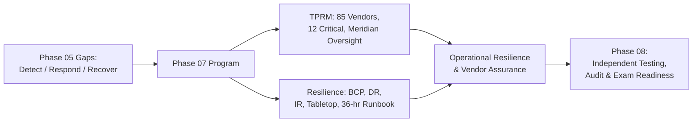

# 07.13 — Phase Summary &amp; Transition

| Field | Value |
|---|---|
| Document ID | CCB-BCM-PHASE07-2026-713 |
| Version | 1.0 |
| Date | 2026-06-15 |
| Classification | Confidential — Nonpublic Information (NPI) // Illustrative Portfolio Sample |
| Owner | Steven Nakamura, Chief Risk Officer (CRO) |
| Author | Advisory Team (Financial-Services GRC) |
| Status | Approved |

## Purpose

This document closes **Phase 07 — Third-Party / Vendor Risk &amp; Business Continuity** for Cornerstone Community Bank. It recaps what the phase delivered, confirms how it satisfies GLBA §501(b) service-provider oversight and FFIEC Business Continuity Management expectations, ties the work back to the **Detect / Respond / Recover** maturity gaps identified in Phase 05, and hands off to **Phase 08 — Independent Testing, Audit &amp; Examination Readiness**.

Phase 07 built two interlocking disciplines: a **Third-Party Risk Management (TPRM) program** covering the Bank's vendor population, and an **operational-resilience program** spanning business continuity, disaster recovery, incident response, and regulatory notification. Together they address the concentration and resilience risks inherent in a community bank whose core is outsourced to **Meridian Core Services, LLC**.

## What Phase 07 Delivered

| Deliverable | Document | Outcome |
|---|---|---|
| TPRM program | 07.01 | Program aligned to 2023 Interagency Guidance &amp; GLBA §501(b) |
| Vendor inventory &amp; tiering | 07.02 | 85 third parties; 12 critical/high-risk identified |
| Due diligence | 07.03 | Risk-based diligence, enhanced for critical vendors |
| Contract &amp; SLA controls | 07.04 | Resilience, security, termination, exit clauses |
| SOC report review | 07.05 | SOC 1 / SOC 2 reliance; CUECs operated |
| Ongoing monitoring | 07.06 | KRIs and continuous vendor monitoring |
| Meridian oversight | 07.07 | Enhanced oversight; concentration risk managed |
| Business Continuity Plan | 07.08 | BIA; critical functions; RTO/RPO; FFIEC BCM alignment |
| Disaster Recovery | 07.09 | System RTO/RPO; backup (R-08); DR test performed |
| Incident Response Plan | 07.10 | Six-phase lifecycle; CSIRT; notification triggers |
| IR tabletop | 07.11 | Ransomware / NPI-breach exercise conducted (≈ 2026-09) |
| 36-hour runbook | 07.12 | FDIC notification runbook; SEC-materiality coordination |

## Program Metrics Recap

| Metric | Value |
|---|---|
| Third parties in inventory | 85 |
| Critical / high-risk relationships | 12 |
| Core provider under enhanced oversight | Meridian Core Services, LLC |
| BCP with BIA and tiered RTO/RPO | Established |
| DR test performed | Yes (Phase 07, ≈ 2026-09) |
| Incident Response Plan | Established; six-phase lifecycle |
| Tabletop exercise | Conducted; action items tracked |
| 36-hour notification runbook | Established (FDIC primary regulator) |
| Backup / recovery risk (R-08) | Treated in 07.09 |

## Remediation of Phase 05 Maturity Gaps

Phase 07 was scoped in part to close the **Detect / Respond / Recover** maturity gaps from the Phase 05 FFIEC / NIST CSF 2.0 assessment. The mapping below shows how each function was advanced toward the Intermediate target profile.

| CSF 2.0 Function | Phase 05 Gap | Phase 07 Remediation |
|---|---|---|
| Detect | Immature detection/triage | IR lifecycle detect &amp; analyze; severity model (07.10) |
| Respond | No formal IR / notification process | IR plan, CSIRT, 36-hour runbook, tabletop (07.10–07.12) |
| Recover | Untested continuity/recovery | BCP, DR with tested RTO/RPO, backup (R-08) (07.08–07.09) |
| Govern / Identify | Vendor risk visibility | TPRM program, tiering, Meridian oversight (07.01–07.07) |

## Open Items Carried Forward

The tabletop and DR test surfaced improvement actions that continue into Phase 08 evidence and validation. None are material weaknesses; all are tracked to closure.

| Item | Source | Carried To |
|---|---|---|
| Tabletop action items (A-1…A-6) | 07.11 | Tracked to closure; evidence for Phase 08 |
| DR runbook clarifications | 07.09 | Incorporated; re-tested next cycle |
| Meridian escalation pre-staging | 07.11 (F-2) | Runbook update; vendor governance |
| Customer-notification templates | 07.11 (F-4) | Pre-drafted; approved for readiness |

## Governance and Board Reporting

Phase 07's outputs feed the Bank's risk-governance rhythm and the annual GLBA report to the Board. Vendor concentration, resilience posture, and incident-response readiness are standing topics at the Risk Committee.

| Governance Output | Audience | Cadence |
|---|---|---|
| Vendor concentration &amp; Meridian risk | Risk Committee / Board | Quarterly / annual |
| Resilience posture (BCP/DR test results) | Risk Committee | At least annually |
| Incident-response readiness &amp; tabletop | CISO to Risk Committee | Annually |
| GLBA §501(b) service-provider oversight | Board (annual GLBA report) | Annually |

## Transition to Phase 08

Phase 08 subjects the program to **independent validation** — external penetration testing, internal audit, and FFIEC IT examination readiness. Phase 07's artifacts are direct exam evidence: the TPRM program, SOC reliance, BCP/DR with a completed test, the IR plan, the tabletop record, and the 36-hour runbook.

| Phase 08 Activity | Phase 07 Input |
|---|---|
| Independent penetration testing | Resilience &amp; control posture to validate |
| Internal audit | TPRM, BCP/DR, IR program evidence |
| FFIEC IT exam readiness | BCM, outsourcing, information-security artifacts |
| Exam evidence package | 07.01–07.12 documents, test &amp; tabletop results |

## Cross-References

- **07.01–07.07** — TPRM program, tiering, diligence, SOC, monitoring, Meridian oversight.
- **07.08–07.12** — BCP, DR, IR plan, tabletop, 36-hour runbook.
- **Phase 05** — FFIEC / NIST CSF 2.0 maturity gaps remediated.
- **Phase 06** — SOX ITGC and Meridian SOC 1 reliance.
- **Phase 08** — Independent testing, audit, and examination readiness (next phase).

---
[⬅ Previous](07.12-36-hour-notification-runbook.md) · [🏠 Phase README](07.00-README.md) · [Next ➡](../08-independent-testing-audit-exam-readiness/08.00-README.md)
