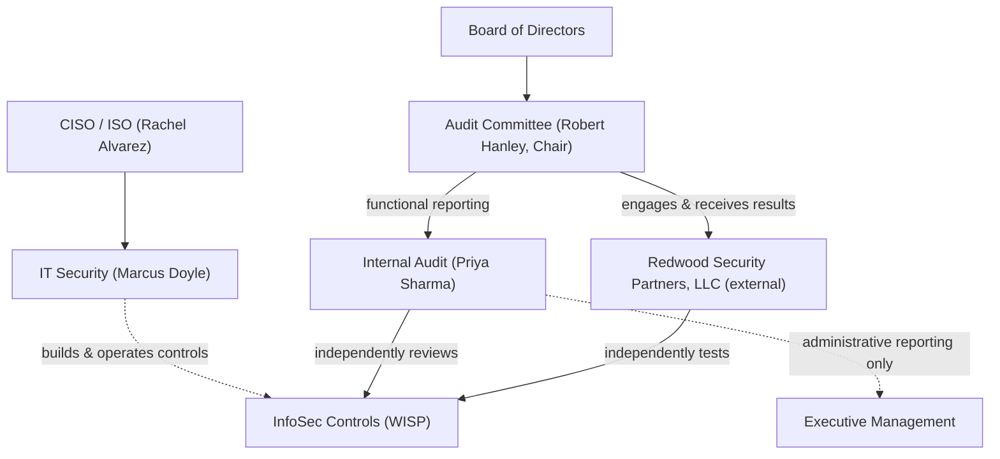

# 08.01 — Independent Testing Strategy

| Field | Value |
|---|---|
| Document ID | CCB-IT-AUD-2026-801 |
| Version | 1.0 |
| Date | 2026-06-15 |
| Classification | Confidential — Nonpublic Information (NPI) // Illustrative Portfolio Sample |
| Owner | Priya Sharma, Director of Internal Audit |
| Author | Advisory Team (Financial-Services GRC) |
| Status | Approved |

## Purpose

This document defines Cornerstone Community Bank's ("Cornerstone," "the Bank") strategy for the **independent testing** of the information security program required under the Gramm-Leach-Bliley Act (GLBA) §501(b) and the Interagency Guidelines Establishing Information Security Standards. The Interagency Guidelines require each institution to "regularly test the key controls, systems, and procedures of the information security program," with the frequency and nature of tests determined by risk, and to have those tests conducted or reviewed by **independent third parties or staff independent of those who develop or maintain the program**.

Independent testing is the mechanism by which the design and operating effectiveness of the safeguards built in Phases 04–07 are objectively validated before the Bank enters its FFIEC IT examination (fieldwork 2026-11) and the FY2026 SOX 404 opinion cycle. This strategy establishes the testing portfolio, the independence model, the annual cadence, and the scoping methodology that governs the engagements documented in the remainder of this phase.

## Regulatory Basis for Independent Testing

| Authority | Requirement | How Cornerstone Satisfies It |
|---|---|---|
| GLBA §501(b) / Interagency Guidelines III.C.3 | Regularly test key controls; testing conducted or reviewed by independent parties | External pen test by Redwood Security Partners; Internal Audit review by a function independent of IT |
| FFIEC IT Handbook — Audit booklet | Independent audit function reporting to the Board/Audit Committee; risk-based audit universe | Internal Audit reports functionally to the Audit Committee (Robert Hanley, Chair) |
| FFIEC IT Handbook — Information Security booklet | Independent testing of controls, including penetration testing and vulnerability assessment | Annual external pen test + quarterly vulnerability assessments |
| FFIEC Cybersecurity Assessment (mapped to NIST CSF 2.0) | Detect / Protect validation of control maturity | Test results feed the CSF 2.0 current-profile evidence base |
| SOX 404 / FDICIA Part 363 | Independent evaluation of ITGC over financially significant systems | Coordinated Internal Audit and external auditor (Whitmore & Associates) testing |

## The Independent Testing Portfolio

Cornerstone employs a layered testing portfolio so that no single technique carries the full assurance burden. The layers are complementary: automated breadth (scanning) plus expert depth (penetration testing) plus process assurance (internal audit).

| Testing Layer | Description | Provider / Independence | Primary Documents |
|---|---|---|---|
| External penetration test | Authenticated and unauthenticated attack simulation against internet-facing and internal assets, web/mobile banking | Redwood Security Partners, LLC (external, independent) | 08.02, 08.03, 08.05 |
| Vulnerability assessment | Recurring authenticated/unauthenticated scanning of the enterprise attack surface | Redwood Security Partners + internal security tooling | 08.04 |
| Social engineering / phishing | Simulated phishing and pretext-based credential capture against staff | Redwood Security Partners | 08.02, 08.03 |
| Red-team-lite exercise | Scenario-driven, objective-based intrusion emulation (constrained scope) | Redwood Security Partners | 08.02, 08.03 |
| Internal audit of the InfoSec program | Independent review of WISP, policies, and control operation | Internal Audit (Priya Sharma) | 08.06, 08.07 |
| Third-party assurance review | Reliance on Meridian SOC 1/SOC 2 Type II reports for outsourced core/digital banking | Internal Audit + Vendor Management | 08.02 (out-of-scope rationale) |

### Scope Boundary — Outsourced Core

Because core banking and digital banking are **outsourced to Meridian Core Services, LLC**, the internals of the Meridian platform are out of scope for Cornerstone's own penetration test. Assurance over Meridian's environment is obtained through Meridian's independent **SOC 1 Type II and SOC 2 Type II** reports and the complementary user entity controls (CUECs) validated in Phase 07. Cornerstone's testing focuses on the assets it owns and operates, plus the integration/authentication paths into Meridian.

## Independence Model

Independence is preserved along two axes: **organizational** independence (the tester does not report to the party that owns the control) and **engagement** independence (the external firm has no role in building the controls it tests).

The CISO (Rachel Alvarez) and IT Security Manager (Marcus Doyle) **build and operate** the controls; they neither perform nor sign off on the independent tests of those controls. Redwood is retained and its results are received by the Audit Committee. Internal Audit reports functionally to the Audit Committee to protect its independence from management pressure.

## Cadence and Scheduling

| Activity | Frequency | 2026 Timing | Trigger for Off-Cycle Test |
|---|---|---|---|
| External penetration test | Annual | 2026-10 | Major architecture change; significant incident |
| Vulnerability assessment (external) | Quarterly | Q1–Q4 2026 | New internet-facing service |
| Vulnerability assessment (internal, authenticated) | Monthly | Continuous | Critical CVE disclosure |
| Social engineering / phishing | Semi-annual | Bundled with pen test 2026-10 | Post-incident awareness validation |
| Internal audit of InfoSec program | Annual | 2026-11 | Board/regulatory request |
| Patch validation scan | Monthly + on-demand | Continuous | Emergency patch deployment |

## Scoping Methodology

Scope for each engagement is derived from the risk assessment (Phase 03: 42 risks; 8 High) and the asset inventory (Phase 02: 22 NPI-bearing systems within 140 total; 6 SOX-significant). Systems are prioritized for testing depth using the following criteria:

| Criterion | Weight | Rationale |
|---|---|---|
| NPI exposure | High | GLBA §501(b) protects customer NPI (22 systems) |
| Internet exposure | High | External attack surface is the highest-likelihood vector |
| Financial significance (SOX) | High | ITGC reliance for FY2026 404 opinion (6 systems) |
| Inherent risk rating (Phase 03) | Medium | Focus depth on the 8 High risks |
| Recent change | Medium | Change increases likelihood of misconfiguration |

The output of this scoping process is the penetration test Rules of Engagement (08.02) and the vulnerability assessment target set (08.04).

## Roles and Responsibilities

| Role | Person | Responsibility in Independent Testing |
|---|---|---|
| Director of Internal Audit | Priya Sharma | Owns the independent audit; reports to Audit Committee; validates remediation |
| CISO / ISO | Rachel Alvarez | Sponsors external testing; owns program remediation; does not test own controls |
| IT Security Manager | Marcus Doyle | Coordinates pen test logistics and de-confliction; drives technical remediation |
| Audit Committee Chair | Robert Hanley | Receives results; oversees independence and issue closure |
| External testing firm | Redwood Security Partners, LLC | Performs pen test and vulnerability assessment independently |
| Vendor Management / Privacy | Karen Ellis (Privacy Officer) | Confirms Meridian assurance reliance for out-of-scope core |

## Risk-Based Testing Depth

Not every system receives the same testing depth. The strategy allocates effort by tier so the highest-value assets receive expert manual testing while the broader estate is covered by automated scanning.

| Tier | System Population | Testing Depth |
|---|---|---|
| Tier 1 — Crown jewels | Internet-facing and NPI-critical systems (subset of 22 NPI systems) | Manual pen test + authenticated scan + red-team-lite objective |
| Tier 2 — NPI / SOX-significant | Remaining 22 NPI and 6 SOX-significant systems | Authenticated scan + sampled manual testing |
| Tier 3 — General estate | Remaining systems within the 140-system inventory | Automated vulnerability scanning |
| Tier 4 — Outsourced | Meridian core/digital banking | Third-party assurance (SOC 1/SOC 2 Type II) |

## Outputs and Downstream Use

- Findings feed the **remediation tracker** (08.05) with owners and due dates.
- Results become **current-profile evidence** for the NIST CSF 2.0 assessment (Phase 05).
- Results and remediation status are packaged into the **FFIEC IT examination readiness** file (08.08) and the **annual GLBA Board report** (Phase 09).
- Internal Audit's conclusion (Satisfactory with recommendations, 08.06/08.07) provides the Board with independent assurance over the whole program.

## Cross-References

- `08.00-README.md` — Phase 08 overview and index
- `08.02-penetration-test-scope-and-rules.md` — Redwood engagement scope and ROE
- `08.06-internal-audit-of-infosec-program.md` — Internal Audit scope and result
- `../03-risk-assessment/` — 42-risk assessment driving test scope
- `../04-information-security-program-controls/` — WISP and 14 core policies under test
- `../07-third-party-risk-business-continuity/` — Meridian SOC report reliance
- `08.08-ffiec-it-examination-readiness.md` — exam packaging of testing results

[⬅ Previous](08.00-README.md) · [🏠 Phase README](08.00-README.md) · [Next ➡](08.02-penetration-test-scope-and-rules.md)
