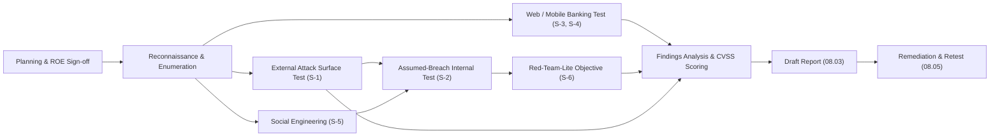

# 08.02 — Penetration Test Scope &amp; Rules of Engagement

| Field | Value |
|---|---|
| Document ID | CCB-IT-PEN-2026-802 |
| Version | 1.0 |
| Date | 2026-06-15 |
| Classification | Confidential — Nonpublic Information (NPI) // Illustrative Portfolio Sample |
| Owner | Marcus Doyle, IT Security Manager / Rachel Alvarez, CISO |
| Author | Advisory Team (Financial-Services GRC) |
| Status | Approved |

## Purpose

This document records the agreed scope, methodology, and Rules of Engagement (ROE) for the annual external penetration test performed for Cornerstone Community Bank by **Redwood Security Partners, LLC** ("Redwood"). It serves as the formal authorization and safety envelope for the engagement, satisfying the FFIEC IT Handbook (Information Security booklet) expectation that penetration testing be conducted under a clearly defined, authorized scope with agreed rules and de-confliction procedures. The engagement validates the key controls of the information security program required to be independently tested under GLBA §501(b).

The test window is **2026-10** (annual cadence per 08.01). This document is baselined before test execution; results are recorded separately in 08.03 and remediation in 08.05.

## Engagement Overview

| Attribute | Detail |
|---|---|
| Client | Cornerstone Community Bank (subsidiary of Cornerstone Bancorp, Inc., Nasdaq: CCBK) |
| Testing firm | Redwood Security Partners, LLC (independent) |
| Engagement type | Grey-box external + internal penetration test, web/mobile banking, social engineering, red-team-lite |
| Authorizing officers | Rachel Alvarez (CISO), Marcus Doyle (IT Security Manager) |
| Board oversight | Audit Committee (Robert Hanley, Chair) receives results |
| Test window | 2026-10-05 through 2026-10-23 |
| Methodology | PTES, OWASP WSTG / MASVS, NIST SP 800-115, MITRE ATT&amp;CK |
| Retest window | Post-remediation retest by Redwood (see 08.05) |

## Scope — In Scope

The following asset groups are authorized targets. Targets were selected using the scoping methodology in 08.01 (NPI exposure, internet exposure, SOX significance, inherent risk).

| # | Scope Area | Description | Test Type |
|---|---|---|---|
| S-1 | External network | Internet-facing perimeter, VPN concentrators, email gateway, DNS, published services | Unauthenticated + authenticated |
| S-2 | Internal network | Corporate LAN, Active Directory, server VLANs, branch network segments | Authenticated (assumed-breach foothold) |
| S-3 | Web banking (customer) | Meridian-integrated online banking front end, authentication and session paths owned/configured by Cornerstone | Authenticated + unauthenticated |
| S-4 | Mobile banking | iOS/Android mobile app client and its API integration owned by Cornerstone | OWASP MASVS, API testing |
| S-5 | Social engineering | Email phishing simulation and voice pretext against in-scope staff populations | Simulated campaign |
| S-6 | Red-team-lite | Objective-based emulation: reach a simulated NPI datastore from an external starting point (time-boxed) | Scenario-driven |
| S-7 | Wireless | Corporate and guest wireless at HQ (Riverton) and two sampled branches | On-site assessment |

## Scope — Out of Scope

| Excluded Item | Rationale |
|---|---|
| Meridian Core Services platform internals | Core and digital banking are **outsourced to Meridian**; assurance obtained via Meridian SOC 1 Type II and SOC 2 Type II reports and CUEC validation (Phase 07). Testing Meridian internals would exceed Cornerstone's authorization. |
| Third-party SaaS provider back ends | Covered by respective vendor assurance / SOC reports (85 third parties; 12 critical) |
| Denial-of-service (DoS/DDoS) attacks | Excluded to protect customer-facing availability |
| Destructive exploitation / data exfiltration of real NPI | Prohibited; proof-of-concept only, with synthetic markers |
| Physical intrusion / lock bypass | Not authorized this cycle |
| Customer or third-party owned devices | No authorization to test |

## Rules of Engagement

| Rule | Provision |
|---|---|
| Authorization | Written authorization signed by CISO (Rachel Alvarez); "get-out-of-jail" letter carried by testers |
| Test window | Active testing 2026-10-05 to 2026-10-23; intrusive tests during agreed maintenance windows only |
| Data handling | No real customer NPI to be extracted; findings evidenced with synthetic/redacted data; all artifacts encrypted and destroyed per NIST SP 800-88 at engagement close |
| De-confliction | Redwood lead and Marcus Doyle maintain a shared channel; live activity log kept |
| Emergency stop | Either party may invoke an immediate stop; instability, customer impact, or discovery of an active real-world intrusion triggers stop and notification |
| Notification incident carve-out | If testing reveals evidence of an actual (non-simulated) breach, the Computer-Security Incident Notification Rule 36-hour clock and the IR plan take precedence over test continuation |
| Credential use | Test accounts provisioned by Cornerstone; no lateral use of harvested real credentials beyond proof |
| Social engineering limits | No targeting of executives' personal accounts; no threats, no real financial transactions; captured credentials rotated immediately |
| Reporting | Draft within 5 business days of test close; findings ranked by CVSS v3.1-aligned severity |

## Methodology and Phases

### Methodology Mapping

| Scope Area | Primary Standard | Notes |
|---|---|---|
| External / internal network | PTES + NIST SP 800-115 | Full attack lifecycle, mapped to MITRE ATT&amp;CK |
| Web banking | OWASP WSTG + OWASP Top 10 | Authentication, session, access-control focus |
| Mobile banking | OWASP MASVS / MASTG | Client storage, transport, API |
| Social engineering | PTES social engineering + industry pretext frameworks | Credential-capture and awareness metrics |
| Red-team-lite | MITRE ATT&amp;CK objective emulation | Time-boxed, single objective |

## Deliverables

- Executive summary and technical findings report (basis for **08.03**).
- Ranked findings register with CVSS-aligned severities and remediation guidance.
- Retest attestation after remediation (basis for **08.05**).
- Evidence package (redacted) for the FFIEC IT examination file (08.08).

## Cross-References

- `08.01-independent-testing-strategy.md` — testing portfolio and independence model
- `08.03-penetration-test-results.md` — findings produced under this scope
- `08.04-vulnerability-assessment-results.md` — supporting scan results
- `08.05-pentest-remediation.md` — remediation and Redwood retest
- `../07-third-party-risk-business-continuity/` — Meridian SOC reliance (out-of-scope basis)
- `../02-asset-inventory-data-classification/` — 22 NPI systems informing scope

[⬅ Previous](08.01-independent-testing-strategy.md) · [🏠 Phase README](08.00-README.md) · [Next ➡](08.03-penetration-test-results.md)
