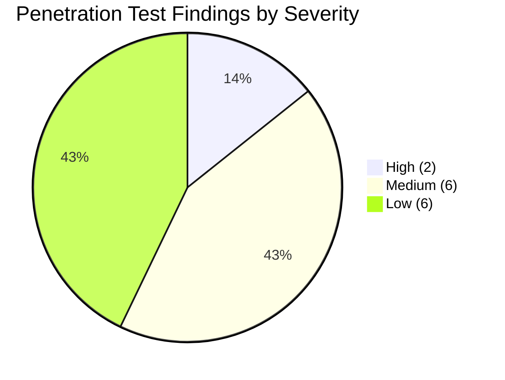
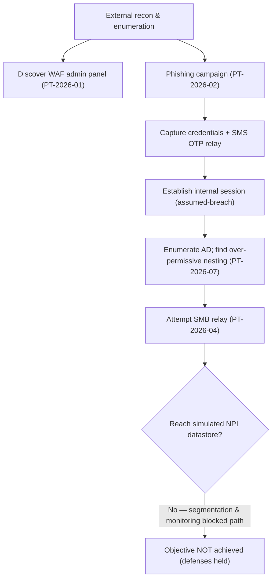

# 08.03 — Penetration Test Results

| Field | Value |
|---|---|
| Document ID | CCB-IT-PEN-2026-803 |
| Version | 1.0 |
| Date | 2026-06-15 |
| Classification | Confidential — Nonpublic Information (NPI) // Illustrative Portfolio Sample |
| Owner | Marcus Doyle, IT Security Manager / Rachel Alvarez, CISO |
| Author | Advisory Team (Financial-Services GRC) |
| Status | Approved |

## Purpose

This document presents the results of the annual external penetration test performed for Cornerstone Community Bank by **Redwood Security Partners, LLC** under the scope and Rules of Engagement in 08.02. The test produced **14 findings — 2 High, 6 Medium, and 6 Low** severity. It is a keystone independent-testing artifact: it evidences GLBA §501(b) independent testing of key controls and provides the FFIEC examiner-facing record of the Bank's real-world security posture and its response. **All 14 findings have since been remediated and retested** (see 08.05).

No **Critical** findings were identified, and no evidence of an actual, non-simulated compromise was found. No real customer NPI was extracted; all proofs used synthetic markers per the ROE.

## Executive Summary

Redwood conducted a grey-box engagement across the external perimeter, internal network (assumed-breach), customer web and mobile banking front ends, wireless, a social-engineering campaign, and a time-boxed red-team-lite objective. The Bank's overall posture was assessed as **Moderate and improving**, consistent with the Phase 03 inherent risk profile. Perimeter hardening and endpoint controls performed well; the two High findings concentrated in an externally exposed service misconfiguration and a legacy MFA path exploitable via phishing. The red-team-lite objective (reach a simulated NPI datastore from an external start) was **not achieved** within the time box, indicating layered defenses functioned.

## Findings by Severity

| Severity | Count | CVSS v3.1 Band | Target Remediation SLA |
|---|---|---|---|
| Critical | 0 | 9.0–10.0 | 24 hours |
| High | 2 | 7.0–8.9 | 30 days |
| Medium | 6 | 4.0–6.9 | 60 days |
| Low | 6 | 0.1–3.9 | 90 days |
| Informational | 0 | — | Best effort |
| **Total** | **14** | — | — |

## Complete Findings Register

| Finding ID | Title | Severity | Affected Area | CVSS v3.1 | Status |
|---|---|---|---|---|---|
| PT-2026-01 | Misconfigured external service exposing management interface over TLS with weak cipher and default credentials on a legacy web-application firewall admin panel | High | External network (S-1) | 8.1 | Remediated |
| PT-2026-02 | Phishing-driven credential capture succeeds against a legacy MFA path (SMS-fallback) permitting session establishment without app-based factor | High | Social engineering / auth (S-5) | 7.4 | Remediated |
| PT-2026-03 | Online banking session tokens not invalidated server-side on logout, enabling session reuse within timeout window | Medium | Web banking (S-3) | 6.5 | Remediated |
| PT-2026-04 | Internal SMB signing not enforced on a subset of file servers, enabling relay in assumed-breach scenario | Medium | Internal network (S-2) | 6.3 | Remediated |
| PT-2026-05 | Mobile banking app stores non-sensitive session metadata unencrypted in local cache | Medium | Mobile banking (S-4) | 5.4 | Remediated |
| PT-2026-06 | Missing security headers (HSTS, CSP) on customer-facing marketing and login portals | Medium | Web banking (S-3) | 5.3 | Remediated |
| PT-2026-07 | Over-permissive Active Directory group nesting grants unintended access to a file share containing NPI | Medium | Internal network (S-2) | 6.1 | Remediated |
| PT-2026-08 | Outdated TLS 1.0/1.1 still negotiable on one branch-facing VPN endpoint | Medium | External network (S-1) | 5.9 | Remediated |
| PT-2026-09 | Verbose error messages disclose framework and version information on internal web application | Low | Internal network (S-2) | 3.7 | Remediated |
| PT-2026-10 | Guest wireless not fully isolated from a management VLAN at one sampled branch | Low | Wireless (S-7) | 3.9 | Remediated |
| PT-2026-11 | Password policy permits a small set of common patterns not blocked by a deny-list | Low | Internal network (S-2) | 3.1 | Remediated |
| PT-2026-12 | Service account with non-expiring password and interactive logon rights | Low | Internal network (S-2) | 3.8 | Remediated |
| PT-2026-13 | Email gateway does not enforce DMARC reject policy, weakening anti-spoofing | Low | External network (S-1) | 3.5 | Remediated |
| PT-2026-14 | Informational banner and directory listing enabled on an internal utility host | Low | Internal network (S-2) | 2.6 | Remediated |

## High-Severity Findings — Detail

### PT-2026-01 — External WAF Admin Panel Misconfiguration (High, CVSS 8.1)

A legacy web-application firewall retained an internet-reachable administrative interface protected only by a default vendor credential and negotiating a weak cipher suite. Redwood authenticated to the panel from the internet, demonstrating the ability to alter filtering rules that protect customer-facing services. **Root cause:** decommissioning of the legacy appliance was incomplete; the management interface was not removed from the perimeter. **Business impact:** potential weakening of perimeter protections for NPI-bearing services. **Remediation:** management interface removed from the perimeter, default credentials rotated, legacy appliance decommissioned; validated in retest (08.05).

### PT-2026-02 — Legacy MFA Path Bypass via Phishing (High, CVSS 7.4)

The phishing simulation captured credentials from a subset of staff. For accounts that had not migrated to app-based authentication, the **SMS-fallback MFA path** allowed Redwood to complete authentication and establish a session using a real-time relay of the one-time code. **Root cause:** a legacy SMS-fallback authentication path remained enabled for a residual user population during MFA modernization. **Business impact:** credential-theft-driven account takeover of internal accounts. **Remediation:** SMS-fallback path disabled, residual users migrated to phishing-resistant factors, conditional-access hardening applied; validated in retest (08.05).

## Attack Narrative (Red-Team-Lite)

The red-team-lite objective failed at the final segmentation and detection boundary, confirming that layered controls (network segmentation, monitoring, least privilege on the crown-jewel datastore) operated even after chaining several findings.

## Social Engineering Campaign Results

| Metric | Result | Benchmark / Target |
|---|---|---|
| Emails delivered | 240 | Full in-scope staff population |
| Click rate | 11.7% | Target &lt; 15% |
| Credential submission rate | 4.2% | Target &lt; 5% |
| MFA-relay success (legacy path) | 6 accounts | Drove PT-2026-02 |
| Reported to security within 1 hour | 38% | Target &gt; 30% |

Captured credentials were rotated immediately per the ROE. Results feed the security-awareness program metrics reported to the Board (Phase 09).

## Conclusion

The engagement identified no Critical findings and no evidence of actual compromise. The two High findings represented realistic, exploitable weaknesses that were promptly addressed. Overall the independent test confirms a Moderate, well-managed posture consistent with the program's target state and supports FFIEC IT examination readiness. Full remediation and Redwood retest are documented in 08.05.

## Cross-References

- `08.02-penetration-test-scope-and-rules.md` — scope and ROE under which findings were produced
- `08.04-vulnerability-assessment-results.md` — scan results reconciling with these findings
- `08.05-pentest-remediation.md` — remediation actions and retest closure for all 14 findings
- `08.06-internal-audit-of-infosec-program.md` — independent audit context
- `../03-risk-assessment/` — inherent risk profile corroborated by results
- `08.08-ffiec-it-examination-readiness.md` — exam packaging

[⬅ Previous](08.02-penetration-test-scope-and-rules.md) · [🏠 Phase README](08.00-README.md) · [Next ➡](08.04-vulnerability-assessment-results.md)
