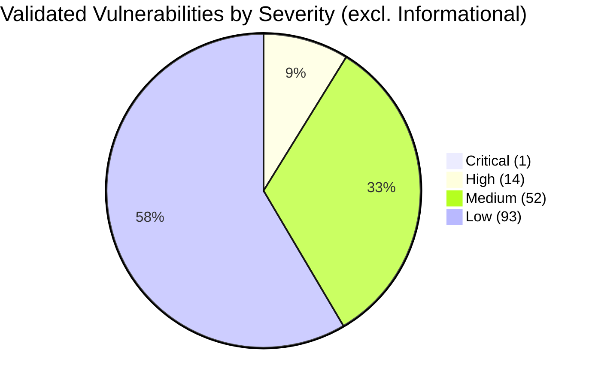
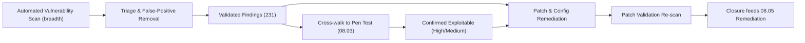

# 08.04 — Vulnerability Assessment Results

| Field | Value |
|---|---|
| Document ID | CCB-IT-VUL-2026-804 |
| Version | 1.0 |
| Date | 2026-06-15 |
| Classification | Confidential — Nonpublic Information (NPI) // Illustrative Portfolio Sample |
| Owner | Marcus Doyle, IT Security Manager / Rachel Alvarez, CISO |
| Author | Advisory Team (Financial-Services GRC) |
| Status | Approved |

## Purpose

This document reports the vulnerability assessment results that support and reconcile with the penetration test (08.03). Where the penetration test provides expert, exploitation-based depth, the vulnerability assessment provides automated, repeatable breadth across the enterprise attack surface. Together they satisfy the FFIEC IT Handbook (Information Security booklet) expectation for both vulnerability assessment and penetration testing as complementary independent-testing techniques, and they generate the current-profile evidence for the NIST CSF 2.0 "Identify — Risk Assessment" and "Protect" outcomes.

Scans were performed by **Redwood Security Partners, LLC** (external, unauthenticated) and by Cornerstone's internal security tooling (authenticated, credentialed) under the oversight of the IT Security Manager (Marcus Doyle). This document covers the assessment cycle aligned to the 2026-10 penetration test.

## Assessment Scope and Approach

| Attribute | Detail |
|---|---|
| External unauthenticated scan | Full internet-facing IP range, published services, VPN/email/DNS endpoints |
| Internal authenticated scan | Credentialed scans across server VLANs, workstations, network devices |
| Web application scan | Automated DAST against customer-facing and internal web applications |
| Coverage | 140-system enterprise inventory; emphasis on 22 NPI-bearing and 6 SOX-significant systems |
| Out of scope | Meridian core/digital banking internals (covered by Meridian SOC reports) |
| Scanner reconciliation | False positives triaged; findings cross-walked to pen test (08.03) |
| Cadence | Quarterly external, monthly internal (per 08.01), plus this pre-pen-test cycle |

## Results — Counts by Severity

Severity uses CVSS v3.1 bands. Counts are post-triage (validated, false positives removed).

| Severity | External (unauth) | Internal (authenticated) | Web App (DAST) | Total |
|---|---|---|---|---|
| Critical | 0 | 1 | 0 | 1 |
| High | 3 | 9 | 2 | 14 |
| Medium | 11 | 34 | 7 | 52 |
| Low | 18 | 61 | 14 | 93 |
| Informational | 22 | 40 | 9 | 71 |
| **Total** | **54** | **145** | **32** | **231** |

The single Critical finding was an internal, authenticated-scan detection of an unpatched remote-code-execution CVE on a non-production internal utility host; it was patched within the emergency SLA (24 hours) before pen-test exploitation and did not appear as a pen test finding.

## External Attack Surface

| Attribute | Result | Notes |
|---|---|---|
| Internet-facing hosts discovered | 27 | Reconciled against approved perimeter inventory |
| Unapproved/shadow services found | 1 | Legacy WAF admin panel — became pen test PT-2026-01 |
| Expired/weak TLS endpoints | 2 | Weak cipher (PT-2026-01); TLS 1.0/1.1 (PT-2026-08) |
| Missing security headers | 4 portals | Reconciled to PT-2026-06 |
| Email authentication gaps | DMARC not at reject | Reconciled to PT-2026-13 |

The external attack surface was small and largely well-controlled; the notable exception was the legacy WAF management interface, which both the scan and the pen test independently flagged.

## Reconciliation With the Penetration Test

The vulnerability assessment and penetration test are cross-walked so that examiners can see how automated detection and manual exploitation corroborate one another. Automated scanning surfaced the raw condition; the pen test confirmed exploitability and business impact.

| Scan Observation | Corroborating Pen Test Finding | Relationship |
|---|---|---|
| Internet-reachable admin interface, weak cipher | PT-2026-01 (High) | Scan detected; pen test proved exploitable (default creds) |
| Legacy SMS-fallback auth enabled | PT-2026-02 (High) | Config observation; pen test proved phishing bypass |
| SMB signing not enforced (subset) | PT-2026-04 (Medium) | Scan flagged; pen test demonstrated relay |
| Over-permissive AD group nesting | PT-2026-07 (Medium) | Authenticated scan + manual validation |
| TLS 1.0/1.1 negotiable | PT-2026-08 (Medium) | Scan detected; pen test confirmed on VPN endpoint |
| Missing HSTS/CSP headers | PT-2026-06 (Medium) | Scan detected; pen test confirmed |
| DMARC not at reject | PT-2026-13 (Low) | Scan detected; pen test confirmed spoofing risk |

## Patch Validation

| Metric | Result | Target |
|---|---|---|
| Critical patched within SLA (24h) | 1 of 1 (100%) | 100% |
| High patched within SLA (30d) | 14 of 14 (100%) | 100% |
| Medium patched within SLA (60d) | 52 of 52 (100%) | &gt; 95% |
| Low patched/accepted within SLA (90d) | 93 of 93 (100%) | &gt; 90% |
| Re-scan confirmation performed | Yes — all severities | Required |

Patch validation re-scans confirmed remediation of all validated Critical, High, and Medium items. Low items were either remediated or formally risk-accepted with compensating controls and documented in the remediation tracker (08.05).

## Feed Into Remediation

All validated findings were loaded into the remediation tracker with a severity-based SLA, an assigned owner, and a due date. Findings that also appear as pen test items are jointly tracked so that a single remediation closes both the scan finding and the corresponding pen test finding. Closure status is reported in 08.05 and rolled up for the FFIEC IT examination file (08.08).

## Cross-References

- `08.03-penetration-test-results.md` — pen test findings reconciled here
- `08.05-pentest-remediation.md` — remediation and retest closure
- `08.01-independent-testing-strategy.md` — scan cadence and portfolio
- `../02-asset-inventory-data-classification/` — 140-system inventory / 22 NPI systems
- `../05-ffiec-nist-csf-assessment/` — CSF 2.0 current-profile evidence
- `08.08-ffiec-it-examination-readiness.md` — exam packaging

[⬅ Previous](08.03-penetration-test-results.md) · [🏠 Phase README](08.00-README.md) · [Next ➡](08.05-pentest-remediation.md)
