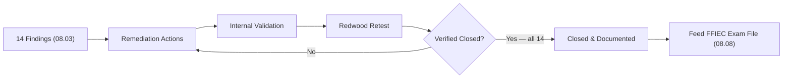
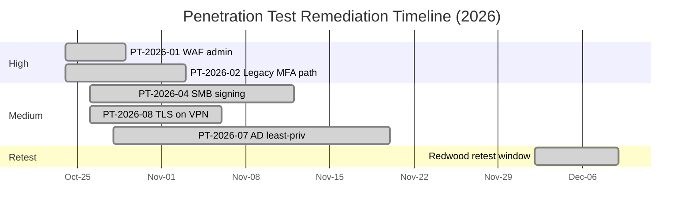

# 08.05 — Penetration Test Remediation

| Field | Value |
|---|---|
| Document ID | CCB-IT-PEN-2026-805 |
| Version | 1.0 |
| Date | 2026-06-15 |
| Classification | Confidential — Nonpublic Information (NPI) // Illustrative Portfolio Sample |
| Owner | Rachel Alvarez, CISO / Marcus Doyle, IT Security Manager |
| Author | Advisory Team (Financial-Services GRC) |
| Status | Approved |

## Purpose

This document records the remediation of all **14 penetration test findings** (2 High, 6 Medium, 6 Low) reported in 08.03, together with the supporting vulnerability assessment items (08.04). It evidences that the Bank not only identified control weaknesses through independent testing but also **remediated every finding and obtained independent retest confirmation** from **Redwood Security Partners, LLC**. This closed-loop remediation is a core FFIEC and GLBA §501(b) expectation (the "adjust the program" element) and a key input to FFIEC IT examination readiness (08.08).

**Outcome: 14 of 14 findings remediated and retested — 0 open.**

## Remediation Summary

| Severity | Findings | Remediated | Retested Closed | Open |
|---|---|---|---|---|
| High | 2 | 2 | 2 | 0 |
| Medium | 6 | 6 | 6 | 0 |
| Low | 6 | 6 | 6 | 0 |
| **Total** | **14** | **14** | **14** | **0** |

## Remediation Register — All 14 Findings

| Finding ID | Severity | Remediation Action | Owner | Target SLA | Completed | Retest Result |
|---|---|---|---|---|---|---|
| PT-2026-01 | High | Removed legacy WAF admin interface from perimeter, rotated default credentials, decommissioned appliance | Marcus Doyle | 30 days | 2026-10-29 | Closed — confirmed |
| PT-2026-02 | High | Disabled legacy SMS-fallback MFA path; migrated residual users to phishing-resistant factors; conditional-access hardening | Rachel Alvarez | 30 days | 2026-11-03 | Closed — confirmed |
| PT-2026-03 | Medium | Enforced server-side session invalidation on logout for online banking front end | Marcus Doyle | 60 days | 2026-11-18 | Closed — confirmed |
| PT-2026-04 | Medium | Enforced SMB signing across all in-scope file servers via GPO | IT Security team | 60 days | 2026-11-12 | Closed — confirmed |
| PT-2026-05 | Medium | Updated mobile app to encrypt local session metadata; released via app stores | Mobile app team | 60 days | 2026-12-01 | Closed — confirmed |
| PT-2026-06 | Medium | Deployed HSTS and CSP headers on customer-facing portals | Marcus Doyle | 60 days | 2026-11-09 | Closed — confirmed |
| PT-2026-07 | Medium | Restructured AD group nesting; applied least-privilege on NPI file share; access recertified | IT Security team | 60 days | 2026-11-20 | Closed — confirmed |
| PT-2026-08 | Medium | Disabled TLS 1.0/1.1 on branch VPN endpoint; enforced TLS 1.2+ | Network team | 60 days | 2026-11-06 | Closed — confirmed |
| PT-2026-09 | Low | Suppressed verbose error messages on internal web application | App owner | 90 days | 2026-11-25 | Closed — confirmed |
| PT-2026-10 | Low | Corrected VLAN isolation for guest wireless at affected branch | Network team | 90 days | 2026-11-15 | Closed — confirmed |
| PT-2026-11 | Low | Deployed common-password deny-list; strengthened password policy | IT Security team | 90 days | 2026-11-22 | Closed — confirmed |
| PT-2026-12 | Low | Set service-account password expiry; removed interactive logon rights | IT Security team | 90 days | 2026-11-13 | Closed — confirmed |
| PT-2026-13 | Low | Moved DMARC policy to reject; validated SPF/DKIM alignment | Marcus Doyle | 90 days | 2026-11-17 | Closed — confirmed |
| PT-2026-14 | Low | Disabled directory listing and banner on internal utility host | IT Security team | 90 days | 2026-11-10 | Closed — confirmed |

## Remediation Timeline

## High-Finding Remediation Detail

### PT-2026-01 — External WAF Admin Panel

The legacy web-application firewall was fully decommissioned rather than merely reconfigured, eliminating the exposed management interface. Perimeter inventory controls were updated so any future internet-facing management interface is flagged during quarterly external scans. Redwood confirmed the panel was no longer reachable and no default credentials remained.

### PT-2026-02 — Legacy MFA Path Bypass

The SMS-fallback authentication path was disabled enterprise-wide. The residual user population was migrated to phishing-resistant, app-based authentication, and conditional-access policies were tightened to require the stronger factor. Redwood re-ran the phishing-plus-relay scenario and could no longer complete authentication, confirming closure.

## Remediation Approach by Theme

The 14 findings were grouped into remediation themes so systemic root causes were addressed rather than isolated symptoms.

| Theme | Findings | Systemic Fix |
|---|---|---|
| Perimeter &amp; legacy asset hygiene | PT-2026-01, PT-2026-08, PT-2026-13 | Decommission legacy assets; enforce modern TLS and email authentication; add perimeter inventory checks |
| Authentication strength | PT-2026-02, PT-2026-11, PT-2026-12 | Retire legacy MFA path; deny-list weak passwords; harden service accounts |
| Web/mobile app hardening | PT-2026-03, PT-2026-05, PT-2026-06, PT-2026-09 | Session handling, security headers, client-side encryption, error suppression |
| Internal least privilege &amp; segmentation | PT-2026-04, PT-2026-07, PT-2026-10, PT-2026-14 | SMB signing, AD least privilege, VLAN isolation, service hardening |

## Risk Acceptance and Compensating Controls

No finding was closed by risk acceptance alone; all 14 were technically remediated. Where a Low-severity item required a phased rollout (for example, the mobile app store release cycle for PT-2026-05), interim compensating controls were documented and monitored until the permanent fix shipped. Each closure required both an internal validation artifact and Redwood retest confirmation before the item was marked closed.

## Verification and Governance

| Verification Step | Performed By | Evidence |
|---|---|---|
| Internal fix validation | IT Security (Marcus Doyle) | Change records, config screenshots, re-scan output |
| Independent retest | Redwood Security Partners | Retest attestation (2026-12) |
| Vulnerability re-scan reconciliation | IT Security | Patch validation re-scans (08.04) |
| Governance sign-off | CISO (Rachel Alvarez) | Remediation closure memo |
| Board/Audit Committee reporting | Priya Sharma / Rachel Alvarez | Reported to Audit Committee |

The retest was performed by Redwood in the **2026-12** window. Redwood issued a retest attestation confirming that all 14 findings were remediated and could no longer be reproduced. Closure was reported to the Audit Committee (Robert Hanley, Chair) and packaged for the FFIEC IT examination.

## Cross-References

- `08.03-penetration-test-results.md` — the 14 findings remediated here
- `08.04-vulnerability-assessment-results.md` — patch validation reconciliation
- `08.02-penetration-test-scope-and-rules.md` — retest authorization basis
- `08.06-internal-audit-of-infosec-program.md` — audit view of remediation discipline
- `08.08-ffiec-it-examination-readiness.md` — exam packaging of closure evidence
- `../09-board-reporting-program-maturity/` — Board reporting of results

[⬅ Previous](08.04-vulnerability-assessment-results.md) · [🏠 Phase README](08.00-README.md) · [Next ➡](08.06-internal-audit-of-infosec-program.md)
