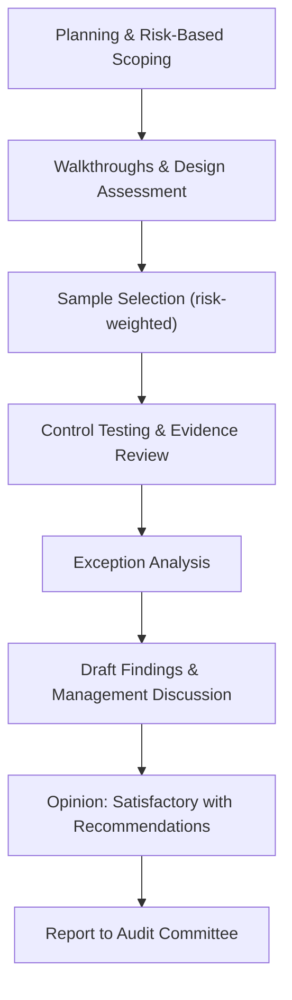

# 08.06 — Internal Audit of the Information Security Program

| Field | Value |
|---|---|
| Document ID | CCB-IT-AUD-2026-806 |
| Version | 1.0 |
| Date | 2026-06-15 |
| Classification | Confidential — Nonpublic Information (NPI) // Illustrative Portfolio Sample |
| Owner | Priya Sharma, Director of Internal Audit |
| Author | Advisory Team (Financial-Services GRC) |
| Status | Approved |

## Purpose

This document records Internal Audit's independent review of Cornerstone Community Bank's information security program, conducted by the Director of Internal Audit (Priya Sharma) with functional reporting to the Board Audit Committee (Robert Hanley, Chair). The review provides the Board with independent assurance over the GLBA §501(b) / Interagency Guidelines information security program and supports the FFIEC IT Handbook (Audit booklet) expectation of a risk-based, independent audit function. The engagement evaluated the design and operating effectiveness of the Written Information Security Program (WISP), its supporting policies, and key controls.

**Overall audit opinion: Satisfactory with recommendations.**

## Audit Objectives and Standards

| Objective | Description |
|---|---|
| Program governance | Assess Board/management oversight, WISP approval, and annual GLBA reporting |
| Risk assessment | Evaluate the Phase 03 risk assessment (42 risks) for adequacy and currency |
| Control design | Assess administrative, technical, and physical safeguards against the WISP and 14 core policies |
| Control operation | Test operating effectiveness of a sample of key controls |
| Third-party oversight | Evaluate oversight of Meridian and the broader vendor portfolio |
| Independent testing | Assess the design and use of pen testing and vulnerability assessment |
| Incident response | Evaluate IR readiness and the 36-hour notification process |

The audit was performed against the FFIEC IT Handbook, the Interagency Guidelines, NIST CSF 2.0, and the IIA International Professional Practices Framework (IPPF).

## Scope and Coverage

| Domain in Scope | WISP / Policy Coverage | Systems Sampled |
|---|---|---|
| Governance &amp; oversight | Information Security Program Policy; Board reporting | N/A (governance evidence) |
| Access management | Access Control Policy; Identity &amp; Authentication Policy | 6 of 22 NPI systems |
| Change &amp; configuration | Change Management Policy; Configuration Standards | 4 of 6 SOX-significant systems |
| Data protection | Data Classification &amp; Handling Policy; Encryption Policy | 5 of 22 NPI systems |
| Vulnerability &amp; testing | Vulnerability Management Policy; Independent Testing | Pen test and scan programs |
| Third-party risk | Third-Party Risk Management Policy | Meridian + 3 critical vendors |
| Incident response | Incident Response Policy; Notification procedures | IR plan + tabletop evidence |
| Physical &amp; environmental | Physical Security Policy | HQ + 2 branches |

The audit covered the WISP and all 14 core policies, with control testing focused on the higher-inherent-risk domains identified in Phase 03. Coverage was risk-weighted rather than exhaustive, consistent with a risk-based internal audit methodology.

## Audit Approach and Sampling

### Sampling Methodology

| Control Type | Population | Sample Basis | Sample Size |
|---|---|---|---|
| User access recertification | 22 NPI systems | Risk-weighted judgmental | 6 systems |
| Privileged access reviews | Privileged accounts | Attribute sampling | 25 accounts |
| Change tickets | Q3 2026 changes | Random | 30 changes |
| Vendor risk reviews | 85 third parties (12 critical) | Judgmental (critical-first) | 4 vendors |
| Security awareness completion | ~240 employees | Random | 40 staff |
| Vulnerability remediation SLAs | 2026 remediation records | Judgmental (High/Medium) | 20 items |

## Results Summary

Internal Audit concluded that the information security program is **appropriately designed and operating effectively in most material respects**, warranting a **Satisfactory with recommendations** opinion. Governance, the risk assessment, independent testing discipline, and incident-response readiness were assessed as strengths. A small number of recommendations and observations — none rated critical — were raised to further strengthen the program; these are detailed in 08.07.

| Assessment Area | Rating | Basis |
|---|---|---|
| Governance &amp; oversight | Effective | Board oversight, WISP approval, GLBA reporting evidenced |
| Risk assessment | Effective | 42-risk assessment current and methodologically sound |
| Control design | Effective | WISP + 14 policies align to safeguards and CSF 2.0 |
| Control operation | Effective with minor exceptions | Isolated recertification and SLA exceptions (08.07) |
| Independent testing | Effective | Pen test + scans + closed-loop remediation (08.03–08.05) |
| Third-party oversight | Effective with recommendation | Meridian oversight strong; documentation enhancement noted |
| Incident response | Effective | IR plan, tabletop, and 36-hour notification process in place |

## Alignment With Other Independent Testing

Internal Audit reviewed, but did not duplicate, the technical penetration test performed by Redwood Security Partners (08.03). Audit confirmed that the pen test was independently performed under an appropriate scope (08.02), that all 14 findings were remediated and retested (08.05), and that remediation SLAs were substantially met. This reliance model preserves audit independence while avoiding duplicative technical testing, consistent with the FFIEC Audit booklet.

## Strengths Identified

Internal Audit noted the following program strengths, which it recommends be sustained:

| Strength | Evidence |
|---|---|
| Board-level oversight | WISP board approval; annual GLBA report cadence; Audit Committee engagement |
| Current, methodical risk assessment | NIST SP 800-30-aligned 42-risk assessment feeding control priorities |
| Closed-loop independent testing | Pen test findings fully remediated and independently retested (08.05) |
| Strong outsourced-provider oversight | Meridian SOC 1/SOC 2 Type II reliance with CUEC validation |
| Incident-response readiness | IR plan, tabletop exercise, and 36-hour notification procedure in place |

## Auditor Independence Statement

The Director of Internal Audit reports functionally to the Audit Committee and administratively to executive management, preserving organizational independence from the IT and information security functions that own and operate the controls under review. Internal Audit did not design, implement, or operate any of the controls tested. Where technical penetration testing was relied upon, it was performed by an external firm (Redwood Security Partners) independent of both Internal Audit and IT. No scope limitations or impairments to independence were encountered during the engagement.

## Conclusion

The information security program provides a sound and well-governed basis for protecting customer NPI across the 22 in-scope systems and for meeting GLBA and FFIEC expectations. The **Satisfactory with recommendations** opinion, together with the fully remediated pen test results, positions the Bank well for the FFIEC IT examination. Recommendations and management responses are tracked to completion in 08.07.

## Cross-References

- `08.07-internal-audit-findings-and-response.md` — findings, responses, and remediation
- `08.01-independent-testing-strategy.md` — independence model and testing portfolio
- `08.03-penetration-test-results.md` — technical testing relied upon
- `08.05-pentest-remediation.md` — remediation reviewed by audit
- `../04-information-security-program-controls/` — WISP and 14 core policies audited
- `../07-third-party-risk-business-continuity/` — Meridian oversight reviewed
- `08.08-ffiec-it-examination-readiness.md` — exam packaging of audit assurance

[⬅ Previous](08.05-pentest-remediation.md) · [🏠 Phase README](08.00-README.md) · [Next ➡](08.07-internal-audit-findings-and-response.md)
