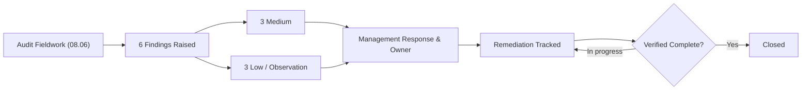
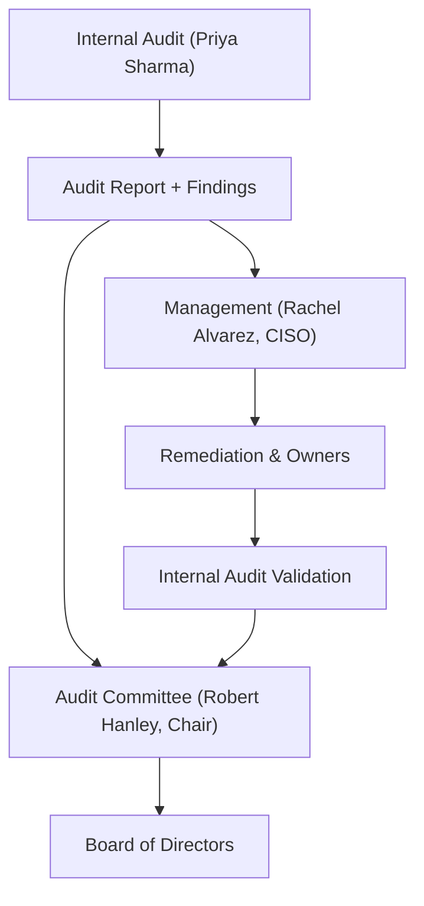

# 08.07 — Internal Audit Findings &amp; Management Response

| Field | Value |
|---|---|
| Document ID | CCB-IT-AUD-2026-807 |
| Version | 1.0 |
| Date | 2026-06-15 |
| Classification | Confidential — Nonpublic Information (NPI) // Illustrative Portfolio Sample |
| Owner | Priya Sharma, Director of Internal Audit |
| Author | Advisory Team (Financial-Services GRC) |
| Status | Approved |

## Purpose

This document presents the detailed findings and observations from Internal Audit's review of the information security program (08.06), together with management's response and remediation plan for each. Consistent with the **Satisfactory with recommendations** opinion, all items are recommendations or observations — **none is rated critical, and none constitutes a significant deficiency or material weakness**. Recording findings, management responses, and remediation tracking satisfies the FFIEC IT Handbook (Audit booklet) expectation for a closed-loop issue-management process reporting to the Audit Committee.

## Findings Rating Scale

| Rating | Definition | Board Reporting |
|---|---|---|
| Critical | Immediate threat to NPI, safety-and-soundness, or compliance | Immediate |
| High | Significant control weakness requiring prompt action | Audit Committee |
| Medium | Control improvement opportunity; moderate risk | Audit Committee |
| Low / Observation | Minor enhancement; best-practice recommendation | Summary reporting |

## Findings Summary

| Rating | Count |
|---|---|
| Critical | 0 |
| High | 0 |
| Medium | 3 |
| Low / Observation | 3 |
| **Total** | **6** |

## Detailed Findings and Management Response

| Finding ID | Rating | Observation | Recommendation | Management Response | Owner | Target Date | Status |
|---|---|---|---|---|---|---|---|
| IA-2026-01 | Medium | User access recertification for 2 of 6 sampled NPI systems was completed late (outside the quarterly window) | Enforce automated reminders and escalation for recertification deadlines | Agreed. Automated workflow with escalation to be enabled | Marcus Doyle | 2026-12-31 | In progress |
| IA-2026-02 | Medium | Vendor risk documentation for 1 of 4 sampled critical vendors lacked a current SOC report summary in the vendor file | Standardize vendor-file completeness checklist; obtain current SOC summary | Agreed. Checklist standardized; SOC summaries refreshed | Karen Ellis / Vendor Mgmt | 2026-12-15 | In progress |
| IA-2026-03 | Medium | Vulnerability remediation SLA evidence was inconsistently retained for a subset of Medium-severity items | Centralize remediation evidence in the tracker with mandatory closure artifacts | Agreed. Tracker updated to require closure evidence | Marcus Doyle | 2026-12-31 | In progress |
| IA-2026-04 | Low | Two service accounts lacked documented ownership in the access inventory | Assign and document accountable owners for all service accounts | Agreed. Ownership assigned and documented | IT Security team | 2026-11-30 | Closed |
| IA-2026-05 | Low | Security awareness completion for 3 of 40 sampled staff exceeded the 30-day completion target | Tighten completion tracking and manager escalation | Agreed. Escalation thresholds tightened | Rachel Alvarez | 2026-12-31 | In progress |
| IA-2026-06 | Observation | Physical visitor-log retention at 1 sampled branch was inconsistent with policy retention period | Reinforce branch procedure and add periodic spot-check | Agreed. Procedure reinforced; spot-checks added | Branch Operations | 2026-12-15 | Closed |

## Remediation Status Roll-Up

| Rating | Total | Closed | In Progress | Overdue |
|---|---|---|---|---|
| Medium | 3 | 0 | 3 | 0 |
| Low / Observation | 3 | 2 | 1 | 0 |
| **Total** | **6** | **2** | **4** | **0** |

All Medium items carry target dates within 2026 and are on schedule; no item is overdue. Internal Audit will validate closure evidence for each item and confirm final closure to the Audit Committee. None of the findings changes the overall **Satisfactory with recommendations** opinion.

## Relationship to the Penetration Test

The audit findings are distinct from, but complementary to, the penetration test findings (08.03). The pen test addressed technical exploitability of controls; the audit findings address process and documentation discipline (recertification timeliness, evidence retention, ownership). Several audit recommendations (IA-2026-01, IA-2026-03) reinforce the same least-privilege and remediation-discipline themes surfaced by the pen test, demonstrating a consistent control-improvement narrative for examiners.

## Root-Cause Themes

To ensure remediation addresses causes rather than symptoms, Internal Audit grouped the six findings into three underlying themes. This thematic view is shared with the CISO to prioritize systemic fixes over point corrections.

| Theme | Related Findings | Systemic Corrective Action |
|---|---|---|
| Timeliness of periodic reviews | IA-2026-01, IA-2026-05 | Automated reminders, escalation thresholds, and manager accountability across recertification and awareness cycles |
| Evidence and documentation retention | IA-2026-02, IA-2026-03, IA-2026-06 | Standardized completeness checklists and mandatory closure artifacts centralized in the relevant trackers |
| Ownership and accountability | IA-2026-04 | Named owners recorded in the access inventory for all accounts, including service accounts |

None of these themes indicates a design failure in the WISP or the 14 core policies; each reflects an operating-discipline enhancement. Internal Audit will re-test the themes in the next annual cycle to confirm durability.

## Impact on Overall Opinion

The findings were evaluated individually and in aggregate against the rating scale. Because all items are Medium or lower, are supported by compensating controls, and carry committed remediation dates with no overdue items, they do not rise to a significant deficiency or material weakness and do not alter the **Satisfactory with recommendations** conclusion. Management concurred with every finding and recommendation, and no finding was disputed or accepted without action.

## Governance and Reporting

The findings, management responses, and remediation status were reported to the Audit Committee. Internal Audit retains responsibility for independent validation of closure. The results, together with the fully remediated pen test (08.05), form part of the evidence base for the FFIEC IT examination (08.08) and the annual GLBA Board report (Phase 09).

## Cross-References

- `08.06-internal-audit-of-infosec-program.md` — audit scope, approach, and opinion
- `08.05-pentest-remediation.md` — related technical remediation
- `08.03-penetration-test-results.md` — pen test findings for comparison
- `08.01-independent-testing-strategy.md` — independence and testing portfolio
- `../04-information-security-program-controls/` — WISP and policies referenced in findings
- `08.08-ffiec-it-examination-readiness.md` — exam readiness packaging
- `../09-board-reporting-program-maturity/` — Board reporting of audit results

[⬅ Previous](08.06-internal-audit-of-infosec-program.md) · [🏠 Phase README](08.00-README.md) · [Next ➡](08.08-ffiec-it-examination-readiness.md)
