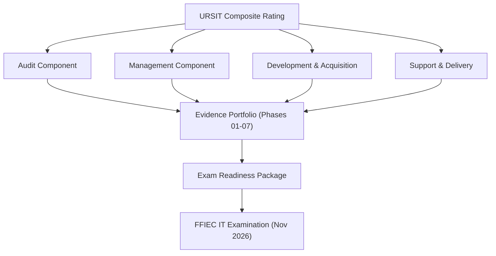

# 08.08 — FFIEC IT Examination Readiness

| Field | Value |
|---|---|
| Document ID | CCB-EXAM-RDY-2026-808 |
| Version | 1.0 |
| Date | 2026-06-15 |
| Classification | Confidential — Nonpublic Information (NPI) // Illustrative Portfolio Sample |
| Owner | Rachel Alvarez, Chief Information Security Officer (CISO) |
| Author | Advisory Team (Financial-Services GRC) |
| Status | Approved |

## Purpose

This document describes how Cornerstone Community Bank ("Cornerstone," "the Bank") prepared for its **FFIEC Information Technology (IT) examination**, conducted jointly by the **FDIC** (primary federal regulator for a state non-member bank) and the **Ohio Division of Financial Institutions (DFI)**. Fieldwork is scheduled for **November 2026**, with the examination report expected **2026-12-15**. The objective of readiness activity is to ensure that examiners can efficiently validate that the Bank's information security program is **well-managed** — that the GLBA §501(b) risk assessment, the Written Information Security Program (WISP), the control set, the FFIEC/NIST CSF 2.0 assessment, third-party risk management (TPRM), and business continuity / disaster recovery / incident response (BCP/DR/IR) are all in place and operating. Readiness is organized around the **URSIT (Uniform Rating System for Information Technology)** components and the FFIEC IT Examination Handbook booklets examiners use.

## Examination Framework: URSIT Components

Examiners assign a **URSIT composite rating** (1 best to 5 worst) supported by four component ratings. Cornerstone mapped its evidence portfolio to each URSIT component so that every rating dimension is supported by artifacts already produced in Phases 01–07.

| URSIT Component | What Examiners Evaluate | Primary Cornerstone Evidence | Owner |
|---|---|---|---|
| Audit | Independence, scope, and effectiveness of the IT audit function; issue tracking | Internal audit report (08.06/08.07), pen test (08.03–08.05), remediation tracker (08.12) | Priya Sharma |
| Management | Board/senior oversight, IT strategy, staffing, risk management culture | WISP, board minutes, annual GLBA report, risk assessment (Phase 03) | Rachel Alvarez |
| Development &amp; Acquisition | Project management, SDLC, change control, vendor selection/acquisition | SOX ITGC change/development domains (Phase 06), TPRM (Phase 07) | James Porter |
| Support &amp; Delivery | Operations, security, availability, BCP/DR, service delivery | Information security controls (Phase 04), BCP/DR/IR (Phase 07), Meridian oversight | Marcus Doyle |

## FFIEC IT Handbook Coverage Map

Cornerstone confirmed that its documentation addresses each FFIEC IT Examination Handbook booklet an examiner is likely to reference for a community bank of ~$1.2B in assets with an outsourced core.

| FFIEC IT Handbook Booklet | Cornerstone Coverage | Status |
|---|---|---|
| Information Security | WISP + 14 core policies; NIST CSF 2.0 assessment | Ready |
| Management | Board oversight, IT strategy, GLBA annual report | Ready |
| Audit | Independent internal audit + external pen test | Ready |
| Business Continuity Management | BCP/DR with RTO/RPO; IR plan + tabletop | Ready |
| Outsourcing / Architecture, Infrastructure &amp; Operations | Meridian TPRM, SOC 1/SOC 2 review, 85 third parties | Ready |
| Development &amp; Acquisition | SOX ITGC change/development controls | Ready |

## Pre-Exam Self-Assessment

Prior to the first-day letter, the CISO led a **pre-exam self-assessment** simulating the examiner's approach. Each URSIT component was scored against expected findings, gaps were confirmed closed, and evidence was pre-staged. The self-assessment concluded the program was positioned for a **Satisfactory** outcome consistent with a URSIT composite of "2."

| Self-Assessment Area | Expected Examiner Focus | Result of Self-Assessment | Residual Action |
|---|---|---|---|
| Audit function independence | Reporting line to Audit Committee | Confirmed functional independence (Priya Sharma) | None |
| Issue management closed-loop | Are findings tracked to closure? | Consolidated tracker in place (08.12) | Monitor open items |
| GLBA safeguards completeness | Risk assessment + WISP + board report | All present and board-approved | None |
| Third-party oversight | Critical vendor (Meridian) monitoring | Enhanced oversight documented | None |
| BCP/DR/IR | Tested plans with RTO/RPO | Tabletop completed; results retained | None |

## Evidence Packaging and Indexing

To minimize examiner follow-up and demonstrate program discipline, the Bank assembled a **single, indexed evidence package** cross-referenced to the anticipated document request (08.09). Each artifact was version-controlled, classified, and mapped to the URSIT component and Handbook booklet it supports.

| Evidence Package Section | Contents | Cross-Reference |
|---|---|---|
| Governance | Board/Audit Committee minutes, GLBA annual report, charters | Phase 01, Phase 09 |
| Risk &amp; Assessment | 501(b) risk assessment (42 risks), NIST CSF 2.0 assessment | Phase 03, Phase 05 |
| Controls &amp; Policies | WISP + 14 policies, control matrices | Phase 04 |
| SOX / ITGC | 48 key controls, testing results, SOC 1 reliance | Phase 06 |
| Third-Party &amp; Resilience | TPRM inventory, Meridian SOC reports, BCP/DR/IR | Phase 07 |
| Independent Testing | Pen test, internal audit, remediation tracker | Phase 08 |

## Subject-Matter Expert (SME) Preparation

Each URSIT component was assigned a **named SME** to respond to examiner interviews. SMEs were briefed on scope, coached to answer factually and concisely, and instructed to route document requests through the single point of contact (SPOC) established in 08.09.

| SME | URSIT / Topic | Interview Readiness |
|---|---|---|
| Rachel Alvarez (CISO) | Management, Information Security | Lead spokesperson; program owner |
| Priya Sharma (Internal Audit) | Audit | Independence, issue tracking |
| James Porter (CIO) | Development &amp; Acquisition | SDLC, change, vendor acquisition |
| Marcus Doyle (IT Security Manager) | Support &amp; Delivery | Operations, monitoring, DR |
| Steven Nakamura (CRO) | Enterprise risk context | Risk appetite, aggregation |

## Anticipated Examiner Questions and Prepared Responses

To sharpen SME preparation, the CISO compiled a list of high-probability examiner questions with concise, evidence-backed responses. SMEs rehearsed these to ensure consistent, factual answers.

| Anticipated Question | Prepared Response (evidence) |
|---|---|
| How does the board oversee information security? | Quarterly reporting and the annual GLBA report to the Board/Audit Committee (Phase 01/09) |
| How is the GLBA risk assessment kept current? | Annual refresh; 42 risks rated (8H/18M/16L); NIST SP 800-30 methodology (Phase 03) |
| How is Meridian (core) overseen? | Enhanced oversight; SOC 1/SOC 2 review; contract and CUEC monitoring (Phase 07) |
| How are findings tracked to closure? | Consolidated tracker with owners, dates, validation (08.12) |
| How is resilience tested? | BCP/DR with RTO/RPO; documented IR tabletop (Phase 07) |
| How does the cybersecurity assessment work post-CAT? | CAT structure mapped forward to NIST CSF 2.0 with a defined target profile (Phase 05) |

## Readiness Roles and Timeline

| Readiness Milestone | Owner | Timing |
|---|---|---|
| Pre-exam self-assessment | Rachel Alvarez | Pre-fieldwork |
| Evidence package assembly &amp; indexing | Marcus Doyle | Pre-fieldwork |
| SME briefing and rehearsal | Rachel Alvarez | Pre-fieldwork |
| First-day-letter response coordination | SPOC (CISO) | On receipt |
| On-site fieldwork support | All SMEs | November 2026 |

## Readiness Conclusion

The pre-exam self-assessment, indexed evidence package, and SME preparation collectively support the Bank's expectation of a **Satisfactory** examination outcome (**URSIT composite "2"**), reflecting a program judged well-managed with only minor recommendations anticipated. The readiness posture is carried forward into the document request process (08.09) and the recorded outcome (08.10).

## Cross-References

- `08.09-exam-document-request-and-evidence.md` — document request and evidence index
- `08.10-ffiec-it-examination-outcome.md` — recorded examination outcome
- `08.07-internal-audit-findings-and-response.md` — audit findings feeding Audit component
- `../03-risk-assessment/` — GLBA 501(b) risk assessment
- `../05-ffiec-nist-csf-assessment/` — NIST CSF 2.0 maturity assessment
- `../07-third-party-risk-business-continuity/` — TPRM and BCP/DR/IR evidence

[⬅ Previous](08.07-internal-audit-findings-and-response.md) · [🏠 Phase README](08.00-README.md) · [Next ➡](08.09-exam-document-request-and-evidence.md)
