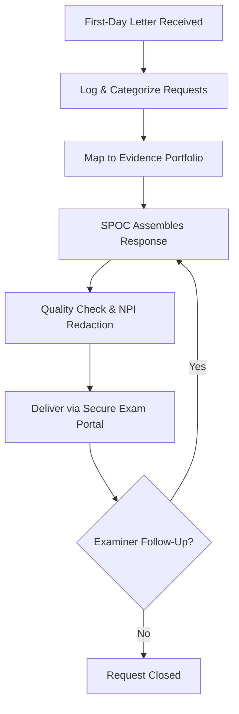
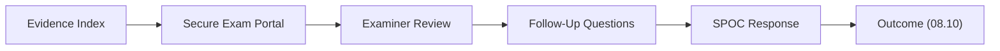

# 08.09 — Exam Document Request &amp; Evidence

| Field | Value |
|---|---|
| Document ID | CCB-EXAM-DOC-2026-809 |
| Version | 1.0 |
| Date | 2026-06-15 |
| Classification | Confidential — Nonpublic Information (NPI) // Illustrative Portfolio Sample |
| Owner | Rachel Alvarez, Chief Information Security Officer (CISO) |
| Author | Advisory Team (Financial-Services GRC) |
| Status | Approved |

## Purpose

This document describes how Cornerstone Community Bank managed the **FFIEC IT examination document request** — the "first-day letter" (FDL) or pre-examination request list issued by the **FDIC** and **Ohio DFI** examination team. It defines the categories of evidence requested, how the Bank's existing Phases 01–07 portfolio maps to each request, the **evidence index**, the **single point of contact (SPOC)** protocol, and the controls applied to protect NPI during examiner access. Efficient, complete, and well-indexed responses are themselves a signal of a well-managed program and support the expected **Satisfactory (URSIT composite "2")** outcome.

## First-Day Letter Process

The examination team issues the FDL in advance of on-site fieldwork (scheduled November 2026). Cornerstone processes the request through a controlled workflow so that every requested item is tracked, produced from the authoritative source, and logged for examiner access.

## Single Point of Contact (SPOC)

All examiner communications and document deliveries route through a designated SPOC to ensure consistency, completeness, and version control. The CISO serves as primary SPOC, with Internal Audit as backup for audit-scoped requests.

| Role | Named Individual | Responsibility |
|---|---|---|
| Primary SPOC | Rachel Alvarez (CISO) | All examiner requests, scheduling, tracking |
| Backup SPOC | Marcus Doyle (IT Security Manager) | Technical evidence, operations questions |
| Audit-scoped liaison | Priya Sharma (Director of Internal Audit) | Audit workpapers, independence evidence |
| Executive sponsor | David Okonkwo (Bank President) | Escalation, opening/closing meetings |

## Document Request Categories and Portfolio Mapping

The examination request list is organized into categories aligned to the FFIEC IT Handbook. Each category maps to existing, version-controlled artifacts — no evidence was created reactively for the exam.

| Request Category | Examples of Items Requested | Cornerstone Source Artifact | Phase |
|---|---|---|---|
| Governance &amp; Oversight | Board/Audit Committee minutes, IT strategy, org charts | Governance records, GLBA annual report | 01 / 09 |
| Risk Assessment | GLBA 501(b) risk assessment, methodology | 42-risk assessment (8H/18M/16L) | 03 |
| Information Security Program | WISP, policies, standards | WISP + 14 core policies | 04 |
| Cybersecurity Assessment | Maturity assessment, target profile | NIST CSF 2.0 assessment (28 gaps) | 05 |
| SOX / ITGC | Control matrix, testing, SOC reports | 48 key controls; Meridian SOC 1 | 06 |
| Third-Party Risk | Vendor inventory, contracts, due diligence | 85 vendors; 12 critical/high; Meridian | 07 |
| Business Continuity | BCP, DR plan, test results | BCP/DR with RTO/RPO; tabletop | 07 |
| Audit &amp; Independent Testing | Audit reports, pen test, remediation | Internal audit; Redwood pen test | 08 |
| Incident Response | IR plan, 36-hour notification procedure | IR plan + tabletop | 07 |

## Evidence Index

The Bank maintains a master evidence index assigning each artifact a unique reference, a classification, and the URSIT component / Handbook booklet it supports. The index is delivered to examiners as the navigation layer for the full package.

| Evidence Ref | Artifact | Classification | Supports URSIT |
|---|---|---|---|
| EV-GOV-01 | Board &amp; Audit Committee minutes (FY2026) | Confidential — NPI | Management |
| EV-RSK-01 | GLBA 501(b) risk assessment | Confidential — NPI | Management |
| EV-ISP-01 | WISP + 14 core policies | Confidential | Support &amp; Delivery |
| EV-CSF-01 | NIST CSF 2.0 maturity assessment | Confidential | Management |
| EV-SOX-01 | ITGC matrix + testing results | Confidential — NPI | Development &amp; Acquisition |
| EV-TPR-01 | Vendor inventory + Meridian SOC 1/SOC 2 | Confidential — NPI | Support &amp; Delivery |
| EV-BCP-01 | BCP/DR plan + tabletop results | Confidential | Support &amp; Delivery |
| EV-AUD-01 | Internal audit report + remediation | Confidential | Audit |
| EV-PEN-01 | Redwood pen test report (14 findings) | Confidential — NPI | Audit |

## NPI Handling During Examination

Because many artifacts contain or reference customer NPI, the Bank applies controls to protect confidentiality during examiner access, consistent with GLBA §501(b) and the Interagency Guidelines.

| Control | Description |
|---|---|
| Secure delivery | Evidence provided via a secure examination portal or on-site read-only access |
| Least-privilege access | Examiner access scoped to requested items only, logged by the SPOC |
| Redaction | Customer-identifying NPI redacted where full records are not required |
| Retention log | Every delivered item logged with date, requester, and version |

## Request Tracking Log

Each requested item is tracked from receipt to delivery with status and version, giving the SPOC a live view of outstanding requests during fieldwork.

| Request ID | Category | Status | Delivered Version |
|---|---|---|---|
| REQ-01 | Governance &amp; Oversight | Delivered | v1.0 |
| REQ-02 | Risk Assessment | Delivered | v1.0 |
| REQ-03 | Information Security Program | Delivered | v1.0 |
| REQ-04 | Cybersecurity Assessment | Delivered | v1.0 |
| REQ-05 | SOX / ITGC | Delivered | v1.0 |
| REQ-06 | Third-Party Risk | Delivered | v1.0 |
| REQ-07 | Business Continuity | Delivered | v1.0 |
| REQ-08 | Audit &amp; Independent Testing | Delivered | v1.0 |
| REQ-09 | Incident Response | Delivered | v1.0 |

## Roles and Responsibilities in the Response Process

| Activity | Accountable | Consulted / Supporting |
|---|---|---|
| Request intake and logging | SPOC (Rachel Alvarez) | Backup SPOC |
| Evidence retrieval | Marcus Doyle | IT Security team |
| Audit-scoped items | Priya Sharma | Internal Audit staff |
| NPI redaction / QC | SPOC | Karen Ellis (Privacy) |
| Executive escalation | David Okonkwo | CISO |

## Response Quality and Completeness

The SPOC tracked each request to closure, confirming completeness before delivery. No requested item was unavailable, and follow-up requests were limited to clarifications — evidence of a mature, well-documented program. The document response process feeds directly into the recorded examination outcome (08.10).

## Cross-References

- `08.08-ffiec-it-examination-readiness.md` — readiness and evidence packaging
- `08.10-ffiec-it-examination-outcome.md` — examination outcome
- `08.12-findings-remediation-tracker.md` — consolidated findings tracker
- `../06-sox-itgc-fdicia/` — ITGC evidence
- `../07-third-party-risk-business-continuity/` — TPRM and BCP/DR/IR evidence
- `../01-program-foundation-regulatory-scoping/` — governance records

[⬅ Previous](08.08-ffiec-it-examination-readiness.md) · [🏠 Phase README](08.00-README.md) · [Next ➡](08.10-ffiec-it-examination-outcome.md)
