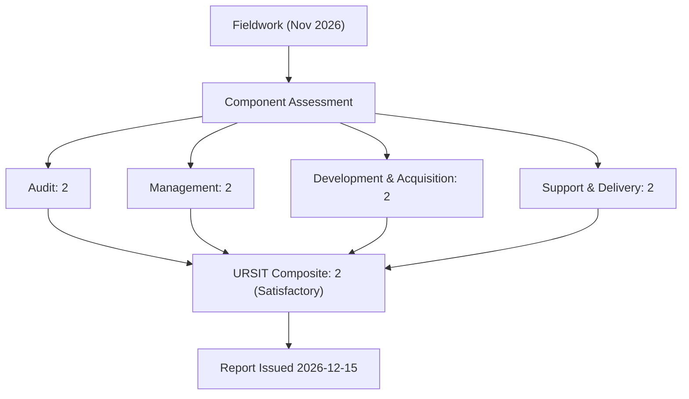
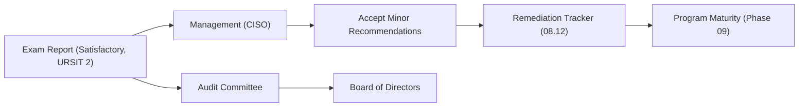

# 08.10 — FFIEC IT Examination Outcome

| Field | Value |
|---|---|
| Document ID | CCB-EXAM-OUT-2026-810 |
| Version | 1.0 |
| Date | 2026-06-15 |
| Classification | Confidential — Nonpublic Information (NPI) // Illustrative Portfolio Sample |
| Owner | Rachel Alvarez, Chief Information Security Officer (CISO) |
| Author | Advisory Team (Financial-Services GRC) |
| Status | Approved |

## Purpose

This is the **keystone outcome document** recording the result of Cornerstone Community Bank's **FFIEC Information Technology (IT) examination**, conducted jointly by the **FDIC** and the **Ohio Division of Financial Institutions (DFI)**. Fieldwork was performed in **November 2026**; the examination report was issued **2026-12-15**. The examination concluded that the Bank's information security program is **well-managed**, assigning an overall rating of **Satisfactory — URSIT composite "2"**. There were **no Matters Requiring Attention (MRAs)** or matters requiring board attention beyond minor recommendations, and **no supervisory action** was taken. This document records the composite and component ratings, examiner comments, and management's response.

> **Portfolio note:** The metadata date of 2026-06-15 reflects the document-authoring convention for the illustrative portfolio; the examination events it records (fieldwork November 2026, report 2026-12-15) are the storyline dates and are internally consistent across the program.

## Examination Result Summary

| Attribute | Result |
|---|---|
| Examination type | FFIEC IT (safety-and-soundness IT component) |
| Examining agencies | FDIC (primary federal) + Ohio DFI |
| Fieldwork period | November 2026 |
| Report date | 2026-12-15 |
| Overall rating | **Satisfactory** |
| URSIT composite | **"2"** |
| MRAs / matters requiring board attention | None (minor recommendations only) |
| Supervisory action | None |

## URSIT Component Ratings

The examiners rated each URSIT component and rolled the components into the composite. A composite "2" indicates a sound program with well-controlled operations and only minor weaknesses that management is capable of correcting in the normal course of business.

| URSIT Component | Rating | Basis for Rating |
|---|---|---|
| Audit | 2 | Independent internal audit function; external pen test; closed-loop issue tracking |
| Management | 2 | Active board/senior oversight; complete GLBA safeguards; sound risk culture |
| Development &amp; Acquisition | 2 | Disciplined change/SDLC controls; robust vendor acquisition and due diligence |
| Support &amp; Delivery | 2 | Effective operations, monitoring, and tested BCP/DR/IR; strong Meridian oversight |
| **Composite** | **2** | **Well-managed program; minor recommendations only** |

## Examiner Comments — Strengths

Examiners identified multiple program strengths, confirming the Bank's assessment that the program is well-managed and that the GLBA §501(b) framework is fully implemented.

| Strength Cited | Supporting Evidence |
|---|---|
| Complete GLBA safeguards framework | Risk assessment, WISP, board oversight, service-provider oversight, annual board report all present |
| Robust independent testing | Redwood external pen test (14 findings) fully remediated; internal audit Satisfactory |
| Mature cybersecurity assessment | FFIEC structure mapped forward to NIST CSF 2.0 with defined target profile |
| Strong third-party oversight | Enhanced oversight of Meridian; SOC 1/SOC 2 review; 85-vendor inventory |
| Tested resilience | BCP/DR with RTO/RPO and completed IR tabletop |
| Sound governance | Active Audit Committee engagement and closed-loop issue management |

## Examiner Comments — Minor Recommendations

Consistent with a composite "2," examiners offered a small number of **minor recommendations** (not MRAs). These reinforce operating-discipline themes already surfaced by internal audit and are tracked in the consolidated remediation tracker (08.12).

| Ref | Recommendation | Nature | Disposition |
|---|---|---|---|
| EXAM-REC-01 | Continue tightening timeliness of periodic access recertification | Operating discipline | Accepted; tracked (aligns to IA-2026-01) |
| EXAM-REC-02 | Formalize centralized evidence retention for remediation closures | Documentation | Accepted; tracked (aligns to IA-2026-03) |
| EXAM-REC-03 | Advance selected NIST CSF 2.0 domains toward the Intermediate target | Maturity | Accepted; roadmap in Phase 09 |

## Management Response

Management concurred with the examination result and accepted each minor recommendation. No finding was disputed. The responses below were provided to the examination team and reported to the Audit Committee and Board.

| Recommendation | Management Response | Owner | Target |
|---|---|---|---|
| EXAM-REC-01 | Agreed. Automated recertification reminders/escalation being enabled | Marcus Doyle | 2026-12-31 |
| EXAM-REC-02 | Agreed. Tracker updated to require mandatory closure artifacts | Marcus Doyle | 2026-12-31 |
| EXAM-REC-03 | Agreed. CSF 2.0 maturity roadmap folded into program-maturity plan | Rachel Alvarez | 2027 cycle |

## URSIT Composite Rating Scale (Reference)

For context, the URSIT composite ratings run 1–5. Cornerstone's "2" places it in the second-highest band — a fundamentally sound program.

| Composite | Meaning | Cornerstone |
|---|---|---|
| 1 | Strong performance; sound in every respect | — |
| 2 | Satisfactory; sound with only minor weaknesses | **Assigned** |
| 3 | Fair; some weaknesses requiring supervisory attention | — |
| 4 | Marginal; serious weaknesses | — |
| 5 | Unsatisfactory; critical weaknesses | — |

## Comparison to Self-Assessment

The examination result matched the pre-exam self-assessment prediction (08.08), validating the accuracy of the Bank's internal control-assurance process — itself a positive governance signal.

| Dimension | Self-Assessment Prediction | Examination Result |
|---|---|---|
| Overall rating | Satisfactory | Satisfactory |
| URSIT composite | Expected "2" | "2" |
| MRAs | None expected | None |
| Nature of findings | Minor recommendations | Minor recommendations |

## Significance to the Program

The **Satisfactory (URSIT "2")** outcome, with no MRAs and only minor recommendations, independently validates the Bank's GLBA/FFIEC program. Combined with the fully remediated pen test, the Satisfactory internal audit, and the SOX ICFR unqualified opinion (08.11), the examination completes the external-assurance picture for FY2026 and is a headline input to the annual GLBA Board report and program-maturity roadmap in Phase 09.

## Cross-References

- `08.08-ffiec-it-examination-readiness.md` — exam preparation
- `08.09-exam-document-request-and-evidence.md` — document request and evidence
- `08.11-sox-external-audit-support.md` — SOX external audit support
- `08.12-findings-remediation-tracker.md` — consolidated remediation tracker
- `08.13-phase-summary-and-transition.md` — phase summary
- `../09-board-reporting-program-maturity/` — board reporting and maturity roadmap

[⬅ Previous](08.09-exam-document-request-and-evidence.md) · [🏠 Phase README](08.00-README.md) · [Next ➡](08.11-sox-external-audit-support.md)
